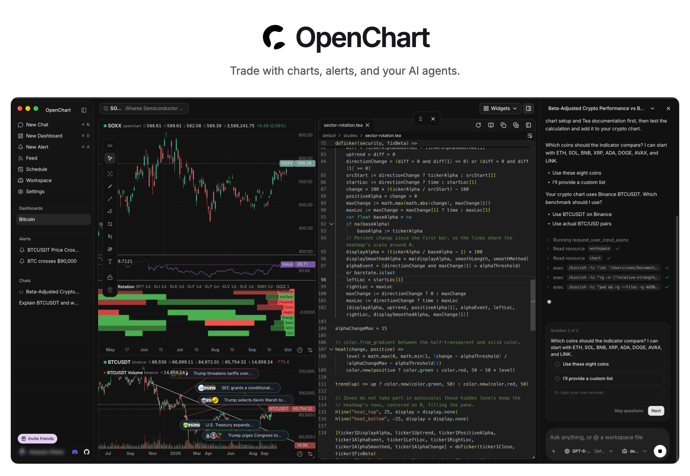
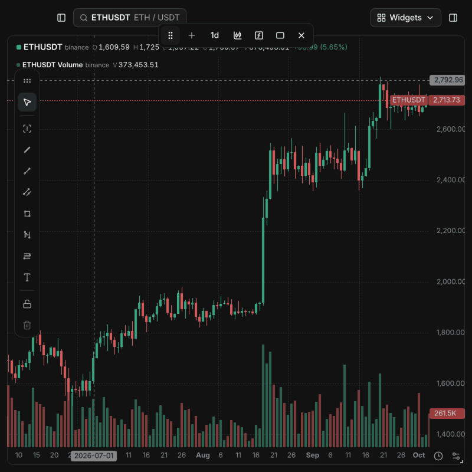
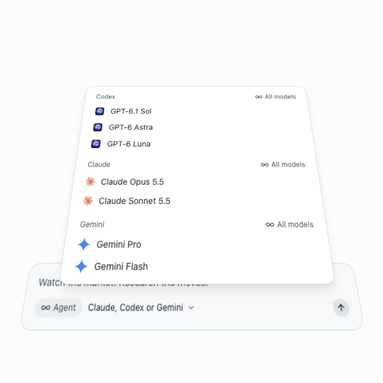
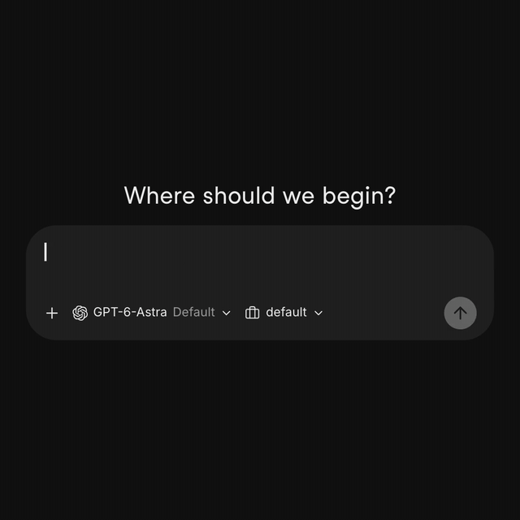
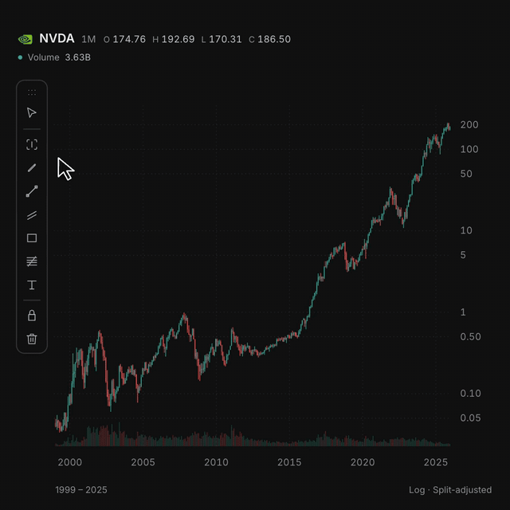
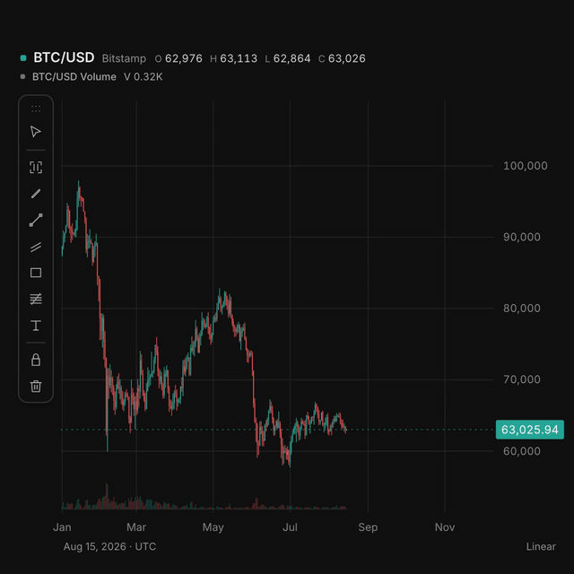
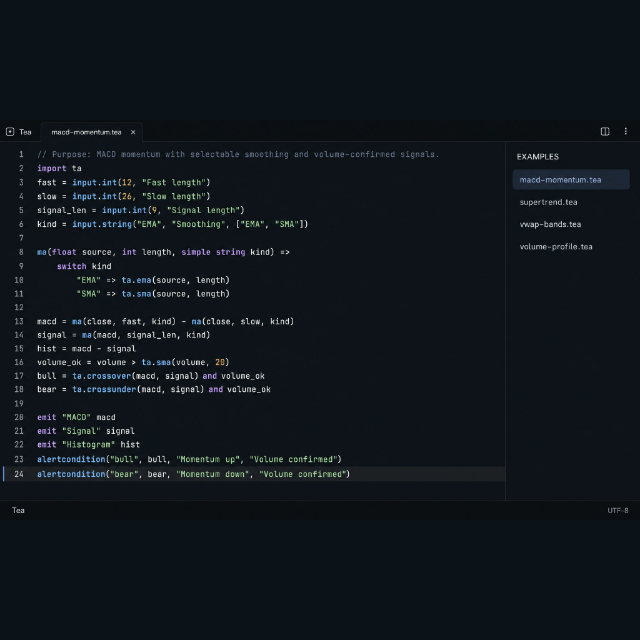
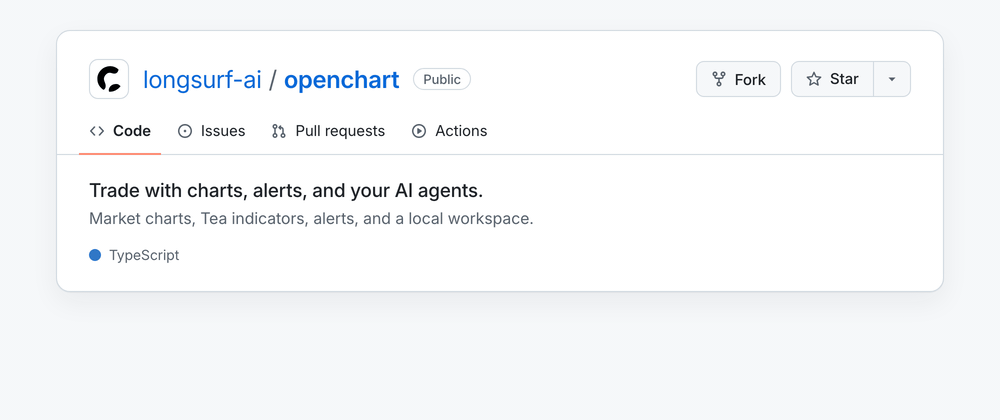

<p align="center">
  <a href="https://openchart.co">
    
  </a>
</p>

<p align="center">
  <a href="https://downloads.longsurf.ai/openchart/darwin/arm64/OpenChart.dmg">Download Desktop</a> ·
  <a href="docs/development.md#build">Self-hosting</a> ·
  <a href="#key-features">Features</a> ·
  <a href="https://openchart.co/tea">Tea</a>
</p>

<p align="center">
  <a href="https://openchart.co"></a>
  <a href="https://openchart.co/#pricing"></a>
  <a href="https://discord.gg/PR4gfbMKUD"></a>
  <a href="https://x.com/OpenChartHQ"></a>
  <a href="https://www.reddit.com/r/OpenChartOfficial/"></a>
  <a href="https://github.com/longsurf-ai/openchart/actions/workflows/ci.yml"></a>
</p>

OpenChart brings AI agents into every step of your investment journey: statistical
and technical analysis with code and charts, real-time responses to market events
with alerts, opportunity discovery through agentic research, and more.

OpenChart is not built to monetize software, but to explore a future where humans
and agents manage assets together. If you believe in this future and want to join
forces, [we want to talk to you](https://discord.gg/PR4gfbMKUD).

## Quick start

[Download Desktop for macOS (Apple Silicon)](https://downloads.longsurf.ai/openchart/darwin/arm64/OpenChart.dmg),
open the disk image, and install OpenChart.

To run Desktop from source, install [Node.js 24](https://nodejs.org/en/download),
[npm 11.11.1](https://docs.npmjs.com/downloading-and-installing-node-js-and-npm/),
[Bun 1.4.2](https://bun.sh/docs/installation), and [Just](https://just.systems/man/en/),
then run:

```sh
git clone https://github.com/longsurf-ai/openchart.git
cd openchart
just install --frozen-lockfile
just desktop
```

`just install` also initializes and builds Tea, a programming language built for analyzing market, by the same team.
Follow the [setup guide](https://openchart.co/docs/getting-started/)
for your first chart and alert, or the [development guide](docs/development.md)
for building and packaging the app.

Desktop is free. AI usage follows your agent provider's plan; optional Cloud
market data is priced separately.

## Key features

<table>
  <tr>
    <td width="50%" valign="top">
      <a href="https://openchart.co/#charts"></a>
      <h3>Charts without software quotas</h3>
      <p>Add indicators and Volume Profile, then expand to a 4×4 grid. No software plan limits on charts, indicators, or price and indicator alerts.</p>
    </td>
    <td width="50%" valign="top">
      <a href="https://openchart.co/#agents"></a>
      <h3>Use your own agents</h3>
      <p>Use your Claude, Codex, and Gemini models to research markets, build indicators, and set up alerts with the accounts you already have.</p>
    </td>
  </tr>
  <tr>
    <td width="50%" valign="top">
      <a href="https://openchart.co/#alerts-market-watch"></a>
      <h3>Describe what to watch</h3>
      <p>Tell your agent what matters. It builds Tea monitors that evaluate incoming data and investigate when a condition fires.</p>
    </td>
    <td width="50%" valign="top">
      <a href="https://openchart.co/#auto-explain"></a>
      <h3>Explain what moved the chart</h3>
      <p>Select a range and let your agent research the move, with source-linked annotations pinned to the bars.</p>
    </td>
  </tr>
  <tr>
    <td width="50%" valign="top">
      <a href="https://openchart.co/#alerts"></a>
      <h3>Draw it, get alerted</h3>
      <p>Draw a line or zone on the chart. When price crosses it, an alert can ask your agent to research the move.</p>
    </td>
    <td width="50%" valign="top">
      <a href="https://openchart.co/tea"></a>
      <h3>Write your own market logic in Tea</h3>
      <p>Build custom indicators and conditions with functions, loops, state, and collections that evaluate as data flows in. <a href="https://openchart.co/tea">Explore Tea →</a></p>
    </td>
  </tr>
</table>

## Staying updated

[Star OpenChart](https://github.com/longsurf-ai/openchart) to support the project
and help more people discover it.

[](https://github.com/longsurf-ai/openchart)

## Credits

Thank you to the projects and people whose work helps shape OpenChart:

- [Jan](https://www.jan.ai/): for inspiration on the app's design and visual style.
- [TradingView's Pine Script](https://www.tradingview.com/pine-script-docs/welcome/):
  for inspiring Tea's language design.
- [OpenCode](https://opencode.ai/): a major inspiration for OpenChart, and the
  project through which we discovered [Effect](https://effect.website/).
- [Dify](https://github.com/langgenius/dify): for inspiring the organization of
  this README.
- [assistant-ui](https://www.assistant-ui.com/) and
  [AG-UI](https://docs.ag-ui.com/introduction): for the agent conversation interface
  and event protocol.
- [shadcn/ui](https://ui.shadcn.com/docs),
  [Radix UI](https://www.radix-ui.com/primitives), and
  [Base UI](https://base-ui.com/): for reusable interface components.
- [Effect](https://effect.website/): for the runtime, concurrency, and error-handling
  foundations.
- [Inter](https://rsms.me/inter/) and [Hugeicons](https://hugeicons.com/): for
  typography and interface icons.
- [robust-orientation](https://github.com/mikolalysenko/robust-orientation) and
  related libraries by Mikola Lysenko, and
  [kld-intersections](https://github.com/thelonious/kld-intersections) by Kevin Lindsey:
  for geometry algorithms adapted in Tea.

Thanks also to the maintainers of the many other open-source dependencies that
make OpenChart possible.

## Contributing

Help improve OpenChart through code, indicators, documentation, and feedback.

- **Code:** Start with the [development guide](docs/development.md) and
  [architecture](docs/architecture/code-organization.md). Run `just check` before
  submitting a pull request.
- **Indicators:** Improve OpenChart's built-in studies, or contribute to the
  [Tea compiler and runtime](https://github.com/longsurf-ai/tea).
- **Documentation:** Fix an unclear explanation, improve a setup guide, or add a
  useful example.
- **Ideas and feedback:** Tell us what you are building on
  [Discord](https://discord.gg/PR4gfbMKUD), or open an
  [issue](https://github.com/longsurf-ai/openchart/issues) with a bug report or
  feature request.

### Contributors

Thanks to everyone helping build OpenChart.

<p>
  <a href="https://github.com/longsurf-ai/openchart/graphs/contributors"></a>
  <a href="https://openai.com/codex/"></a>
  <a href="https://claude.com/product/claude-code"></a>
</p>

## Community & contact

- [Discord](https://discord.gg/PR4gfbMKUD): Ask questions, share charts and
  indicators, and meet other users.
- [GitHub Issues](https://github.com/longsurf-ai/openchart/issues): Report
  reproducible bugs and suggest improvements.
- [X / @OpenChartHQ](https://x.com/OpenChartHQ): Follow release news and project
  updates.
- [Reddit / r/OpenChartOfficial](https://www.reddit.com/r/OpenChartOfficial/): Share
  setups, discuss market research workflows, and exchange ideas.

## Security disclosure

Report vulnerabilities privately to [security@longsurf.ai](mailto:security@longsurf.ai),
following our [security policy](SECURITY.md). Please do not disclose vulnerabilities
in public issues, pull requests, or community channels.

## License

OpenChart uses the [OpenChart License](LICENSE), based on Apache 2.0 with additional
conditions. See the license for usage and commercial terms. For commercial
licensing, contact [legal@longsurf.ai](mailto:legal@longsurf.ai).
