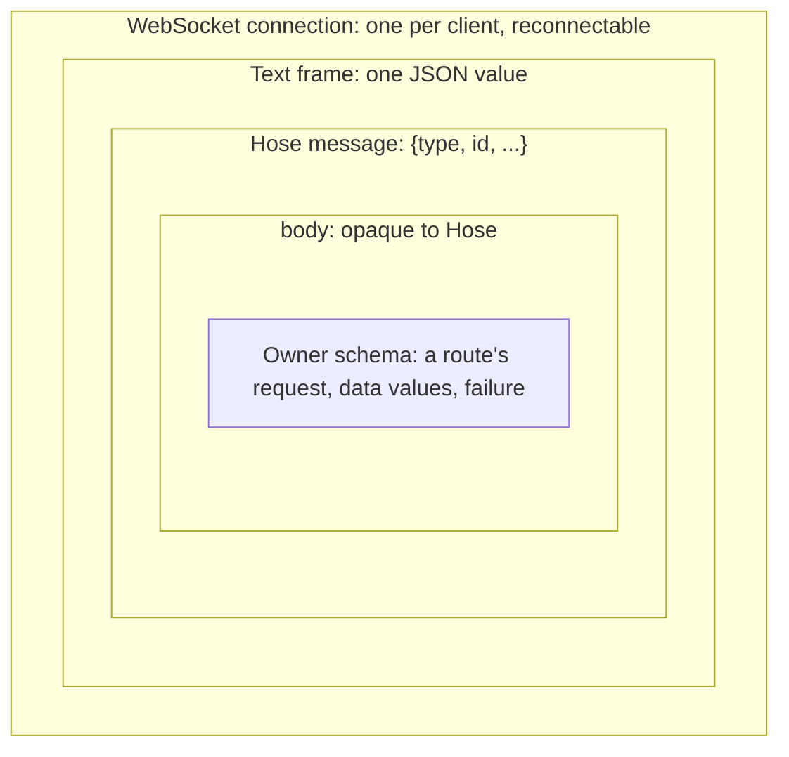
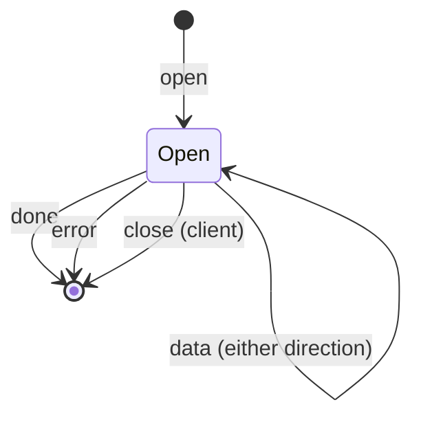

# Hose

Hose carries many independent data flows, called channels, over one WebSocket.
It owns framing, routing by `body.type`, the channel lifecycle and fair sending.
It never reads a body: each channel's owner decodes its own bodies with its own
schema. Routing, registration and duplex design are discussed in
[Hose architecture](../../docs/architecture/hose.md).

## Layers

Each layer wraps the next and knows nothing about what is inside it.



A Bars channel on the wire:

```json
{"type":"open","id":"c1","body":{"type":"bars.open","request":{"...":"..."}}}
{"type":"data","id":"c1","body":{"type":"snapshot","snapshot":{"...":"..."}}}
{"type":"data","id":"c1","body":{"type":"updates","data":{"...":"..."}}}
{"type":"done","id":"c1"}
```

Hose reads `open.body.type` to pick the route (`bars.open`) and nothing else.
The data bodies also have a `type` field, but that one belongs to the Bars
schema; Hose never reads it.

## Messages

Every message is a strict JSON object: an unknown field is a protocol error.
`id` is a non-empty string the client chooses, unique among its open channels.
A `body` is any JSON value except absent.

| Direction       | `type`  | Fields                | Meaning                                    |
| --------------- | ------- | --------------------- | ------------------------------------------ |
| client → server | `open`  | `id`, `body`          | Open a channel; `body.type` names a route  |
| client → server | `data`  | `id`, `body`          | Send a value on an open channel            |
| client → server | `close` | `id`                  | Cancel the channel                         |
| server → client | `data`  | `id`, `body`          | Send a value; the channel stays open       |
| server → client | `done`  | `id`                  | End the channel normally                   |
| server → client | `error` | `id`, `code`, `body`? | End the channel with a failure (see below) |



Messages for a channel that has already ended are ignored: they may have been
in flight when it ended.

## Errors

A failure belongs to exactly one layer, and the layer decides how much it ends.

| Layer      | What failed                               | Ends          | Carried as                                           |
| ---------- | ----------------------------------------- | ------------- | ---------------------------------------------------- |
| Connection | the socket, or a frame Hose cannot accept | every channel | WebSocket close, then a client code                  |
| Channel    | Hose could not run the channel            | one channel   | `error` with a Hose code                             |
| Owner      | the route's own work failed               | one channel   | `error` with `code: "failed"` and the owner's `body` |

### The `error` message

```ts
type ErrorMsg =
  | { type: "error"; id: string; code: "failed"; body: unknown }
  | {
      type: "error";
      id: string;
      code: "invalid_request" | "not_found" | "internal";
    };
```

- `failed`: the owner failed and says why in `body`. Hose never reads it; the
  owner's client decodes it like a data body. OpenChart's server sends its
  encoded public error here, the same object tRPC sends at `data.error` (see
  [errors](../../docs/architecture/errors.md)).
- `invalid_request`: the open body has no valid `type`, or the route rejected
  its request.
- `not_found`: no route has that `type`.
- `internal`: the server failed without a public reason, for example a handler
  threw. The cause stays in the server's logs.

There is no text field. People read the owner's decoded failure; developers read
the server's log of the cause. A Hose code carries no body, and `failed` always
does.

### Connection failures

The server closes the socket with a WebSocket close code, and every channel on
it ends:

| Close code | Reason                                                                                                                                |
| ---------- | ------------------------------------------------------------------------------------------------------------------------------------- |
| HTTP 401   | the handshake was not authorized                                                                                                      |
| `1002`     | a frame was not text, not JSON, or not a valid message, or it opened an id that is still open                                         |
| `1009`     | an inbound frame exceeded 1 MiB                                                                                                       |
| `1011`     | creating the connection context failed                                                                                                |
| `1013`     | an outbound message did not fit the 16 MiB send queue (the client read too slowly, or one message was larger), or a write was refused |
| none       | an asynchronous send failed; the server drops the socket and the client sees `1006`                                                   |

Reconnecting restores the socket, not the channels. Each owner reopens its own.

### `HoseError` on the client

Every channel failure reaches the client as one `HoseError { code, body? }`.
`body` is present only when `code` is `failed`. Its `message` is `Hose <code>`,
for logs only.

| `code`            | Layer      | Produced by | Meaning                                      |
| ----------------- | ---------- | ----------- | -------------------------------------------- |
| `failed`          | Owner      | server      | decode `body` with the owner's schema        |
| `invalid_request` | Channel    | server      | the request was rejected                     |
| `not_found`       | Channel    | server      | unknown route                                |
| `internal`        | Channel    | server      | server failure without a public reason       |
| `empty_response`  | Channel    | client      | `request()` saw the channel end without data |
| `socket_failed`   | Connection | client      | the socket could not open or failed          |
| `socket_closed`   | Connection | client      | the socket closed                            |
| `protocol_error`  | Connection | client      | the server sent a message Hose cannot accept |
| `disconnected`    | Connection | client      | the client disconnected on purpose           |

Owners branch on `code` only to tell these layers apart, and decode `body` only
for `failed`. Cancelling a channel by unsubscribing or aborting is not a
failure: an abort rejects with the signal's reason.
