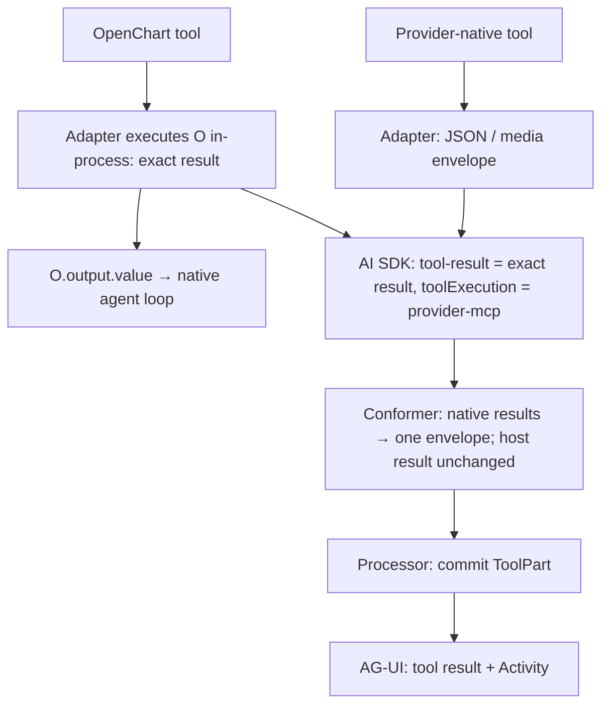

# Provider Stream Protocol

The schemas and types in [provider-protocol.ts](provider-protocol.ts) define the
processor-facing contract; [stream.ts](stream.ts) validates it at the SDK exit.
This document illustrates result delivery and delegate lifecycle ordering. Concrete provider adapters translate native events into
provider-neutral AI SDK parts. One OpenChart conformer then maps scoped step
markers in `streamText.fullStream` into this protocol before the stream reaches
the session processor. Raw provider and AI SDK transport shapes are not part of
the processor contract.

## Boundaries

| Boundary                 | Owner                                                                                                                                                                                           | Contract                                                                                           |
| ------------------------ | ----------------------------------------------------------------------------------------------------------------------------------------------------------------------------------------------- | -------------------------------------------------------------------------------------------------- |
| Native provider stream   | Concrete provider adapter ([Claude Code](providers/claude-code/adapter/translate.ts), [Codex](providers/codex/adapter/translate.ts), [Antigravity](providers/antigravity/adapter/translate.ts)) | Emit provider-neutral content, tool events, and scoped step markers.                               |
| `LanguageModelV4` stream | AI SDK ([`streamText` call](../../../server/agent/llm/llm.ts#L353))                                                                                                                             | Scoped step markers use `custom` parts because adapters cannot emit `start-step` or `finish-step`. |
| `streamText.fullStream`  | OpenChart conformer ([`conformProviderStream`](stream.ts#L69), [call](../../../server/agent/llm/llm.ts#L368))                                                                                   | Map scoped custom markers to OpenChart `start-step` and `finish-step` parts with `delegateCallId`. |
| Normalized stream        | [Session processor](../../../server/agent/processor/processor.ts#L601)                                                                                                                          | Route every step by metadata; never parse provider-native or custom transport events.              |

The conformer runs after `streamText`, so child lifecycle projection cannot
alter AI SDK outer-step accounting.

The normalized stream is an OpenChart extension of `TextStreamPart`: unlike a
raw AI SDK root `start-step`, its scoped `start-step` may carry routing metadata.

## Metadata

`providerMetadata.openchart` is schema-defined in
[provider-protocol.ts](provider-protocol.ts). Delegate routing uses two
independent fields: `delegateCallId` names the delegate that owns an event
(absence selects the root), and `openDelegate` marks an `Agent` tool-call that
opens a delegate. Result provenance and transport-only markers share this
namespace. The conformer consumes
`finishDelegate` and `toolMedia`; normalized metadata never carries them.
Unknown fields and conflicting markers fail at the boundary; unrelated provider
namespaces are preserved.

## Stream

This is the normalized stream (`ModelStreamEvent`) that the session processor
consumes, for one root step that runs one delegate. Adapters never emit the
delegate `start-step` / `finish-step` directly; they emit `custom` markers that
the conformer rewrites (see [Transport Conformance](#transport-conformance)).

Delegate fields under `providerMetadata.openchart`:

- `delegateCallId`: the `Agent` call ID of the delegate that owns the event.
  Any event may carry it; absence means the root owns the event.
- `openDelegate`: `{ description, prompt, agent }`. Only on an `Agent`
  `tool-call`; it opens a delegate identified by that call's `toolCallId`.

`—` means the field is absent; `call` is the `openDelegate` payload.

| #   | Event                                             | `delegateCallId` | `openDelegate` | Processor effect                                             |
| --- | ------------------------------------------------- | ---------------- | -------------- | ------------------------------------------------------------ |
| 1   | `start`                                           | —                | —              | None.                                                        |
| 2   | `start-step`                                      | —                | —              | Root: persist `StepStartPart`.                               |
| 3   | `reasoning-*`, `text-*`                           | —                | —              | Root: persist content parts.                                 |
| 4   | `tool-call` `Agent`, call ID `A`                  | —                | `call`         | Root: open the proxy `ToolPart`; create `A`'s child session. |
| 5   | `start-step`                                      | `A`              | —              | `A`: persist `StepStartPart`.                                |
| 6   | `reasoning-*`, `text-*`                           | `A`              | —              | `A`: persist content parts.                                  |
| 7   | `tool-input-*`, `tool-call`, `tool-result` `Read` | `A`              | —              | `A`: persist the nested `ToolPart`.                          |
| 8   | `finish-step` with `finishReason`, `usage`        | `A`              | —              | `A`: persist `StepFinishPart`; seal `A`.                     |
| 9   | `tool-result` `Agent`, call ID `A`                | —                | —              | Root: complete the proxy `ToolPart` only.                    |
| 10  | `reasoning-*`, `text-*`                           | —                | —              | Root: persist content parts.                                 |
| 11  | `finish-step` with `finishReason`, `usage`        | —                | —              | Root: persist `StepFinishPart`; seal the root.               |
| 12  | `finish`                                          | —                | —              | None.                                                        |

This is one valid ordering. Root content may also appear between rows 5 and 8.
Row 9 must follow row 8, and row 11 must follow all root and `A` activity
(invariants 4, 6, and 7).

- **Proxy**: the parent's `Agent` `ToolPart`. Its terminal `tool-result` or
  `tool-error` completes or fails only the proxy; it never ends the child or
  carries child text.
- **Seal**: finalize that assistant message: usage, cost, completion time,
  snapshot, and `StepFinishPart`.
- Root and delegate `start-step` share one handler, as do both `finish-step`
  forms; each resolves its destination from `delegateCallId`.

## Transport Conformance

| Adapter emits `custom` with `kind` | Its `providerMetadata.openchart`                             | Conformer yields                                                                              |
| ---------------------------------- | ------------------------------------------------------------ | --------------------------------------------------------------------------------------------- |
| `openchart.delegate-start-step`    | `delegateCallId: A`                                          | `start-step` with `delegateCallId: A`                                                         |
| `openchart.delegate-finish-step`   | `delegateCallId: A`, `finishDelegate: {finishReason, usage}` | `finish-step` with `finishReason`, `usage`, and `delegateCallId: A`; `finishDelegate` removed |

The adapter owns native lifecycle semantics and emits each custom marker
exactly once. A finish marker carries normalized `finishReason` and `usage`.
When a provider exposes only aggregate root usage, its child finish marker uses
zero usage; the root finish retains the provider's aggregate measurement.
The single post-`streamText` conformer copies those fields while changing only
the event shape; it never invents lifecycle data or infers it from child text
or the parent proxy result.

## Ordering Invariants

1. An `Agent` `tool-call` with `openDelegate` precedes every event whose
   `delegateCallId` is its tool-call ID.
2. Every delegate emits exactly one `start-step` and one `finish-step` with its
   `delegateCallId`.
3. The child `start-step` precedes every regular child content or nested-tool
   event.
4. The child `finish-step` follows all child content and nested-tool terminal
   events and precedes the matching terminal `Agent` tool event.
5. The terminal `Agent` tool event belongs to the parent scope: it has no
   `delegateCallId` at the root, or the enclosing delegate's `delegateCallId`
   inside a delegate. It never references the child it just completed and never supplies
   child text or child lifecycle state.
6. Parent output may interleave with a running child's output; every event
   names its destination, so the processor needs no ordering between them.
   Only the terminal `Agent` tool event waits for the child `finish-step`.
7. The root `finish-step` carries no `delegateCallId` and occurs after all
   root and delegate activity for that step.
8. A protocol-complete error path preserves the same ordering: child
   `finish-step` uses an error finish reason, then the parent proxy emits its
   terminal error event. An abrupt transport failure may instead fail all open
   delegates during consumer cleanup.

## Nested Delegates

Same notation as [Stream](#stream). Indentation shows ownership: the root opens
`A`, and `A` opens `B`.

```text
event                     delegateCallId  openDelegate  effect
tool-call Agent A         —               call          root opens A
  start-step              A               —
  tool-call Agent B       A               call          A opens B
    start-step            B               —
    B content and tools   B               —
    finish-step           B               —             seal B
  tool-result Agent B     A               —             A closes B's proxy
  finish-step             A               —             seal A
tool-result Agent A       —               —             root closes A's proxy
```

## Tool Result Delivery

Both paths preserve `toolCallId` and delegate ownership:



Transport markers in `providerMetadata.openchart` determine boundary parsing:

- `toolExecution = "provider-mcp"`: the adapter ran an OpenChart tool inside the
  native loop and emitted the exact `Tool.ExecuteResult` itself, including
  title, metadata, output, and attachments. The marker's name is historical.
- `toolMedia = true`: parse the native media envelope, then remove the marker.
  Unmarked native JSON is wrapped as `{ output: JSON, attachments: [] }` without
  interpreting its contents.

All native results expose `ProviderNativeToolOutput` to Processor. It assigns
attachment IDs and projects the same fields without a media/JSON branch:

| Result field  | ToolPart state            | AG-UI                                  |
| ------------- | ------------------------- | -------------------------------------- |
| `output`      | `output` (text or JSON)   | `TOOL_CALL_RESULT.content`             |
| `attachments` | `attachments` (FileParts) | `Activity.content.attachments`         |
| `computerUse` | `metadata.computerUse`    | `Activity.content.details.computerUse` |

`computerUse.screenshot` is display-only and never becomes model input;
attachments use the existing model-history projection. Codex takes computer-use
provenance from native `codex/toolSurface` and omits the display screenshot when
its URL already appears in attachments.

Each completed capture is published through the existing Activity snapshots/deltas
while the run continues. Live updates and cold history use the same committed
ToolPart; no separate screenshot event or frame store is added.

Implementation: [host tool contract](provider-tools.ts),
[protocol schemas and types](provider-protocol.ts),
[processor projection](../../../server/agent/processor/tool-result.ts).
