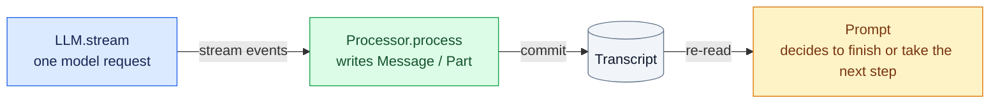
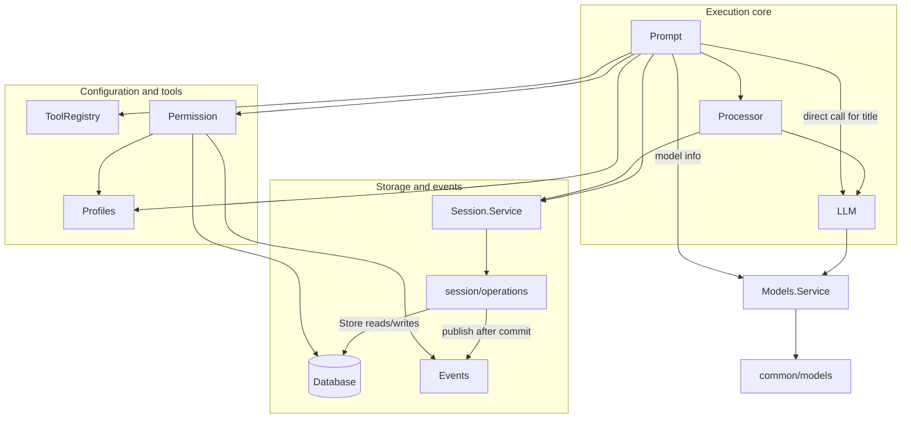
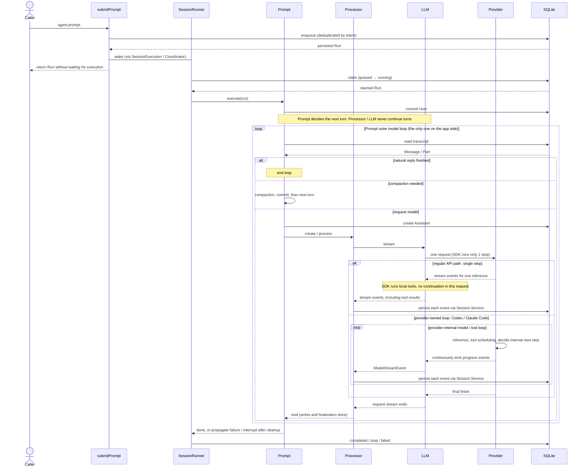

# Agent

Agent is split into a **three-layer core plus outer Run orchestration**. Transcript stores conversation facts and Run stores execution state; the application runtime assembles shared services.

## Three-layer core

Calls go down: `Prompt → Processor → LLM.stream → Models / SDK`. Results come back up:



| Layer                                                  | Granularity                                 | Responsibility                                                                                                                                    |
| ------------------------------------------------------ | ------------------------------------------- | ------------------------------------------------------------------------------------------------------------------------------------------------- |
| [LLM](../../server/agent/llm/llm.ts)                   | One model request                           | Uses the resolved model, validates the variant, handles SDK/MCP callbacks and request cancellation, and outputs an event stream                   |
| [Processor](../../server/agent/processor/processor.ts) | One Assistant, including provider delegates | Consumes the stream; handles persistence, tool state, retries, idle timeout, and finalization                                                     |
| [Prompt](../../server/agent/prompt/execute.ts)         | One claimed Run                             | Materializes the User message, resolves the model, selects history/profile, binds tools, and handles compaction, titles, and multi-turn decisions |

**On success Processor returns `void`; Prompt decides the next step from the committed transcript.** Prompt creates a Processor for each Assistant; Processor is a local instance, while LLM and Prompt are application-shared Services.

## Directories and responsibilities

Only Agent-related directories are expanded; listed files are key entry points.

```text
v2/
├── common/
│   └── models/                    Provider adapters, model discovery, SDK and stream event protocol
└── server/
    ├── runtime.ts     Assembles shared services; manages the application lifecycle
    ├── agent/
    │   ├── index.ts               Assembles RunStore → Runner → SessionExecution
    │   ├── router.ts              tRPC entry for agent.prompt
    │   ├── schema.ts              Agent runtime table definitions
    │   ├── contracts/             Shared Session / Message / Part / AgentPromptInput contracts
    │   │   └── parts/             Schemas for each Part kind
    │   │
    │   ├── run/                   Run contract and queue SQL: enqueue / claim / complete / stop / fail
    │   ├── session/               Session storage; Session.Service aggregates Session / Message / Part operations
    │   │   ├── operations/       Session / Message / Part data operations, one file per action
    │   │   ├── submit-prompt.ts   Persist Run → wake → return the admission result
    │   │   ├── commit.ts          Publishes events after the transaction commits
    │   │   ├── message/           Transcript storage, evidence, and model message projection
    │   │   ├── execution/         Coalesces wakes per Session, runs serially, handles interrupts
    │   │   └── runner/            claim Run → Prompt.execute → write the Run terminal state
    │   │
    │   ├── prompt/                Inner loop: input, history, model steps, tool binding, titles, compaction
    │   ├── processor/             Stream projection, delegates, tool state, and cleanup for a single Assistant
    │   ├── llm/                   Single model request and the Effect ↔ SDK Promise boundary
    │   ├── publisher/             Domain change publication contract and client protocol implementations
    │   │   ├── publisher.ts       Publisher.Change / Interface / Service
    │   │   └── agui/              Native AG-UI projection, event encoding, and bootstrap
    │   ├── plugin/                run.before hook and typed context contributions
    │   ├── profiles/              AgentProfile definitions, registration, configuration, and default selection
    │   │   └── prompt/            System prompt compilation and composition
    │   │       ├── analyst/       Manifest and template inputs for the analyst Agent
    │   │       ├── title/         Manifest for the title prompt
    │   │       ├── compaction/    Manifest for the summary prompt
    │   │       └── segments/      Shared prompt text and registry
    │   ├── tool/                 Tool definitions, argument decoding, initialization, and registry
    │   │   └── tools/            Echo, Resource, Task, Workflow, Transcript, Schedule, and Symbology tools
    │   ├── permission/           Permission rules, approval wait/reply, saved grants
    │   └── question/             Wait, answer, and cancel for native clarifying questions
    │
    ├── models/                   Models.Service: shared model registry and lifecycle
    ├── db/                       SQLite connection and forward migrations
    ├── events/                   In-process events and the generic SSE route
    └── resources/                Business resources under the Resource framework
        ├── agent-schedule/       Schedule data definition
        └── agent-schedule-occurrence/  Definition linking a single scheduled fire to its Run
```

`agent/prompt/` runs the loop; `agent/profiles/prompt/` only organizes system prompt text.

`agent/session/message/model-message-user-parts.ts` projects user Parts into model
input. Dig In framing reads only the selected text of the matching ContextPart; regular
and synthetic TextParts in the same message keep their original text and relative
order, are each replayed once, and are no longer concatenated into a Dig In question.

`agent.digInSession({ sessionID, messageID, selection })` creates a Dig In.
`selection` contains `partId`, a snapshot of the selected text `text`, and
`startOffset` / `endOffset` in the rendered text; the backend checks that the Part
belongs to the selected completed Assistant, and the text snapshot is not sliced from
the raw Markdown. The Session `digIn` operation, in one transaction, copies that reply
and the history before it, creates a `kind: dig_in` child session, and appends an
anchor to the parent session. Every call creates a new child session; creation is not
deduplicated. `fork` and `digIn` share the history checks and ID remapping in
`session/operations/internal/branch.ts`; they reject recursive Dig In and copying
existing markers, and do not copy Runs, bindings, or approvals.

Creation does not start execution; the caller then sends a regular `agent.prompt` to
the child session. When Prompt first materializes the User message, it adds the single
Dig In ContextPart from the parent anchor and commits it together with the user input.
Later sends read the full history and add no marker; Dig In markers in external input
are still rejected. The existing serial execution per Session guarantees uniqueness.
History before the marker only provides model context; delegates in the copied history
also stay out of the visible snapshot. Clicking Dig In in the frontend only opens a
local panel with the selected text; the first send calls `digInSession` and then goes
through the regular `submitPrompt`. Like `create` / `fork`, every creation makes a new
session; once the child Session ID is known, send retries reuse it.
`sessionIntentID` is only used to deduplicate the Run for a question submission; it is
not part of Dig In creation or the anchor.

## Dependencies

An arrow `A → B` means A uses B; the diagram shows only the main runtime dependencies.



`server/agent/contracts` owns the shared data contracts; the execution layers and Resources reference them directly. Contracts do not depend on execution logic or the database. See [Models](models.md) for model adapters and [Permission](permission.md) for permission rules.

## One request



- **Admission is separate from execution**: the Session must already exist; submission returns the persisted Run without waiting for the model to finish.
- **Per-turn Workspace selection**: `AgentPromptInput.workspaceId` and the same-named field on the User Message are both optional. `Run.input` and the User Message store the selection without expanding it early into a default ID. Workflow child calls use `child.workspaceId ?? parent.workspaceId`, which allows an explicit override; native sub-Agent messages inherit the parent message's selection. If it is still omitted at the end, it means the Home default, and the concrete Workspace is resolved when the execution environment is built. Today this field records the selection; wiring it into the model execution `cwd` is still pending.
- **Serial within a Session, concurrent across Sessions**: Run is the only persistent queue; Coordinator only holds in-process execution state.
- **Interrupts are finalized separately**: Runner records a pure interrupt with successful cleanup (an explicit Stop or a normal runtime shutdown) as `stop`, publishes `RUN_FINISHED`, and keeps propagating the interrupt to stop the current drain. Normal completion is `completed`; execution errors, cleanup failures, and leftover Runs recovered at startup are `failed`. Transcript keeps the interrupted content and tool state.
- **Tools are recorded before they run**: SDK/MCP call → Processor waits for the initial ToolPart to commit → the callback bound by Prompt → the concrete Tool; Processor then persists the result event. Local tools run only one SDK step at a time; Prompt decides later turns.
- **Events publish only committed state**: `Session.Service → operations → Store → SQLite commit → Publisher → client adapter → Events → SSE`. Persisted Messages/Parts are projected into native AG-UI events inside a single `agent.event` envelope. A subscription registers and reads its snapshot under the same Effect semaphore, then receives deltas; reconnecting re-reads the current state and does not replay past events.

The backend currently wires admission, Prompt, Processor, LLM, the Echo and Resource tools, and Run finalization, and provides APIs for Session creation, listing, native message snapshots, subscription, cancellation, and approval. The [HTTP/SSE integration test](../../server/agent/router.sse.test.ts) uses the real router and the community reducer and covers multiple turns, tools, failures, interrupts, approvals, and resubscription. The [production App](../../app/README.md) connects to the real backend through the shared SessionStore and assistant-ui; the live-scenario verification script is `app/e2e/tests/agent-live.ts`. `agent.forkSession` uses the Session's existing transaction and Store to copy history up to and including the selected Assistant reply, creating an independent root Session; it does not copy Runs, bindings, or approvals. The App calls it with the Message ID from native metadata, then refreshes the session list and navigates to the new Session on success. The remaining business tools are not wired yet.

`agent.truncateSession({ sessionID, messageID })` prepares a history edit. It is
allowed only on a main session (`kind: chat`) with no queued / running Run, and keeps
the specified completed Assistant and the history before it; `messageID: null` clears
the history. Inside a transaction it deletes later Messages / Parts and removes Dig In
anchors that point to deleted Parts; it keeps the Session identity, the remaining
message IDs, child sessions, and past Runs. After commit, Publisher publishes a
`session.updated` metadata notification and a `transcript.updated` history-change
notification. The latter is for operations such as edit and delete that need a full
history refresh; the adapter turns it into a native history snapshot. Online and
reconnecting clients read the same state; streaming deltas still use Message / Part
events. The operation is not queued and does not wake. Edited content stays on the
client; on confirm the client truncates first, then calls the regular `agent.prompt`
into the single `submitPrompt`. The two calls are not atomic; if submission fails after
truncation, only the prompt with the same intent is retried. The session is not
reserved between the two steps; other prompts are still admitted in normal queue order.
Truncate and fork / Dig In share Session reads and inclusive history-prefix selection
through `operations/internal/read-history-through.ts`; each operation keeps its own
availability checks and transactional writes.

## Startup recovery

One runtime owns execution for a database exclusively; at startup the previous runtime
must already have stopped. `interruptAndRecover()` in `agent/recovery.ts` first calls
`Session.interruptUnfinished()`; `session/operations/interrupt-unfinished.ts` acquires
the Clock and, in its own transaction, closes all leftover Assistants, streaming Parts,
and tools. The scan includes delegate Sessions and active Parts left under terminal
Runs/Messages because finalization failed; it keeps partial output, completed results,
and existing errors.

It then calls `AgentRunStore.recoverQueue()`, which marks each `running` Run as
`failed` through `fail`; `finish` acquires the Clock internally, writes the end time,
and then publishes `run.updated`. Each Run commits independently and existing terminal
states are kept. Interrupted work is not retried, because tool side effects may already
have happened.

After all repairs and Run event publications finish, `interruptAndRecover()` wakes
every Session that holds a `queued` Run, which then runs in queue order through the
existing Coordinator and Runner. `agent/index.ts` only assembles this startup entry; it
does not take the queue or handle wakes. Only then does the runtime start the Scheduler
background and let the HTTP server accept requests. If any step fails, startup fails;
committed repairs remain, and the next startup can retry safely without changing
completed repairs. The Transcript startup repair publishes no live events; Run reuses
the normal failure event, and clients bootstrap from the repaired database.

## Symbology

`symbology_search({queries, limit, assetClass?})` accepts 1–10 queries, and `limit`
applies to each query. The tool checks `symbology_search` permission for all query
texts at once; Analyst allows it by default, and configuration can override that. It
then queries the currently available sources one by one through
`Feed.get().symbology.search()` at call time, with `indexed: true` fixed. It returns
`{query, listings}[]` JSON in input order; each entry's `listings` keeps Feed's
`ProviderListing[]` and the source identity defined by `common/market`. Feed owns
sorting, filtering, limit, and source errors. A query with no matches returns an empty
array; if any query fails, the whole tool call fails and no partial result is returned.

## Market data

`market_data({request})` exposes the current Bars Feed to Analyst. The request is
one of two strict operations; schemas reuse `ProviderListing` and `BarsRequest`:

- `operation: "capabilities"` with `provider` and `listing` returns that identity
  and the supported resolution/session/adjustment combinations and delivery modes.
- `operation: "bars"` adds `resolution`, `session`, `adjustment`, `from`, `to`, and
  `countBack`. Times are epoch milliseconds, with an inclusive start and exclusive
  end. The tool resolves `to: "now"` to a numeric cutoff before calling Feed, so
  every observation is finite and its Scope closes before the result returns.

Agent resolves unknown listings through `symbology_search` and preserves the
provider/listing pair. One `market_data` permission check for `provider:symbol`
precedes `Feed.get()`; Analyst allows it by default. Initialization captures no
Feed, and source failures and cancellation propagate through ordinary tool execution.

Bars results contain `series`, inspected `range`, `hasMoreBefore`, and ascending
`{time, open, high, low, close, volume}` rows. Only the tool's model projection
converts native DataFrames to JSON rows; missing numeric cells become `null`, with
no filtering or rounding. `countBack` is a minimum between 1 and 1,000, so Feed may
extend the window backwards. Windows exceeding 1,000 rows fail with a request to
shorten the range or choose a coarser resolution; this bounds model output, not
upstream retrieval. Empty windows remain valid. The cutoff does not guarantee
freshness, and the last candle may still be forming; capabilities describe source
delivery modes without implying a fixed delay.

## Task

`task({agent, description, prompt})` starts a brand-new delegate Session by registered
profile name, waits for the whole call and its finalization, and returns the final
text. It reuses `workflow/host.ts` and `executeInvocation`; it creates no child Run,
copies no parent history, and offers no parameters for resuming an old Session or
running in the background. At initialization Task lists every visible profile in the
tool description, without filtering by the calling Agent's permissions; explicit name
resolution does not restrict mode or hidden. Task requests normal permission as
`task / profile.name`, and child tools use the target profile's own permissions. The
target profile's model/variant takes precedence; without a configured model it uses the
parent model. Workspace follows the existing default inheritance of the child host.
Nesting and parallelism are still handled by the existing call chain.

Processor first commits the running ToolPart. After the host creates the child, it
commits the append-only, deduplicated `childSessionIds` through `ctx.metadata`; only
then can the child call run. Task, provider subagents, and workflow share this set of
direct child Sessions; concurrent registrations commit serially, and the tool's
terminal state keeps every link. If linking fails, the child call does not start; this
may leave an empty child Session, but never produces invisible execution. Cancellation
propagates along the Effect fiber and waits for the child call to finalize.

## Schedule / Occurrence

Like Session, Schedule has no user ownership. A forward migration drops
`agent_schedule.user_id`, changes the updated-at index to no longer group by user, and
keeps the content, relations, revisions, and timestamps of Schedules, Occurrences, and
Runs. The `entity.ts` files of Schedule and Occurrence derive the full Resource
contract from their own table definitions. Both full Stores are wired: Schedule exposes
CRUD, and Occurrence exposes only get/list and projects the required sessionId from
the Run; all Resource lists share bounded cursor pagination. Backend Occurrence
creation commits through the normal Resource transition and Transactor. Schedule CRUD
only maintains the next-fire cursor; it does not start timers, create Runs, or run
prompts. `scheduler/background.ts` starts a separate scheduling loop after Agent
startup recovery completes.

Schedule has no `deletedAt`. Deleting a Schedule deletes its Occurrences through
`ON DELETE CASCADE`; an Occurrence's reference to a Run does not own the Run, so Runs,
Sessions, and transcripts are all kept. A forward migration removes old soft-deleted
Schedules and their Occurrences, keeps the identity, content, revisions, and timestamps
of the remaining Schedules and Occurrences, and changes no Agent execution history.

# UI

- In V1 we implemented the Agent frontend store and message state management ourselves. OpenChart adopts the AG-UI protocol and a compatible community client, reusing their history loading, streaming, and generic state management. We provide protocol-compliant history data, live events, and run controls, and keep state continuous across cold start and reconnect; product-specific interactions are still ours to implement.

`server/agent/publisher/publisher.ts` is the single change-publication interface
between domain operations and client protocols. The Message, Session, Run, and
Permission owners pass in committed or effective domain facts and do not import
`publisher/agui/` or `@ag-ui/*`; ESLint enforces this dependency direction. The
application runtime injects `publisher/agui/adapter.ts`, and the router selects that
protocol's query and subscription entry points. Callers get `Publisher.Service`
directly and call `publish` with the original object references. Implementations must
not mutate the input; an implementation copies any data it needs to keep or queue. The
change-publication callback finishes inside the existing Events barrier, including
reading the display history page when needed, before the next write or subscription
snapshot read is allowed. It must not become an async subscription that re-reads the
database.

`session/message/history.ts` reads raw history for copy/branch; the model reads raw
messages page by page through the Message Store. `session/message/visibility.ts` owns
only the synthetic text rules. The single display read entry, `readTranscriptPage`,
reads complete turns through the Message Store by User boundaries, excludes the copied
Dig In prefix in SQL, and does not load Parts outside the page. `session/state.ts` owns
the public state and the Run input omission rules.
`session/operations/read-snapshot.ts` assembles, from the existing owners, the Session,
the most recent complete turns up to the configured page size, Runs, and pending
permissions. `session/operations/` has one file per action, `session.ts` only registers
functions, and each action's contract is written at its implementation. Callers get the
instance from `Session.Service` and read display history through
`session.readTranscriptPage({sessionID, cursor?, turnLimit?})`;
`session.readSnapshot(sessionID)` assembles live state on the same page. Operations own
transcript transactions; the adapter neither receives nor opens transactions. Prompt
still owns its own compaction history selection.

A TextPart expresses hidden model text only through `synthetic`; metadata does not
decide visibility. The forward migration that removes the old `ignored` and
`metadata.hiddenContext` handles transcripts, Run prompts, and Schedule prompts
together: hidden context becomes synthetic; ignored text is cleared and marked
synthetic, keeping the Part identity and prompt structure so old content is neither
shown again nor sent to the model.

`server/agent/publisher/agui/` only does protocol adaptation: `projection.ts` purely
converts message and Part events, `events.ts` defines the native envelope and
lifecycle/state events, and `adapter.ts` handles sending, necessary snapshot reads, and
subscription bootstrap. The adapter captures Session, Database, and Events; the
change-publication callback reads metadata, history pages, and linked child transcripts
through Session. Session's dependency-free Layer is provided before the adapter. The
Run and Permission owners supply the changed values directly so the callback does not
re-enter their services. The change handler explicitly chooses a single-Session or
transcript delivery scope and does not infer routing from the event type or JSON Patch
path. Each batch of events resolves ancestry once and is delivered one by one in the
original order; each receiver holds its own payload. It uses `@ag-ui/core`'s Message,
event types, and schemas directly; SQLite still stores the existing domain
Message/Part. An Assistant's visible Parts use the Part ID as the native message ID,
preserving the mapping between text selections and Dig In anchors. History and live
projection share one implementation; a child Session's copied history is hidden before
the Dig In marker. Dig In anchors still use `state.session.anchors`; childSessionId is
returned with the tool Activity for the linked toolCallId, with no new transcript
protocol or duplicate anchor.

`subagents.ts` projects existing delegate Sessions, their links from the parent
ToolPart, and their terminal states into native `SUBAGENT_STARTED`,
`SUBAGENT_FINISHED`, and `SUBAGENT_ERROR`. The parent delegating Part ID serves as one
invocation's `subagentRunId`, and the child Session's title is the display name;
`parentToolCallId` links the parent tool, and `parentSubagentRunId` expresses nesting.
Child content keeps its own Session projection and is also sent, with native ownership
fields, to observers of ancestor Sessions. Child input stays only in the separate child
session. Session/Run/Permission state keeps its original scope; child message
completion info is merged into the messageInfo of the parent's observed document. A
child Assistant finishing one turn does not end the card; only the parent ToolPart's
completed/error ends the whole invocation. Bootstrap reads the linked child
transcripts, restores ownership message by message, and uses the same native lifecycle
events to restore child cards. The tree read reuses the root transcript already loaded
by the snapshot, and combines the tree's messageInfo with the root Session state
directly; a history replacement projects the most recent complete-turn window
separately for each observer. Delegates linked within a page also each read only their
latest page into that page; every transcript read is the same paginated read, with no
whole-transcript read entry. Processor, Publisher.Change, the database schema, and
provider protocols stay unchanged.

Normal streaming output uses native TEXT, REASONING, TOOL, and STEP events directly.
The end of tool arguments only closes the argument stream; progress, title,
childSessionId, and attachments during execution are initialized with an
`ACTIVITY_SNAPSHOT` with a stable ID, then updated with `ACTIVITY_DELTA`. Failures are
expressed through `TOOL_CALL_RESULT.error`; the pinned core/client versions apply the
upstream PR #2549 patch. Text projection holds back trailing whitespace and appends it
together with the next non-whitespace content; persistence keeps the model's original
text so continuation history does not change. Message completion time, errors, and
usage use STATE_DELTA on `state.messageInfo[messageID]`; updates that do not change
the UI projection, such as internal requests and provider bookkeeping, send no events.

Cold start, reconnect, and genuine history content replacement may use
`MESSAGES_SNAPSHOT` and sync the matching messageInfo. Full user input is appended
only to its own Session as native TEXT events with `role: "user"`: `content` is the
bubble text, and structures such as attachments, quotes, and workflows stay in
`metadata.parts`. Cold reads match live projection, and already-loaded older pages
stay valid. Editing old messages is not implemented here. Normal streaming, tool progress, and tool completion do not send the
full transcript; delegate routing finds the delegation relationship by reading the
committed parent transcript and keeps no second routing cache.

- Cold start and reconnect for a single Session both request a snapshot through
  `agent.requestSnapshot`; `agent.listSessions` remains the paginated list query.
- `agent.readTranscriptPage({sessionID, cursor?, turnLimit?})` returns an AG-UI page
  of complete turns and `nextCursor`. The page size accepts any positive safe integer;
  the default lives in `DEFAULT_HISTORY_TURN_LIMIT` (currently 1). The first snapshot
  and later replacement snapshots follow the same default, and
  `state.history.nextCursor` points to older history. The query only returns data; it
  does not replay SSE or overwrite live state. The shared SessionStore manages older
  pages with TanStack Query and merges them by ID with the AG-UI live tail. All
  features share the same AgentThread and scroll-up page loading; a replacement
  snapshot resets pagination and cancels in-flight older requests. See the
  [AG-UI protocol](../../server/agent/publisher/agui/PROTOCOL.md#complete-turn-pagination) for
  the full contract.
- Agent and Resource share the single `events.subscribe` SSE connection. After the
  server finishes observer registration it sends a `ready` frame, then `event` frames
  carrying the generic envelope.
- The list observer calls `agent.bootstrapSessions()` after ready. Within the same
  Events barrier the adapter reads the default first page and publishes
  `agent.sessions.bootstrap` with payload `{items, nextCursor}`. The frontend applies
  that snapshot first, then inserts or updates by ID from later `STATE_DELTA /session`
  metadata; an initialized list ignores extra bootstraps, and reconnecting
  reinitializes it. The list tracks only ID, parentId, title, and creation time; it
  does not select new Sessions or subscribe to their details. The demo sidebar shows
  only root Sessions with `parentId === null`. A new chat sends no title, so the
  server's default title triggers automatic naming on the first turn. Only a
  subscriber with the session open triggers that Session's snapshot request. Frontend
  creation also updates the list through the same event; the creation response only
  selects the session. History pagination keeps `listSessions`.
- After ready, the client calls the `agent.requestSnapshot({sessionID})` mutation. It
  reads the snapshot inside the existing Events barrier and publishes
  `agent.snapshot`, which contains `MESSAGES_SNAPSHOT`, `STATE_SNAPSHOT`, and start
  events for unfinished Parts. An observer ignores live deltas until it receives that
  Session's first snapshot, then consumes later `agent.event`s. Any observer can
  trigger a snapshot; an initialized observer ignores later snapshots so it does not
  reset its current reducer. Correlation uses only sessionID. A disconnect resets the
  initialized state; reconnecting requests a snapshot again, with no replay or delta
  buffer. The `agent.snapshot` envelope is broadcast on the shared bus; there is no
  targeted delivery. The HTTP error listener ends on disconnect, unsubscribe, or
  receipt of that Session's snapshot, so an old request cannot fail a new subscription.
- The state's `session`, `runs`, `permissions`, and `questions` come from their own
  owners; Run does not duplicate the prompt input. Each durable claim/terminal
  transition maps to one native Run lifecycle; model continuation creates no extra
  protocol Run. Waiting for approval still belongs to the same unfinished Run.
- `agent.prompt`, `agent.cancel`, and `agent.replyPermission` call the existing
  admission, SessionExecution, and Permission owner respectively. Cancel stops the
  current Run and, after cleanup, continues with already admitted queued requests; a
  dropped subscription does not cancel a background Run.

The App's `lib/agent/useAgent` is the single entry point: internally it combines
AgentClient, Query, and SessionStore, and owns creating and cleaning up Agent
subscriptions. Upper layers use `agent.sessions`, `agent.modelProviders`,
`agent.createSession`, `agent.forkSession`, `agent.submitPrompt`, and
`agent.getSession(id)`; they never touch the raw client or store. Create, fork, and
submit are all exposed as Query mutations. `agent.submitPrompt.mutateAsync` takes
`{ sessionID, draft, model }` and must name an existing Session explicitly. New Chat
and its shortcut only navigate to `/app`; repeated clicks keep the current unsent draft
and create no Session. When `FullPageAgent` gets an undefined ID on the first send, it
calls Agent to create a new session, updates the URL in place, and then submits the
message. AgentView passes the displayed Session ID to the submit callback. The main
page passes the retry Session ID from the URL and no longer keeps a separate draft
Session ID. Query holds the submit state and failed text; when a send fails after
switching to a new session, only that session's failed text is restored into the empty
assistant-ui input.
History editing in main sessions reuses assistant-ui's Edit action, message composer,
and `onEdit`. Clicking Edit or Cancel does not change the backend; on confirm, the
previous displayed reply is mapped to its original Message ID, the
`agent.truncateSession` mutation is called, and then the host's submit callback is
reused. The first turn passes `null`. History is replaced by the native snapshot;
quotes stay structured ContextParts. If truncation fails, the edit box reopens and
keeps the edited text; if submission fails after a successful truncation, the regular
composer is restored and sending again does not truncate again. Child sessions cannot
be edited, and editing is disabled while running or preparing to submit.
`lib/prompt-converter/converter.ts` defines the frontend `ComposerDraft` and
`toPromptParts` in one place: a quote becomes a Quote ContextPart followed by the
original TextPart, and image attachments become FileParts. A Quote ContextPart
persists only `kind` and `text`, not the source message or selection; Session anchors
hold Dig In location info. The assistant-ui composer holds attachments, and
SimpleImageAttachmentAdapter produces data URLs; the Composer and history messages
reuse the official Attachment component. Lexical hands pasted files to the same
composer; a failed draft keeps its text, quotes, and attachments. The submitter calls
this pure conversion function, and SessionStore then assembles the existing Agent
prompt request.
Layout owns sidebar navigation, closing the sidebar on mobile, and rename dialog
state, and passes callbacks to the sidebar through props. `FullPageAgent` reads the
Session ID from the URL itself and owns navigation after create/fork.
AppRouteContext shares only transport; CopilotControlsProvider shares the Copilot
toggle and Session selection provided by Layout. Layout mounts Copilot side by side
with the left sidebar and the routed page; every page except the full-page thread
provides the toggle through the shared PageHeader. Layout holds Copilot's Session
selection; when a Schedule run record is clicked or a manual run succeeds, the same
control entry selects the existing Session and opens Copilot, where the user can keep
sending messages. Switching pages or hiding the panel keeps the draft and observation
and does not cancel background execution.
Layout provides a window-wide shared page context scope through assistant-ui's
`AuiProvider` / `ModelContextClient`; each page declares context from its own state
with `useAssistantContext`, and unmounting unregisters it automatically. Workspace,
the Alert editor, and ChartCell declare context in shared components, so pages and
widgets reuse it automatically. Alert history contributes the rule ID only when
expanded; ChartCell contributes the visible cell's identity, main symbol, resolution,
and focus, and excludes hidden sibling cells when maximized.
Copilot reads a string snapshot when submit starts, before creating a Session, and
passes it as `viewContext` to the single `useAgent.submitPrompt`. That entry appends a
synthetic TextPart after composer conversion and stores it together with this turn's
input. The regular transcript does not show it, but model history keeps it. Manual
compaction also carries the context as summary material, and it stays in the
compacted history with that turn's User message. Each session's assistant-ui runtime
stays isolated; the current view is not copied into the composer, and there is no
separate persistent store.
Layout shares only the existing Agent through `lib/agent`'s `AgentProvider`, and
consumers read it through `useAgentContext`. The shared client, Query, SessionStore,
and subscription hooks all live in `lib/agent`; `useBoundSession` only reads the
binding and observes an existing Session; mounting neither creates nor runs anything.
Chart and chat UI consume this shared layer directly; chat components and assistant-ui
adapters stay in `features/agent`.
`useAgent.submitPrompt` accepts either a composer draft or canonical parts, never
both; a draft is converted and then shares the Session prompt command with directly
submitted parts. Chart Explain submits only a PluginInputPart with `drawingId`; the
backend plugin, in `run.before`, prepares a real market data summary from the saved
selection and Feed bars and asks the Agent to save the annotation through the Drawing
Resource tools.
The host passes the Session ID and submit callback to `AgentView` explicitly; the View
reads only the submit state, model, and failed draft that match that ID. Each View's
model selection and assistant-ui runtime are independent and remount by Session ID.
`AgentPanel` owns the nested views and Back inside the panel, with each level reusing
`AgentView`; when a view is covered, it keeps the underlying component, its own draft,
model selection, and scroll position, and Back unmounts only the top level. Nesting is
cleared when the root Session changes. The selection toolbar reuses assistant-ui and
is scoped to the View where the selection actually is; Quote and Dig In share the
selected-text display. `AgentView` shares the panel-open entry, whose target
distinguishes a Dig In draft from an existing Session. `FullPageAgent` opens
`AgentPanelContent` beside the main conversation, covering the main view on narrow
screens; page navigation closes the panel. Copilot uses the same panel as a nested
view and keeps the view stack while hidden. Only a Dig In draft creates a child
session, on its first send.
Source-text markers reuse the Confidence Marker underline style and decorate Markdown
at render time by text offsets within the Part; the parent Session's anchors are the
persistent source, and unsent selections stay local to the host. Clicking a marker
reopens the saved child session; the marker observes the child Run through the shared
SessionStore and shows ShimmerLabel while it runs; closing the panel does not cancel
execution. Code and formulas have their own renderers; Dig In selections that cross
those regions are currently not accepted.
`FullPageAgent` also provides the page header and the branch button; the Transcript
message-action slot renders under each final reply's runtime, branching uses the
native Message ID, and the host still owns navigation. The Provider creates no state
or subscriptions and adds no execution state machine.
Query holds the session list and model list; SessionStore manages only single-session
observation and commands. The Chats and Dashboards lists use Infinite Query and read
15 items at a time; the shared loading component handles only load-more and retry on
failure. Events and reconnects refresh the loaded pages without walking every cursor.
Chats explicitly filters unarchived `chat` and `chart_explain` root Sessions on the
backend and paginates them uniformly by `updatedAt DESC, id DESC`; bound-session
selection still uses `createdAt DESC, id DESC`, and the cursor validates the sort
order and filter. The Archive menu item calls `agent.archiveSession({ sessionID })`;
Session writes `archivedAt` and publishes a metadata event; list queries and the SSE
bootstrap both exclude archived sessions. Archiving keeps messages, child sessions,
bindings, and Runs, and does not cancel execution; an open session stays readable, and
on success Query refreshes the list.
Chart Explain's bound Session uses `kind: chart_explain`; it reports execution
progress to the chart, also appears in Chats, and opens the conversation details with
the existing AgentView.
The rename form and assistant-ui both call the same Session command and refresh the
list on success.
A Session's `lastReadRunId` records the latest finished turn that has been shown; it
starts as null and does not guess past read state. The list derives `isUnread` from
existing Runs, and `SessionIndicator` shows exactly one of a running spinner, an
unread blue dot, or nothing. The shared session view, only when its host is visible,
the window is in the foreground, and the snapshot has loaded, uses
`agent.markSessionRead` to submit only the finished Run ID actually shown; a hidden
Copilot and covered panels do not advance the watermark. Session derives ownership
from the Run and checks its terminal state; a SQL condition keeps the watermark moving
only forward and does not change `updatedAt`. The existing Session metadata event
refreshes the snapshot and list, with no new local read state or event channel. The
frontend relies on the persisted watermark to confirm reads; an unconfirmed receipt
can be retried on the next focus, and duplicate receipts do not write or publish
again.
The `@ag-ui/client` reducer manages messages/state, and assistant-ui's official
converter connects `useExternalStoreRuntime` and the primitives. The React adapter
uses TanStack's `replaceEqualDeep` to reuse unchanged JSON message projections, and
creates Dates only inside assistant-ui's per-message conversion cache. It does not
copy transcript state. The list uses the subscription/memo boundaries of
`ThreadPrimitive.Messages` and `MessageByIndex`; the runtime Provider's layout subtree
keeps stable references and rebuilds only when display inputs such as host slots,
permissions, and errors change. Turn display subscribes only to structure and
lifecycle fields; text updates are subscribed by the messages and Parts themselves.
Markdown shows the native streaming text directly, with no per-character animation
queue on top.
A minimal patch to the converter keeps regular Activities as data parts; the App's
`assistant-ui-messages.ts` links tool activities to their original tool cards by
toolCallId, and other Activities use a generic display. The patch source and removal
conditions are recorded in `patches/README.md`.
Native subagent subscriber hooks keep only the invocation's start/end events; content
is still merged entirely by the SDK. The frontend first groups by subagentRunId, then
calls the same community converter, and links the parent tool through
parentToolCallId. Regular tools use the official Elements ToolCall; calls with
subagent ownership use the official TaskCard, which shows only the title and child
call status, not the returned result or error body. Child messages stay in the
conversion result but do not take part in the parent session's reply-action
selection; the card does not mount an inline child session. Clicking the card opens
the existing Session using the tool Activity's childSessionId, reusing AgentPanel;
subagentRunId only identifies the invocation and is not a Session ID. The child panel
observes the full session independently; clicking does not create or rerun the task.
Long-lived Session observation uses the reducer's extension points; it does not fake a
Run for cold start, nor mistake a live connection for a model that is still running.
A full snapshot explicitly replaces messages through `onMessagesSnapshotEvent`,
overriding the SDK's default merge behavior that keeps the cached order; otherwise
tool results added while the session was closed would be appended in the wrong place.
This policy also lets infrequent history replacements remove old Activities; all
deltas still go to the native reducer.

## Agent plugins

See [Agent plugins](agent-plugins.md) for the Agent `run.before` hook and persisted
context. No concrete business plugins are implemented yet.

## Native questions

`Prompt.step → Processor → LLM → provider.askQuestion → Question.ask` binds a native
question to the current Session. `Question` is the runtime-shared, in-process owner of
the wait. The frontend gets the full pending list through the Session snapshot and the
existing AG-UI `STATE_DELTA /questions`, and answers through
`agent.replyQuestion({requestID, reply})`; this only completes the existing call and
creates no User message, Run, or new prompt. Transport, the publication barrier, and
delegate visibility match Permission; answers do not go through authorization rules
and save no permission grant.

A request contains `id`, `sessionID`, and `questions[]`; each question has `id`,
`header`, `question`, `options[{label,description}]`, `multiple`, `allowFreeform`, and
`secret`. A reply is `{type: "answered", answers: Record<questionID, string[]>}` or
`{type: "skipped"}`. The owner validates the complete question set, single/multiple
choice, options, and non-empty text. A stale answer returns NOT_FOUND; an invalid
answer returns BAD_REQUEST and the pending request stays.

Waiting pauses the Processor idle deadline and prevents automatic retry of this
request. Cancelling the Run, the native request ending, or runtime disposal releases
the wait. A browser reconnect recovers from the snapshot; a process restart does not
restore native callbacks that are no longer valid. The provider tool transcript stores
answers; the pending list is not written to the database. The frontend uses a
Questionnaire component; unsubmitted input stays inside the component, and a failed
send keeps the answers.
