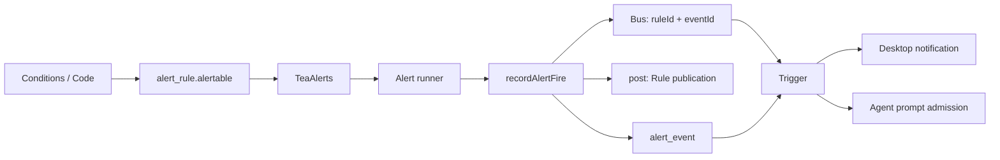

# Alert, Trigger, Notification

Alert observes conditions and records events; Trigger runs actions after an event; Notification is the notification capability provided by the host. Definitions and history are stored in Resources; in-process messages carry only IDs.



## Model and responsibilities

`server/alert/alertable.ts` defines the runtime protocol; there is no separate alertable directory:

```ts
interface Alertable<Event, E = never, R = never> {
  observe(): Stream.Stream<Event, E, R>;
}
```

The stream acquires resources when consumed and releases them on completion, failure, or cancellation. `TeaAlerts` is the first implementation and handles compilation, Feed observation, and Tea output parsing. The generic runner handles only `{condition,time,title,message,data}` and knows nothing about Arrow, notifications, or Agent. Future file/Web sources can implement the same protocol; there is no plugin registration framework in this phase.

```text
alert_rule    name, enabled, repeat, alertable (tea | drawing)
alert_event   ruleId ⇒ alert_rule, condition, time, detail{title,message,data}
trigger       name, enabled, event{kind:"alert",ruleId}, target
```

- The `source` of a `tea` definition is complete, self-contained Tea source stored in SQLite; registry imports work, relative-path imports do not. `config` is the encoded complete `NodeConfig` (inputs can only be Bars; schemas use Arrow JSON), including the inputs, map, and parameters of the root node and of every child request declared at compile time; saving stores the canonical JSON after decoding and re-encoding.
- `config` can also be `{indicatorId, parameters, requests}`: the rule follows that Indicator without copying its definition. During observation, `followIndicator` reads the Indicator snapshot and the current market data of its chart cell (the main series' source plus the cell's resolution, session, and adjustment), and `followIndicatorNodes` expands it into one observe: the Indicator runs on that market data as `nodes.indicator`, the condition node's `indicator` input is a `NodeRef` pointing to it, and its numeric and plot outputs map to `indicator.<output>` columns. Both read the same Bars input, open Feed only once, and share time, provisional state, and warm-up. A change to the Indicator or its cell's market data restarts the rule; other edits to the same chart do not. If the Indicator, chart, or cell no longer exists, the rule is disabled and its history kept. The transaction that records a fire re-checks the Rule revision, the Indicator revision, and the cell's market data. The event data's `inputs` is the market data resolved for that fire (a flat BarsSeries), with `indicatorId`/`indicatorRevision` stored alongside. Child requests still read only Bars. Saving runs one validate with `nodes`: every column the condition reads must have a map entry, and a following rule's map contains only Bars columns and the `indicator.<output>` columns for the Indicator's numeric and plot outputs.
- A `drawing` definition stores `{kind:"drawing",drawingId,operator,inputs}`: it references the Drawing Resource by server ID, and `inputs` is a complete BarsSeries. Geometry belongs only to Drawing; `server/alert/drawing-alerts.ts` derives the Tea source and parameters from the current anchors and does not write them back to the Rule. Saving validates the market data identity, drawing type, condition, and parameters, and re-checks inside the transaction the Drawing revision read at compile time.
- Persisted construction data belongs to `resources/alert-rule/`; runtime objects, methods, and Streams are not persisted. Conditions and Code edit the same source and configuration; there is no second execution definition or condition JSON.
- `enabled` decides whether the rule is observed; `repeat = false` disables the rule in the same transaction that records its first event.
- `alert_event` stores only source facts, including the source-generated title/message and JSON data; it does not store the final notification or Agent text. The public API is read-only and has no read, delivery-success, or execution-status fields. `(ruleId,condition,time)` may repeat.
- Deleting a Rule cascades to its events. Trigger has no foreign key to Rule; the service cleans up references to sources that no longer exist.
- A notification target stores `{kind:"notification",message,sound?}`; an Agent target reuses Schedule's `{kind:"agent_prompt",prompt,binding?}`. Templates are stored with their own targets; there is no shared `template` column.

## Observation and recording

Each enabled rule gets one scoped fiber. `TeaAlerts` compiles and consumes live updates and never fires from a snapshot; restarts do not replay. Alert columns are identified by the compiler's nominal type, so a user struct that happens to have the same shape is not treated as an Alert.

- A non-empty Alert column in an attempt means a fire for that attempt; one column can hold several events. The script decides frequency; there is no implicit per-bar deduplication or throttling.
- `recordAlertFire` carries the Rule revision captured at observation time. If the transaction finds the rule deleted, disabled, or at a different revision, it skips, so a stale observation cannot record an event after an edit.
- The same transaction also publishes a standalone Rule Post; deleting the source does not delete published content. See [Posts](posts.md) for the Post, media, and Agent publishing contracts.
- `alert.fired {ruleId,eventId}` is published only after the event commits, and the step from commit to publish is uninterruptible; the Once disable belongs to the same recording transaction.
- A Resource change cancels the old fiber and starts one from the current definition. On subscription overflow, it resubscribes and reconciles. Compile, data source, or write failures, or the live stream ending while the rule is still enabled, all report a failure and retry that rule with 1–30 second jittered backoff; a write failure loses that fire. Pause, edit, and delete interrupt the fiber with no further retry.
- Building the Layer, compile checks, and saving edits never start observation. The application background service owns startup and shutdown.

## Condition editing and drawings

Creating from a drawing's context menu reuses the same edit Dialog, but linked rules offer no Tea Code; the Chart on the edit page can adjust the original Drawing directly. The chart entry accepts only normal mode on the main price axis and an ordinal X axis; it binds the actual market data input, resolution, session, and adjustment. Supported drawings: horizontal line/ray, trend line, ray, extended line, parallel channel, Fibonacci retracement, and Fibonacci channel. Line and Fibonacci drawings offer Crossing / Up / Down; parallel channel offers Entering / Exiting / Inside / Outside. Every saved geometry change restarts observation of the linked Rule through the existing `Events.ResourceChanged`, with no separate DrawingChanged Bus message. Hiding affects only rendering; after the Drawing or its Dashboard is deleted, the background disables the linked Rule and keeps its history. A Once Rule that has already fired is not re-enabled by moving the drawing.

Fibonacci rules observe all ratio lines; the ratios share constants in `drawing/geometry.ts` with rendering and hit testing. Retracement uses horizontal ratio lines extending right from the earliest anchor; channel uses ratio offsets from the baseline. One confirmed bar crossing several lines produces only one event, and `data.values.crossed_level_<ratio>` stores the price of each crossed ratio line at that time; history shows these snapshots, and the pill sits next to the hovered ratio line, keeping horizontal centering and parallel rotation. A zero-price-range retracement or a zero-width channel cannot pass the history warm-up check; retracement anchors at the same time but different prices are valid.

Drawing alerts use confirmed bars; without provider finality, confirmation may wait for the next bucket. Sloped-line execution starts from the necessary history before the earliest anchor and rebuilds coordinates from the real bar order and nearest match; it cannot replace the bar count with the time difference divided by the resolution. Both samples compute the boundary from the same current geometry, which supports a second anchor on the current unconfirmed bar. Segments keep their finite range and rays keep their direction; history warm-up records no events. A missing anchor, sloped-line anchors on the same bar, or a zero-width channel ends that observation and reports an error, with no fallback to an old boundary. The transaction that records a fire checks both the Rule and Drawing revisions, blocking stale conditions from firing before a change notification is consumed; a monitoring gap still exists during restart warm-up. The event data stores that fire's drawingId/revision/type, derived parameters, and boundary values.

Freehand, Polyline, Rectangle, Triangle, and Curved line share the ordered Line/Quadratic boundary in `drawing/boundary.ts`; rendering and Tea compilation use the same construction. Open paths are not closed, smoothed, or thinned. A regular Tea library imported with `import geometry` performs robust orientation, segment intersection, and quadratic root finding; there is no JS geometry execution bypass.

- Crossing forms a segment from the previous and current confirmed closes: crossing the boundary, or the current endpoint first reaching it, fires; leaving an endpoint, moving along the boundary, and internal tangency do not. Adjacent edges jointly decide vertex crossings; crossing several edges at once still records only one occurrence.
- Touch (`touching`) treats a confirmed candle as a closed rectangle: horizontally `[bar_index - 0.5, bar_index + 0.5]`, vertically `[low, high]`. The boundary intersecting any rectangle edge, or lying inside the rectangle, counts as contact; open strokes are not closed. The width is fixed at one ordinal bar and does not change with zoom, body width, or stroke. This is a candle range test; it does not claim the traded path passed through the intersection. Each boundary segment stores at most one point proving contact: an intersection on a rectangle edge, or one boundary endpoint when fully contained. time is mapped from the time difference between the current adjacent bars, and observationParameter is the price's ratio within low–high.
- These five tools interpolate continuously between adjacent real bar times and extrapolate the future part from the last two bar times, keeping fractional milliseconds; anchors that move into the history region do not snap to a whole bar. The older segment, channel, and Fibonacci tools keep nearest-bar matching, picking the left bar on ties. There is no trading-calendar prediction.
- Each check evaluates both closes with the same current coordinate mapping; provisional updates within the same bar reuse the mapping. A missing price sample does not fire; an unresolvable coordinate or one outside the numeric range ends observation and reports an error.
- A saved event's `data.observation` distinguishes `confirmed_close` / `confirmed_range`, and `contacts` keeps primitiveIndex, observationParameter, time, and price; after the drawing is edited, history still reads the facts at that time.
- The first version allows at most 1,000 anchors; saving explicitly rejects longer strokes, with no automatic sampling. 10,000 points exceed Tea's per-step allocation limit; compile time, per-bar cost, and memory for 100/1,000 points can be re-measured with `server/alert/drawing-boundary-benchmark.ts`. Non-zero absolute values of geometry coordinates must be within `1e-70..1e70`.

`resources.alert_rule.starters` returns Price, Volume, and RSI templates, the exact legacy source, and parameter descriptions. The new templates support 13 conditions: Crossing, Crossing Up/Down, Greater/Less Than, Entering/Exiting/Inside/Outside Channel, Moving Up/Down, and Moving Up/Down %. The boundary truth table lives in `server/alert/starters.test.ts`; covering the names does not mean every TradingView behavior matches exactly.

Conditions uses a React Query Builder AND/OR tree to combine Price, Volume, RSI, and existing condition parameters on a single market data binding. `resources.alert_rule.buildConditions` reuses the full starter semantics to generate standalone Tea and parameters; `resources.alert_rule.readConditions` recognizes only exact starters or programs that can be regenerated verbatim, and does no partial decompilation of arbitrary Tea. Conditions drafts are not stored separately; Code/Resource still treat the Tea source/config as authoritative. The generated program's window length counts toward history warm-up. Source is generated only on first build or a real change; the library's mount normalization does not modify the rule. A condition tree allows at most 32 conditions and 8 group levels, and rejects empty groups.

Going back from custom code to Conditions requires confirmation: it replaces the source, parameters, and child request bindings with the default price condition, and keeps the name, root market data, frequency, and Agent drafts. Cancelling changes no definition; closing Conditions/Code only changes editor visibility. Template updates do not rewrite existing rules.

`resources.alert_rule.inspect({source})` compiles and returns the encoded recursive Definition (schema in Arrow JSON) and Alert output names, then releases the nodes; it reads no market data. Configuration under Code edits the stored complete configuration as JSON (the encoded `NodeConfig` or the indicator-following variant), including root inputs, map, every child request configuration, and their parameters; the frontend no longer expands configuration controls from metadata. Saving parses the configuration and submits `resources.macro.saveAlertRule`, which reuses the `resources.alert_rule.save` transition: it compiles, checks Alert outputs, and validates the complete configuration outside the transaction, then saves the rule and actions in one Resource transaction. `alertable` is server-managed, so the generic create/patch cannot write it; both creating and changing definitions go through `save`. Disabled rules must also pass validation; edits that fail validation stay in the frontend. The Agent `save_alert_rule` tool calls the same transition, writes only the Rule, and does not manage Triggers. Conditions has no separate Validate button.

A save carries the Rule revision and the ID/revision of every existing Trigger, including disabled actions. Concurrent action additions, deletions, or changes all require a re-read; a save cannot overwrite actions it has not seen. Unchanged fields are not patched, so changing only a message or model does not change the Rule revision or restart observation. Saving an edit creates no Session/Run.

A multi-symbol script's data must state the subject of each event explicitly. Only single-input traditional alerts may supply symbol/provider/resolution from the binding; a multi-input script must not pass off the root market data as a child symbol. Tea's request tree is fixed at compile time: a fixed set of 50 symbols can be configured explicitly, while dynamic market-wide universe discovery and adding/removing bindings is a separate language/Feed capability.

## Trigger and templates

Bus is a live-only backend PubSub. Trigger reads the event and the current rule name and dispatches each matching enabled action independently; a single failure is only logged.

A `{token}` in text is looked up in this order: fixed fields `rule,condition,time,title,message` → root-level scalars in data → `data.parameters` scalars → `data.values` scalars. Sources are responsible for explicitly providing variables such as `{symbol}`; Trigger does not guess from inputs. Unknown variables are kept verbatim, and a backslash escapes a literal brace or backslash.

- Trigger renders `target.message` and then calls Notification's `notify({title:trigger.name,body,sound?})`. A notification action can store a sound ID from the catalog as an override; when it is absent, Notification reads Config's `notifications.sound` at delivery time. The host receives only the resolved sound ID and text. `none` keeps the visual notification, `system` uses the system default sound, and the default is the built-in `chime`.
- Agent renders only the text fields in `prompt.parts`, without changing attachments, file references, IDs, model, workspace, or binding, and attaches a reference to the original Post plus an instruction to publish the final analysis in the same prompt; it creates no second message or admission. It shares `admitPromptTarget` with Scheduler, with intent `trigger:<triggerId>:<eventId>`, which prevents admitting the same event twice.
- Desktop main shows system notifications and, on macOS, maps the sound ID to a WAV file in the bundled Resources; other platforms keep the system notification sound. The `common/notification` catalog and hash manifest are shared by Config, preview, and packaging. macOS banner duration still belongs to System Settings; Persistent means until the user dismisses it. Clicking a notification shows and focuses the window; if the host provides no notification capability, it only logs.

For old databases, one forward migration wraps the Rule source/config, converts recorded events, moves notification messages, and appends the old Agent template to its saved prompt. Old prompt text is escaped as literal content, preserving its original meaning. All IDs, revisions, times, event foreign keys, and indexes stay unchanged; a failed migration rolls back entirely.

## Frontend

Each saved Rule page has Setting and Events tabs. Switching tabs keeps the
unsaved editor mounted and hides Save/Cancel while reading Events. New rules
must be saved before they have history. Events reads `alert_event.history`:
bounded pages ordered by occurrence `time`, then ID, with the Rule's complete
event count. Same-time fires remain separate. Compact entries group events by
the selected display calendar day, defaulting to Local. When events are present,
the shared chart timezone control stays at the pane's bottom left, aligned with
timestamps, and updates times and day labels together; this page-local choice
does not change chart preferences or stored timestamps. Details starts collapsed and shows
saved source facts and the original JSON; missing identity, values, and
thresholds stay absent rather than being inferred from current Rule settings.
Resource invalidation refreshes new fires; failed reads retain loaded rows and
offer retry. History does not imply notification delivery or monitoring health.

Each entry links its existing Sessions through the same accepted-execution read
as Feed, deduplicating Session IDs within that event. Agent directory invalidation
refreshes late admissions and title changes. App composition opens the selected
Session in Copilot, retaining the rule draft; navigation never submits a prompt.

`/app/feed` shows the persisted generic Post Feed; New Alert in the main sidebar offers manual/Agent creation, and the Alerts list sits alongside Dashboards and Chats. Selecting a Rule opens the `/app/alerts/rules/:ruleId` configuration page; neither Feed nor rule editing shows a middle navigation column anymore, and the old `/app/alerts` entry redirects to Feed. Feed shows all Posts published by regular chats, scheduled tasks, and Alerts, and references resolve to the current Post; Posts remain after their source is deleted, and stale action entries are hidden. Body text and media reuse the shared renderer and native media controls. Page read state uses a separate device-local preference isolated per desktop profile; filtering happens on the server before pagination, and counts include the full history.

The page and the chart share the same If/Then/And editor. Once/Repeat sits on the right of the If title row; If's separate Conditions/Code toggles can both be turned off. If cannot be deleted; the first action is labeled Then and later ones And. Each action maps to an existing Trigger, and all respond to the same Alert with no serial result dependency. Each Agent has its own native composer, whose current provider decides the icon and title; a notification node edits its own message. New rules add a notification and an Agent by default, and both can be deleted; the + at the end adds an action, and adds/deletes affect only the draft. Existing disabled actions stay disabled and can be enabled explicitly. A Rule with no actions still records events and Feed entries. Drawing keeps a fixed symbol/Price/condition/linked Value, and geometry still belongs to Drawing.

The atomic `resources.macro.saveAlertRule` takes a complete snapshot of the kept actions and an explicit `removedActions[{id,expectedRevision}]`. The union of kept and removed identities must cover the existing actions exactly, every revision must match, and there may be no duplicates or omissions; otherwise the whole save is rejected. The Rule and action creates, updates, and deletes share one transaction, and a failure rolls back everything. Save, duplicate, and enable never automatically restore or enable notifications. Notification defaults belong only to the creation UI; they do not change the persisted Trigger model or add workflow/edge/position. The edit page's Save/Cancel is pinned to the bottom of the right content column, and the form scrolls on its own.

Edits to messages, models, and other actions keep each Trigger's ID/revision; editing any composer does not overwrite sibling actions. Unsaved changes use the shared navigation guard, and a failure keeps the draft. External updates do not replace the captured revisions. Changing only actions does not rewrite the Rule or restart observation.

Chart quick-create and alert-line edit/duplicate all use the same save path. Alert lines are a projection of `alert.readConditions`: only a rule with exactly one threshold condition that applies to Price (the market data input) or to an Indicator output (following the Indicator) draws a line, which sits in that series' pane and uses its scale. The axis + creates a Crossing rule for an Indicator output in that pane, configured as `{indicatorId, parameters, requests}`; the main pane offers price first, then Indicator outputs overlaid on the main pane. Arbitrary Tea scripts cannot be interpreted or rewritten as thresholds. Alert lines are projected only by the chart renderer and create no Drawing Resource.

A linked drawing's pill shows only on hover: horizontally centered in the plot area and parallel to the drawn line; when a finite segment/ray does not pass through the center, the pill is clamped to the visible range. Channels use the currently hovered edge. Position and angle come from the renderer's last completed paint, and the DOM updates after paint; nothing is written back to the Drawing or Rule. When resolution, session, or adjustment differ from the rule's binding, only the pill's bell is dimmed, with a tooltip explaining the original binding; the drawing still shows, and the background rule is not disabled by switching views. A truly disabled rule keeps BellOff and the disabled copy.

## Monitoring

`server/monitoring` holds only current health, without persistence: each module reports the facts it knows with `Monitoring.check(label)`, forming a Check; Checks with the same key flatten into one Status, whose health is the worst Check (`failed > degraded > unknown > healthy`). The executor binds `alert/<ruleId>` for each rule, and data source sessions report to the same Status through the Effect context; `service/alerts` represents the executor itself.

- Green must be earned continuously: a Check starts as `unknown`; a report with `validFor` reverts to `unknown` unless renewed; a Check is removed with its owning Scope, so an old attempt cannot report healthy for a new one.
- Every completed evaluation (including a false condition or `[]`) proves the rule is running; snapshot warm-up counts as the first evaluation but never fires.
- An outage starts when the Status becomes unhealthy; a Check handoff (session end, retry warm-up) or a recovery shorter than 60 seconds does not end it, and the Status `since` is the outage start time.
- The background reads once per second: it publishes `monitoring.changed` when the state or reason changes; when an outage reaches 60 seconds and is currently failed or unknown, it sends one system notification (outages crossing the threshold together are merged), while degraded shows only in the app; after recovery and 60 seconds of continuous health it notifies again, describing the period that may have been missed. Paused and deleted rules are removed silently.
- A failed rule fiber retries with 1–30 second jittered backoff; a failure after one full minute of stable running starts again from 1 second. If reading rules fails, running rules are kept and an "Alert rules" Check is reported under `service/alerts`.
- The frontend trusts the state only while the event connection is ready; a disconnect or a missing Status both show that health cannot be confirmed. The sidebar icon toggles start/stop when healthy or paused, and otherwise opens the rules page; the rules page keeps a banner while unhealthy. No banner means the guarantee holds.

## Guarantees and limits

While the app is running and the computer is awake, every enabled rule either evaluates live data from a healthy data source (no warning in the UI), or the UI shows the reason within 60 seconds and one system notification is sent within 2 minutes. Conditions during an outage are not backfilled; system notifications are not confirmed as shown; nothing runs while the app is closed or asleep.

Actions are still best-effort: nothing is backfilled after downtime, and a crash or subscription overflow between event commit and dispatch can lose actions. A fire record in history does not mean the notification was delivered or the Agent succeeded. There is no reliable delivery queue and no automatic limit on scripts that fire on every tick.
