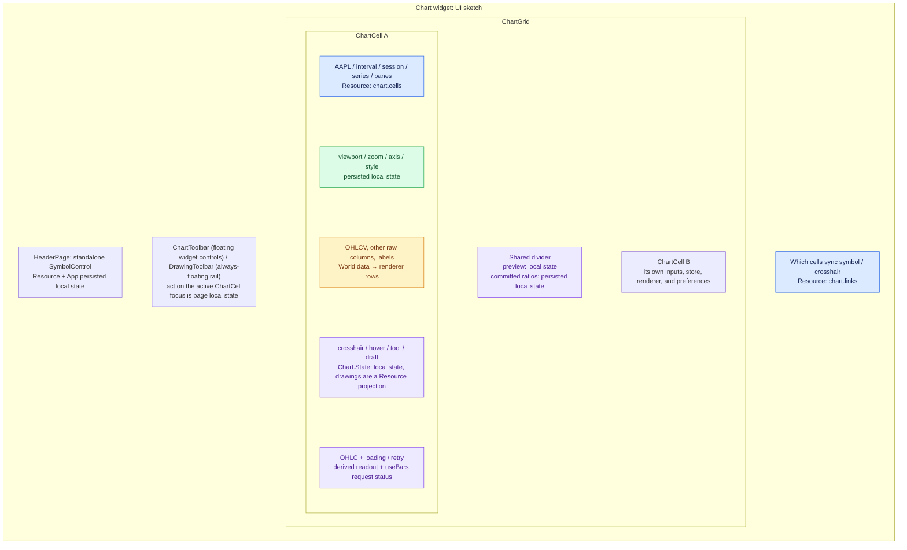
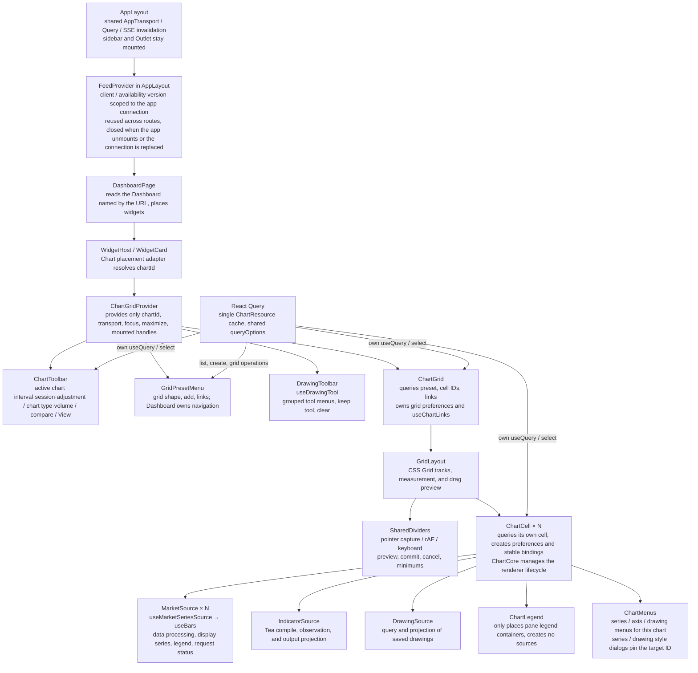
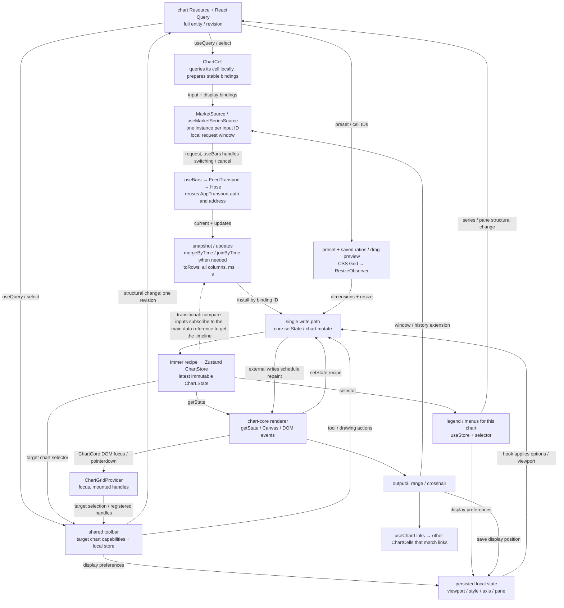

# Chart (React)

In OpenChart, `/app/dashboards/:dashboardId` connects the existing chart-core to React, Feed, and the persisted chart Resource.
It shares AppLayout, AppTransport, and the Electron backend with chat and settings. A Dashboard uses an outer
React Grid Layout to place widgets; the Chart widget still uses CSS Grid inside. See [Widget architecture](widget-architecture.md).

The sidebar owns Dashboard creation and navigation; DashboardPage renders widgets from the Dashboard placements.
New Dashboard calls `resources.macro.createDashboardWithChart()`. The backend creates the
Dashboard, a default Binance `BTCUSDT` daily Chart, and the placement in one transaction; on success the app navigates to the new Dashboard.
The fixed initial config does not read Feed. Adding a Chart from the Widgets dropdown reuses the same BTC daily config; the symbol can be changed later through the chart controls.
Mounting the page does not backfill data and does not inherit previous charts.
The symbol control in the top-left corner of the page reads and writes Query on its own; its target comes from the Dashboard's single frontend selection state.
The other Chart controls sit in a floating bar at the top of the widget, and the drawing toolbar always floats. The
Auto/Log toggles at the bottom of each vertical axis show on hover/focus; there is only one settings button, in the bottom-right corner of the chart, next to the timezone button.
Each pane's axis settings open from a right-click on the axis. An explicitly shared axis is not hidden and does not lock its zero point when a Histogram output is added;
the separate overlay axis for market volume is configured explicitly by MarketVisuals.

Each chart's Chart.State is managed with **Zustand vanilla + Immer**, and React uses Zustand
selectors. **CSS Grid** handles layout, **Radix** handles menus and dialogs, and market data reuses the existing
**useBars / RxJS / Hose**. There is no separate ChartSnapshot, state mirror, command facade, or second
fetch / subscription lifecycle.

## Current capabilities and limits

| Capability       | Implementation                                                                                                                                        |
| ---------------- | ----------------------------------------------------------------------------------------------------------------------------------------------------- |
| chart Resource   | Query, create, atomic patch by revision; background changes refresh through the shared SSE invalidation                                               |
| Multiple charts  | Regular presets from 1 to 4×4, no gaps, shared dividers that resize live, keyboard resizing, cancel, minimum sizes, ratio restore                     |
| Single chart     | pan / zoom, history extension, follow latest, time viewport restore, OHLC, chart types and styles, volume, pane, axis, maximize                       |
| Multiple inputs  | One MarketSource per market input; display series such as price and volume share one useBars                                                          |
| Group linking    | Sync symbol and crosshair through links; each chart keeps its own time range                                                                          |
| Drawing          | Tools that core already supports: create, drag, edit, lock, show/hide, delete; the shared toolbar follows the active chart                            |
| User preferences | Plain persisted local state; chart preferences are saved by cell.id and grid ratios by chart Resource ID; the display timezone is an App-wide setting |
| Indicator        | Indicator Resource: a Workspace Tea file snapshot + explicit parameter overrides; each mounted instance compiles by ID and observes independently     |
| Calendar         | Calendar Feed returns unavailable; no fake trading calendar, market open/closed state, session shading, or countdown                                  |
| Drawing Resource | Persisted; shared by dashboard + provider/listing, with its own revision and delete; failures can be retried                                          |
| Agent overlays   | The Agent can write annotations through Drawing Resource; reuses auto layout, persisted dragging, the V1 card style, and source links                 |

IndicatorSource uses useTea, which has no chart dependency; all outputs of one instance share one observation.
TeaVisuals and MarketVisuals project data through the same ChartSeries component, and React manages series
mounting and cleanup. Both source kinds reuse SeriesLegend; pane, style, and visibility changes do not restart Tea.
`app/src/lib/chart` owns Tea value decoding, indicator default styles, and Tea visual primitive implementations;
previews and installed charts both use them through TeaVisuals. chart-core provides generic series, coordinates,
primitive lifecycles, drawing, and hit-testing interfaces; it does not interpret Tea fields or indicator presentation rules.
The script header `indicator("My study", overlay = false)` declares the title and default pane;
the compiler provides the output schema, and plot/hline values provide styles. Built-in scripts are added to the default Workspace at startup
and run through the same path as custom files. On add, the server records a full snapshot of the script and its imports. The Indicator
Resource stores the source, snapshot, and parameterOverrides, but not default values or compile IDs. Saving the file does not change the
snapshot; Reload takes a new snapshot (revision+1), reopening reuses the snapshot, and an incompatible config fails with an explicit error.
Drawing cap / price-label decoration fields that core does not render are not shown as interactive controls.

# UI and state ownership

These categories describe who provides the data and who owns changes to it. Frontend state is **local state**; the part that must
survive a refresh is called **persisted local state**. It uses plain Zustand persist and is not a separate state system.



| Data                                                                       | Owner and write path                                                                             |
| -------------------------------------------------------------------------- | ------------------------------------------------------------------------------------------------ |
| cells, marketSources, panes, series, preset, links                         | Persisted chart Resource; user action → patch                                                    |
| Indicator: source, snapshot, parameterOverrides                            | Indicator Resource; add and remove go through `resources.macro.addIndicator` / `removeIndicator` |
| bars snapshot / updates                                                    | Feed; keeps the DataFrame's original fields, types, labels, and missing-value semantics          |
| viewport, barSpacing, rightOffset, series style, axis options, pane height | Per-chart persisted local state; updated when a control or interaction ends                      |
| Grid row and column ratios                                                 | Persisted local state per chart Resource                                                         |
| display timezone                                                           | App-level persisted local state; only changes the display                                        |
| focus, instance handles, menus / dialogs, drag preview                     | Page or component local state                                                                    |
| Chart.State                                                                | Chart projection and immediate interaction; Zustand + Immer, no persist                          |
| Canvas, context, rAF, hit / paint caches                                   | renderer RuntimeState; never goes into Zustand / Immer / localStorage                            |

The chart Resource is the **whole grid**; cells[] describes each chart. The frontend **ChartCell** component maps to the backend
data of the same name by cell.id; core's Chart.State.id also uses cell.id. links is a
child record of chart, with no separate Resource envelope or revision.

# Component hierarchy and responsibilities



Boxes are components; the use* names inside boxes are hooks. Components hold UI or dynamic input instances, and hooks hold
subscriptions, interaction, and cleanup. Not every hook needs a component of the same name.

The underlying ChartCore Context passes the stable store / renderer / mutate / output$.
ChartGridProvider only registers the runtime and preference handles that each chart owns. It does not store the Resource or mirror
a set of stores from the Resource cells. The toolbar queries the active cell itself, then reads the registered handles.
cleanup only unregisters the instances it registered, so it works under StrictMode.

The page picks the target identity from the placement, and the standalone SymbolControl reads and modifies the Chart. The grid, single charts, menus, and toolbar use the same query key,
call useQuery where they need it, and select as needed. select creates no second Resource cache and adds no per-chart RPC.
Each consumer's useMutation reuses the chartMutation options. Mutations to the same Resource are serialized with a TanStack scope,
and each run reads the latest revision from the Query cache. Structural operations are centralized as pure functions and update the cache on success;
on failure, the original operation's error or dialog stays. Cross-component busy state is observed with useIsMutating on the same mutationKey.

# How different data flows



Market batches do not need a React render to be written into core. useBars makes status / current part of React
updates, and the current.updates callback merges and commits data directly. When the OHLC selected in the legend changes, React renders normally.

- Add an MSFT input: mount a new MarketSource; the AAPL channel stays.
- Add a volume display for the same AAPL: add a plain Histogram binding that reuses the original channel.
- Change type / style / pane: update the core series and install from the current accumulated frame, without refetching market data.
- Switch request: useBars stops the old channel and opens a new one. keep shows the stopped old chart, and its label comes from
  current.request, so old data never gets the new symbol's name.
- Unmount: cancel the data-consumer subscription; useBars closes the channel and ChartCore releases the renderer.

# Sources, series, and React instances

MarketSource / IndicatorSource represent **the data source of a series**. They match the market / indicator reference in the backend
ChartSeries.source. One input can supply several display series.
The backend input definitions are ChartMarketSource and the Indicator Resources listed by chartId; a binding references an Indicator by value.

```tsx
{
  inputs.map((input) => (
    <MarketSource
      key={input.id}
      input={input}
      cell={cell}
      targets={targets}
      localStore={localStore}
      disabled={saving}
      onRemove={onRemove}
    />
  ));
}
```

The key is marketSource.id or indicator.id; display series use their own Resource binding.id.
ChartCell composes MarketSource, IndicatorSource, and DrawingSource directly, and holds the map of legend DOM
targets. ChartLegend only places containers by core pane geometry and mounts no sources; unmounting the legend
does not stop subscriptions or remove chart data. MarketSource uses a React Portal to put each
binding's legend into its pane, in Resource series order. Moving a pane only moves
the legend and the display binding, without reopening the market subscription. Each indicator always has exactly one legend,
placed in the pane of its first declared output (falling back to the main pane when that is not ready). All output values show on one row,
and the swatch before each value follows that output's color at the current crosshair. Visibility controls the whole output group.
Series settings puts Inputs and Style in one dialog, and Style picks a single output through Output.
Inputs and Style reuse the shared settings rows and controls. Position actions move the indicator's whole output group,
and a separate axis is shared by all outputs of that indicator. The market price label reuses core's ticker badge; its title follows
the symbol of the data currently shown, and the volume label shows only the value. Name search captures the cell/source ID. The main input reuses
replaceListing's linking rules, and compare inputs must be compatible with the cell's interval/session/adjustment.
Inline visibility, style, and position entry points reuse the shared components and ChartMenus; SeriesStyleDialog serves both
the legend and the context menu. hover/focus, lock, and Magnet write core's transient interaction state.
Style shows the colors of all outputs at once, and other styles are chosen through Output; controls read the renderer's actual values.
Color priority is: explicit display override, then the Tea visual description, then V1's `--indicator-*` semantic palette.
Display preferences save only the fields the user changed, and reset deletes the override. Changing color or visibility must not freeze the script's line width and type.
`input.color` is a script parameter; a plot's per-bar color is a visual output and is not inferred statically by parsing parameters.
Do not write inputs.map(input => useBars(...)): hook call order must be fixed, while keyed child components
can be added and removed dynamically. [Rules of React Hooks](https://react.dev/reference/rules/rules-of-hooks)

A single useChartData(inputs) would also work, but it would have to re-implement keyed subscriptions, cancellation,
keep/clear, retry, and error state. The current approach reuses useBars directly: the React tree expresses the input lifecycle,
and the compute service still owns the indicator computation graph.

When a window refresh only changes the computed range, useTea keeps the last successful frame and a new snapshot replaces it whole; failures are reported through the shared Sonner and the old values stay.
Changes to the script, parameters, inputs, or child request config clear data that no longer matches. ChartPanes projects the Resource pane structure before the sources.
Loading, empty data, errors, and renderer type switches never delete a pane; only a Resource structure change alters the pane layout.
Each saved pane must have at least one series binding. When the last binding is moved out or deleted,
the same Resource change must remove that pane. This checks the binding structure, not whether there is drawable data right now.

## Volume and panes

Volume is a **plain display binding** that references the same marketSource as price. The market binding's
`output` (`price` or `volume`) lives in the Resource and decides which data to draw. `volume` renders as a
Histogram; this type is derived from `output` and is not written to local state. The mapping from `output` to column names exists only in
MarketVisuals, and column names come from `BarColumns` in `common/market`: volume takes the `volume` column, and
price takes `close` or the OHLC columns. core does not derive volume automatically, and the wrapper creates no hidden child series ID.
A new cell comes with one volume binding overlaid on the price pane by default.

Adding or removing volume, moving it to a separate pane, or overlaying it on the price pane changes the Resource's bindings /
pane membership. Price chart type, color, and visibility write persisted local state. Price, volume, and other
series share the same register, install, move, and cleanup path. Pane dragging reuses ChartPaneLayout and saves the ratios when it ends.

# ChartStore and renderer

app/src/lib/chart/store.ts uses Zustand vanilla, subscribeWithSelector, and Immer:

```ts
const store = createChartStore(initial);
const commit = (recipe: ChartMutation) => {
  store.setState((draft) => {
    recipe(draft);
  }, true);
};
const renderer = v2.createRenderer({
  container,
  getState: store.getState,
  setState: commit,
});
```

true means full replacement, so a shallow merge cannot bring back deleted root fields. core still only knows the callbacks.
Published state is a plain immutable version, not a long-lived draft Proxy. Changed paths get new references, and
unchanged branches are shared. React selects objects directly with useStore / useChartState, and flat composite readouts use useShallow.

- External data, theme, resize, and tool actions all go through a recipe; never mutate the value returned by getState().
- Recipes run synchronously; the draft, its child objects, and closures that capture the draft must not escape into async tasks.
- An external mutate schedules a repaint; core keeps its own event / paint scheduling.
- The renderer reads the latest version every time; onRenderComplete does not re-send Zustand notifications.
- Chart.State.objects is the single collection of drawings. Drawing.State holds interaction; render / hit-test
  receive a transient Drawing.RenderInput, without installing an items getter or a second collection.
- `drawings.activeTool` is the single selection state for all drawing tools (including `agent_session`).
  The toolbar and hooks all read and write it. core handles anchor drawings or time-range selection by type, and owns completion,
  cancel, and tool lock. When the app receives a completed selection event, it saves the Drawing and starts the Agent.
- useDrawingResources projects Drawing Resource and Query mutations into core and only consumes committed
  plain objects. It merges consecutive changes within 200ms and flushes immediately when a gesture ends and on unmount; on unmount the scope keeps its original value.
  Server projections never generate writes back. A failed mutation keeps its geometry and Retry, and other cells with the same symbol share the Query.
- Chart Explain is mounted by the Chart's DrawingSource per cell/listing. A selection is saved as a plain
  `agent_session` Drawing, and the scanner draws in batches at the span layer: overlapping running selections merge and show the
  Agent count, while separate selections keep their streaming progress. After a task ends, groups are derived again, and merged areas are not persisted.
  All scanners share one mask outside the selections. Execution progress is projected only into
  `drawings.sessionProgress` and never written to the Resource. Layout provides the shared Agent from `lib/agent`, and
  Chart uses `useAgentContext` and `useBoundSession` directly to get commands and progress.
  The widget registry only registers definitions, and ChartGridContext does not pass Agent or Session components through.
  The created Session uses `kind: chart_explain` and appears in Chats; the selection gesture does not open the chat detail automatically.
  Mount and reload only read. core writes the selection preview before publishing the completion event, and the app commits as soon as it receives the event.
  Unmount clears the projection; it does not undo the commit of a completed selection or cancel the Agent run.
- An `annotation` Drawing stores time, title, body, sources, and sentiment, and its anchors are always empty.
  The Agent reuses resource_mutate; there is no separate annotation table or Event. core derives the shared
  annotation layout from objects, and the React AnnotationCard shows the body and sources in the same expanded rectangle that the canvas publishes.
  The source icon is derived from the hostname of source.url. A read-only favicon RPC fetches the image from a fixed icon service and returns a
  canvas-safe data URL; Query caches it by hostname, and the runtime source-badge map and the card share it.
  If loading fails, the letter stays. Icons are not written to the Drawing, the DB, or the Agent context.
  Edit, delete, and reload use the Drawing Query, and layout is never written back to the Resource. The Chart Explain
  frontend submits a `{type: "chart_explain", drawingId, resolution, session, adjustment}`
  PluginInputPart. The three market parameters are captured from the cell when the gesture commits, and async saves and retries reuse that snapshot.
  The backend Chart Explain plugin validates the binding, reads the saved selection and the matching Feed bars, and writes the main swings into the
  `run.before` ContextPart. Market swings only locate the period to research. The Agent iterates with the provider's native web search
  to check events and original sources from the same period, and uses `resource_mutate` to create one
  annotation for each independent, sourced event worth marking. The title and annotation.time belong to that event; the body explains the evidence and its possible link to the price action,
  and does not restate the list of swings. The links actually cited go into each annotation's sources. When there is no credible event from the same period,
  it creates no annotation; it never treats price moves as events or closeness in time as proof of cause. Retries match existing
  event annotations.
- Drawing Resource reuses core's Effect Schema `Drawing.SavedItem` directly: fixed shapes limit the exact anchor count,
  and freehand lines/polylines keep a variable path. Saved geometry rejects degenerate states such as coincident endpoints, zero area, and zero price span; drafts still use `Drawing.Item`.
  `Data.Time` only accepts finite Unix epoch seconds (fractions allowed, Gregorian years 0000–9999) and rejects date strings,
  calendar objects, and millisecond timestamps. Old drawing coordinates are converted by a one-time forward migration; the runtime never guesses the format or unit.
  An annotation always stores the event's original time. Layout picks the last bar in the loaded timeline that is not later than the event,
  and does not snap to a future bar. Beyond the loaded endpoints it is hidden, and the coverage of the last bar is not inferred.
  The database guarantees that `data.id` is unique within one dashboard/provider/listing (symbol, venue, currency); a conflict returns a `/data/id` diagnostic.
  Existing duplicate identities make the forward migration fail atomically; it never deletes drawings or changes identities automatically. Deleting a Dashboard cascades; deleting a Chart does not affect drawings.
- The Resource main role is projected to the series object.role, and core identifies the actual ID and its pane.
  The frontend does not translate a Resource ID into the magic string main.
- Canvas, observers, and channels are created and destroyed per mount; resize / theme reuse the instance.

# Time windows, alignment, and live updates

Feed / local state use epoch ms, and core rows use seconds. toRows keeps all columns and converts only time.
Each new row is frozen first, then handed to Immer. Different display paths never share one mutable row object; future indicators
follow core's dataSeries / dataRef model.

**viewport = null means follow latest.** In that mode, barSpacing and a non-negative pixel rightOffset are saved;
when a new bar arrives, the zoom stays and the view follows the end. When parked at a history position, viewport saves a {from, to} range in milliseconds,
and re-anchors by time after history is prepended or data is appended on the right. Latest changes both the display intent and the needed request window;
it must not just scroll to the end of the loaded history.

visibleRange is converted to time and debounced by 300ms; it drives preference saves and on-demand extension requests. The initial countBack
is computed from the visible space, with a minimum of 120. It extends when the view nears the first bar of the snapshot and hasMoreBefore is set.
Live frame updates must not rebuild the range subscription or cancel a pending drag. The left edge uses the first bar rather than
the start of the coverage range, so market-closed gaps do not block loading earlier history by bar count.
Identical requests are skipped by sameBarsRequest. When the interval switches, ChartCell first ends the old data source and clears the history
viewport, then mounts the main chart and indicators and requests again from the latest position with the existing countBack algorithm. The renderer,
panes, and display preferences stay. When the symbol switches, the request is recomputed for the new input. A daily chart's range of several months is never used directly to request
minute data. The approximate interval of a resolution is only used for padding / data extrapolation;
the loaded timeline uses actual timestamps.

Drawings can extend past the loaded bars. Converting between a mouse position in blank space and a saved anchor reuses the annotation time extrapolation from the two edge points. Creation, control-point editing, whole-drawing drag, painting, and hit-testing stay consistent, and only time/price is saved. Extrapolation estimates a display position; it is not a trading calendar or future market data. With fewer than two valid edge times, nothing is extrapolated. Inside the data range, nearest-bar matching still applies, and the bounded lookup semantics of `indexFromTime` are unchanged.

The viewport API and paint use the same plot width. rightOffset is in **pixels**, and negative values mean
history. set/get round-trips and repeated installs should not keep changing the zoom.

core still draws by ordinal index. Compare inputs use joinByTime from common/timeseries to
align to the main timeline. They get the main data reference through a native Zustand selector subscription, without a separate
frameStore. mergeByTime also belongs to timeseries and keeps labels, field types, and NaN / null.
Normalized compare fixes the base date after the main data arrives and saves it in local state. Remounting keeps the same base
and requests history that includes the base as needed.

# Grid, toolbars, and linking

CSS Grid tracks are derived from the preset and the saved ratios. pointermove → rAF → tracks →
ResizeObserver → renderer; dragging is not debounced and has no transition animation. Release commits; Escape /
pointercancel restores; arrow keys and Home / End support keyboard resizing. When space is short, it is split proportionally so every chart stays reachable.

cells.slice(0, capacity) only selects what to show; the Resource definitions of hidden cells stay. The regular presets in the
Resource are supported today; V1's T-shaped / mixed-row templates have not been migrated yet.
Choosing a preset reuses existing cells first. When there are not enough, it follows the Add chart creation logic and fills them with the active chart's
main symbol, interval, session, and adjustment, saving cells, links, and preset in the same patch.

ChartGridProvider holds focus and handles, and there is one copy of the shared controls; in-chart menus bind to their original cell. A dialog
captures its target when it opens and must not submit to a chart that becomes active later.

Canvas hit-testing stays in core. Menus use the Radix Menu virtual anchor to consume hit coordinates,
without creating transparent buttons or simulating clicks. The shared menu styles and DropdownMenu use the same visual definition.

- syncListing: one Resource patch updates the source cell and its directly linked targets, in one revision.
- syncCrosshair: source index → time → nearest target index. The target shows the time position with its own readout,
  without copying the source price or source pixels; receivers do not publish again, which avoids loops.
- viewport is not synced. A plain hover does not change the shared toolbar's target.

# Desktop and backend availability

Electron main starts the utility-process server, preload provides origin / token, and AppLayout
owns AppTransport and creates FeedTransport / FeedProvider in the same app connection scope.
Chart widgets consume the shared client directly. Leaving the route only releases the useBars channels and does not close the shared Hose.
The initial Feed version query does not block chat, settings, or other routes; bounded Feed queries are enabled once the real version
arrives. A notification failure keeps the client and its consumers, and the Provider offers a way to reconnect.
No business IPC, second connection manager, or bootstrap is added. Tokens, client objects, and URLs that contain tokens are never persisted.

The default runtime registers Binance / YFinance, but Providers are **off by default**. Enable them through the existing
Settings → Data Providers; Config writes the configuration to settings.json, and
the Feed version updates with the Catalog. The saved content:

```json
{
  "providers": {
    "binance": { "enabled": true },
    "yfinance": { "enabled": true }
  }
}
```

The file lives in the desktop userData; the development App is named OpenChart Development. Tests use only an isolated
profile. Provider / Config own the full configuration, and it is not put into Chart.State.
getCapabilities is read before a symbol is picked; for example, Binance is raw / 24h, and Yahoo is currently split /
regular. Resource.session reuses the common/market SessionType and must not allow only stock sessions.
Compare inputs must support this chart's interval / session / adjustment. A failure is shown explicitly, with no retry under a different identity.

The production origin is openchart://app, and localStorage restores across restarts. In Electron development, a change in the Vite port
changes the origin, so restore acceptance uses the production origin. The header reuses HeaderPage, and platform styles handle the desktop title bar area.
Config owns the theme preference, and ThemeProvider maps the confirmed theme and the system appearance to a class on the root element.
ChartCore watches class changes and repaints the existing renderer; the display keeps the existing design tokens. The browser converts
CSS Color 4 into RGB that core's contrast calculation can use, with no separate palette in JavaScript.

## Resource migration

marketSource changes from the old integer listing to provider + Listing JSON, cell gains adjustment,
links drops syncTimeScale, and session reuses the full SessionType. Integer IDs in old development data cannot recover the
provider / symbol / currency, so these old cells and their child records are cleared, while the chart / dashboard
root records stay. The later migration that widens the session constraint keeps all valid child records; both paths have migration tests.

# File ownership

```text
app/src/lib/chart/
  store.ts, context.ts, core.tsx   runtime, Context, ChartCore
  preferences.ts                 plain persisted local state schema / factory
  grid.tsx                       ChartGridProvider / ChartGridContext, identity, focus, maximize, mounted handles
  data.ts, theme.ts               time / rows and DOM theme adapters
app/src/hooks/
  use-chart.ts                   Context / selector
  use-chart-grid.ts               useChartGrid, reads ChartGridContext, does not wrap Resource queries
  use-chart-renderer.ts           renderer, store, resize, theme, cleanup
  use-market-series-source.ts     useBars consumption, window, projection, and display bindings
  use-drawing-tool.ts             tool state and actions
  use-chart-links.ts              group output events
app/src/features/chart/
  api/queries.ts                 Resource queries, shared mutation options, identity
  stores/layout.ts               grid persisted local state
  utils/grid-layout.ts           pure layout calculations
  utils/resource.ts              pure operations on cells, sources, series, panes, links
  components/widget.tsx          placement adapter, atomic creation, and control/content definitions
  components/symbol-control.tsx  page header symbol entry, own Query and captured target IDs
  components/grid.tsx            grid Resource consumption, preferences, GridLayout / SharedDividers
  components/cell.tsx            single-chart Resource consumption, preferences, and stable bindings
  components/sources/market.tsx, indicator.tsx
  components/toolbar.tsx, layout-menu.tsx, drawing-toolbar.tsx, menus.tsx, symbol-picker.tsx
app/src/app/page-header.tsx          60px page header, sidebar/Copilot controls
app/src/components/ui/menu.tsx   Radix virtual-anchor menu, reuses the shared menu-styles
app/src/components/ui/trading-tool-icon/  Figma drawing tool icons
app/src/stores/chart.ts           App display timezone
common/timeseries/src/join.ts     mergeByTime / joinByTime
server/resources/chart/          schema, entity, store, Resource
```

Generic hooks never import features, so their preference schema / pure data functions live in lib/chart.
Product pages, Resource operations, and layout composition live in feature. core does not import React, Zustand, the Feed client,
or app; timeseries does not know about chart.

# Verification and follow-up

Automated checks cover: immutable versions and nested updates, root field deletion, StrictMode cleanup, one channel for several
series from the same input, dynamic input add/remove, cancelling old requests, keep labels, retry, raw columns / gap /
correction, viewport round-trip, latest / history position, layout constraints, Resource, and migration.

Real Electron acceptance covers Resource create / save / restore, real market data, live resize of four charts,
keyboard / cancel, instance and channel retention, toolbar target, drawing, menus, display options, theme /
timezone, leaving the route, and restart. Unit tests do not replace gesture acceptance. Finally, run just check and use the existing
toolchain for desktop build / package / smoke.
