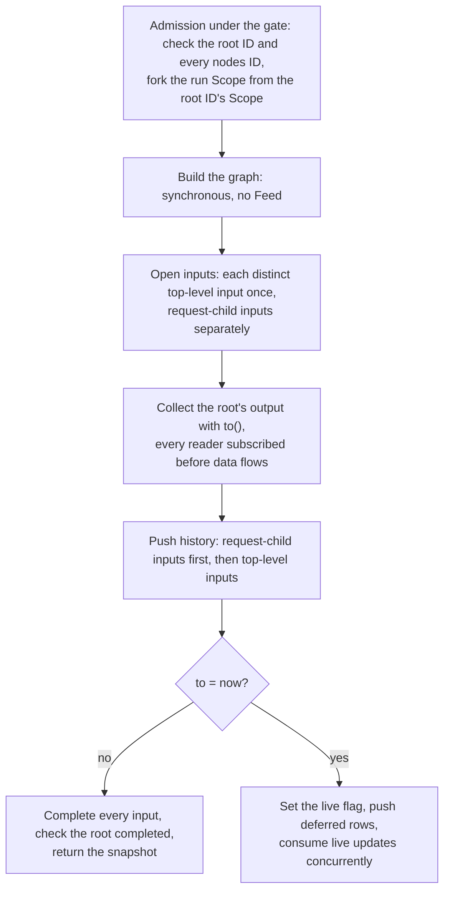
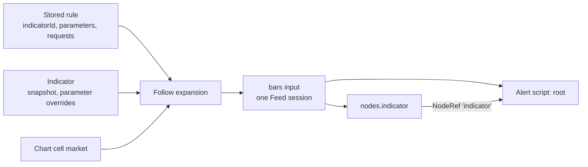

# How to integrate tea into openchart

Even though we built Tea from scratch, it's designed to surface a simple interface to its consumers, something akin to the following:

The examples below describe immutable binding semantics for the existing Node
and Module APIs. Binding derives an independent configuration and execution graph.

```typescript
import { CSVSink, fromCSV, tea } from "tea";
import { Field, Float64, Schema } from "apache-arrow";

// declare and compile tea
const node = tea`
  threshold = input.float(1.5, "Threshold")
  var float balance = 0.0
  if close >= threshold
      balance := balance + close
  else
      balance := balance - close

  plot("Signed running balance", balance, "Signed running balance")
  plot("Above threshold", close >= threshold ? 1 : 0, "Above threshold")
`;

// derive a new node; node remains unchanged
const configured = node.bind({ threshold: 1.5 });

// declare inputs
const schema = new Schema([new Field("close", new Float64(), false)]);
const source = await fromCSV(inputPath, schema);

// bind inputs
const ready = configured.bind(source);

// consume
const csv = new CSVSink(outputPath, "w");
const subscription = ready.to(csv);
try {
  await csv.completion;
} finally {
  subscription.unsubscribe();
  ready.dispose();
}
```

## Immutable Tea embedding API

Keep the existing [Node interface](../../vendor/tea/src/api/node.ts) and its
`module` property. Parameters, input/output schemas and request-child definitions
remain on [Module](../../vendor/tea/src/runtime/module-binding.ts).

| Existing API                           | Target semantics                                                                                                     |
| -------------------------------------- | -------------------------------------------------------------------------------------------------------------------- |
| `Module.bind(values, context?, path?)` | Return a new Module configuration; leave the receiver and its child tree unchanged.                                  |
| `Node.bind(input, path?)`              | Return a new Node with the derived Module and input bindings; leave the receiver unchanged.                          |
| `Node.module`                          | Continue exposing the Module that owns this Node's definition and configuration.                                     |
| `Node.ready()`                         | Read readiness without updating configuration or connections.                                                        |
| `Node.to()` / `Node.dispose()`         | Keep the execution/lifecycle entry points. Execution resources belong to the derived Node used for that observation. |
| `Node.asStream()`                      | Expose the output on this Node's clock as a DataStream another Node can bind; each subscription is one `to()`.       |

`Module.clone()` provides an existing starting point for immutable binding.
Parameter records, child configuration and connection bookkeeping must not be
mutably shared between branches. Arrow schema/metadata ownership must be enforced
inside Module as well. Neither binding failure nor executing one branch may
change another branch's Module.

The service retains Modules, never Nodes. Each observation builds fresh Nodes
from the retained Modules: one for the root and one for each `nodes` entry.
Cleanup calls `dispose()` on every Node the observation built; unsubscribing one
observer alone does not release the current runtime's whole upstream graph. A
Node read through `asStream()` relies on the existing multiple-observer behavior
of one execution: all its readers share one run.

Child parameters are bound independently through the optional request-name path.
For example, `node.bind({ length: 50 }, ["daily"])` derives a child configuration.
The compiler's restriction to top-level request declarations remains unchanged.

### Input requirements and binding ownership

`tea/runtime` exports `ModuleInputs`, an alias for `Module["inputs"]`: the Arrow
schema, series declarations and builtins. Parameters and request children remain
on Module. Inspect requirements after `Module.bind()` because parameter values
can change required column names, history depths and request context.
`common/tea` owns the serializable `Tea.NodeConfig` binding choices (see
[Shared contracts](#shared-contracts)): named inputs, a map from each column to
an input field, parameters and request children. Its metadata is a frontend
projection, not an alternate execution specification.

The service builds and runs an observation from five parts, one file each.
Graph, Bind and Wiring work before any row exists, over empty Sources;
validate stops there, and observe then hands the graph to Run.

| Part   | Question it answers                                           | File            |
| ------ | ------------------------------------------------------------- | --------------- |
| Source | Where one series' rows come from                              | `source.ts`     |
| Wiring | Which stream and field fill each column a script reads        | `wiring.ts`     |
| Bind   | How one script and its request children become a started Node | `bind.ts`       |
| Graph  | How scripts connect, and which Sources they share             | `node-graph.ts` |
| Run    | When which rows are pushed                                    | `run.ts`        |

```mermaid
flowchart LR
  request["ObserveRequest<br/>root NodeConfig + nodes"] --> graph["Graph<br/>connections, shared Sources"]
  modules["Retained Modules"] --> graph
  graph --> bind["Bind, per script<br/>Module.bind, then the Node"]
  graph --> source["Source, per series<br/>empty stream"]
  bind --> wiring["Wiring<br/>one stream per read column"]
  source --> wiring
  dep["Referenced node: asStream()"] --> wiring
  wiring --> node["Started Tea Nodes"]
  node --> run["Run<br/>push rows: snapshot, then updates"]
  source --> run
```

**Graph** (`node-graph.ts`) opens no market data. It checks how the scripts
connect: every NodeRef names a `nodes` key and carries that node's current
`definition.outputs`, compared as encoded JSON; nodes do not read each other in
a loop; every `nodes` entry is read; and request children read no NodeRef. It
gives each distinct top-level series one Source, shared by the root and every
node: two inputs of one kind are the same series when their series fields
(provider, listing, resolution, session, adjustment) are equal, and for Samples
their rows too, whatever their schemas, and the Source carries the union of the
columns its readers declare. Request children open over a window of their own,
so they never share a top-level Source, but children of any script that read
the same series with the same schema share one: four `request.*` lines on the
chart's own bars read Feed once. It then binds each script, referenced nodes
before the nodes that read them, all with the observation's Pine builtin
supplier (see
[Provisional execution and warm-up](#provisional-execution-and-warm-up)).

**Bind** (`bind.ts`) turns one script into a started Node in two steps,
because a level's `syminfo`/`timeframe` context can only be given to
`Module.bind`, before the Node exists, and what a request child reads is known
only once its parent is bound. First, top down, for each level of the Module
tree it:

1. requires every parameter but those whose default follows the chart
   (`chartDefault`), rejects a `requests` entry that names no request
   declaration, and rejects a level without inputs;
2. binds the Module with its parameters and `syminfo`/`timeframe` context. The
   context comes from the level's Bars and Samples inputs, and only when every
   one of them yields the same constant values. `chart.timeframe` is the
   chart's: that of the script's first series before any re-timing (see Auto
   scripts), the same for every level. Tea resolves each left-out chart
   default from that context, such as the session profile's range, Monthly
   on a daily chart; the level's bound values, those included, become its
   config's `parameters`, which its request children inherit;
3. wires the columns the bound level reads (see Wiring);
4. does the same for each request child, over the children's shared Sources.

Then it creates the Node over the bound tree, plugs each level's streams in at
its path, and starts it while the streams are still empty, so Tea's own checks
fail during the build and the Node already listens when Run pushes the first
row. Samples with `to: "now"` are rejected later, when Run opens Sources.

A request child the config leaves out gets one Bars input and the standard map
from what its line asks for once the parent is bound. Its symbol is a ticker
id, `provider:symbol`, read by the per-provider rules in `common/feed`
`ticker.ts`; symbology must find exactly one listing for it, kept whole. Its
timeframe is a Pine timeframe (`""` is the parent's). Its session and
adjustment are those of the parent's single market, and its provider must
declare that combination in Feed's capabilities, or the build fails before any
bars load. Its parameters are the parent's. `syminfo.tickerid` is the ticker id
of a node's own listing and `syminfo.prefix` its provider, so
`request.security(syminfo.tickerid, "D", close)` reads the same listing daily.
observe returns the root's config with these children filled in.

**Wiring** (`wiring.ts`) checks coverage against the bound Module, never
`Definition.inputs`: every column it reads has a map entry, the entry names an
existing input, and its FieldPath exists in that input's declared schema and is
not `index`, `time`, `timed` or `provisional`. Extra map entries are ignored.
Each read column gets a projection, `{time, provisional, [column]: number}`,
taken by FieldPath from a Source row or from a referenced node's `asStream()`
row; a value that is not a number becomes NaN. An input the map does not use is
plugged in with zero columns, so it still drives the node's steps: a script
that reads only `timenow` steps once per bar.

Every graph error is `invalid_request`, Tea's bind errors included, and names
its place: `root`, `nodes.rsi` or `root.requests.daily`, plus the input when one
is involved, such as `input 'bars' at nodes.rsi`. The exception is a request
child the config leaves out: its errors reach chart users, so they name it by
its variable in the script, as in `nvda: yfinance has no 1s bars.` Data errors
during a run are `invalid_data`, and Feed failures are `upstream`.

Bind yields the script's started Tea Node and the config it reads, with every
request child filled in. A script that reads another node binds that node's
`asStream()`. The service collects the root's output with its `to()`, because a
snapshot needs `index`, which `asStream()` leaves out. observe makes one run id
(`rid`) per call.

A **Source** (`source.ts`) is one hot, Subject-backed DataStream of `time`,
`provisional` and its columns as non-null Float64. Null becomes NaN, derived
prices are computed here, and the ordering check and finality inference run
once per Source, so every reader sees the same attempts. At run time, Bars
open through Feed, which receives only the five series fields; Samples open
through a window selection over their rows.

**Run** (`run.ts`) opens each top-level Source over the request's window, then
the request children's Sources, up to 8 at once, from the earliest top-level
start, all with the request's `warmupBars`; pushes the children's rows before
the top-level rows, and collects only the root's output.

**Auto scripts.** A script whose header says
`indicator(..., timeframe = "auto")` runs on finer bars than the chart's.
Graph asks `runResolution` (`source.ts`) for each top-level Bars series an
auto script reads, root or node: the finest resolution the provider offers at
the series' session and adjustment that is at most 32 times finer, else the
series' own. A 1d chart runs on 1h, 1h on 5m, 4h on 15m, 1W and 1M on 1d, and
1s and 1m as they are. The rule ignores the window, so charts, alerts and the
Agent read the same bars. Every input naming that series, in any script, reads
the finer one instead, so an alert and the Indicator it follows still share
one Source and clock, and the config observe returns names the bars read.
`timeframe.*` and `""` requests describe the finer bars, Pine's own context;
`chart.timeframe`, a Tea-only builtin, names the chart's. Samples run as given.
The header also gives the script a `timeframe` parameter whose default, `""`,
follows the chart: left out or `""`, `runResolution` picks the bars; a Pine
timeframe such as `"60"` chooses them, and must name bars the provider offers
at the series' session and adjustment, no coarser than the chart's, or the
build fails `invalid_request`. Scripts reading one series must choose alike.
The run binds the script with the timeframe it runs on, so its config reports
the bars in use, which the chart's inputs form shows. Such a Source covers the request's window, like any other, so the profiles
follow the chart as its window widens on pan, and counts back 1: `countBack`
counts the chart's bars, which `[from, to)` already spans on a market that
trades around the clock; elsewhere the run can start after the chart's first
bar. `warmupBars` counts the Source's own bars. Where the provider keeps the
finer bars for less time than the window reaches back, such as Yahoo's hourly
bars about 730 days, the Source starts where they do, the `availableFrom` of
Feed's HistoryUnavailable. When the run fails `upstream` before its snapshot
for another reason, observe releases it and builds once more on the request's
bars. Run pushes history in slices of 500 rows and yields between them, so a
long run never stalls the backend and a replaced one stops early. The chart
draws the finer rows one per chart bar and names them in the legend (see Chart
indicator declaration).

Known limits: a live run stalls instead of failing when a referenced node emits
nothing for an attempt; a finite run fails instead, with Tea's "times disagree"
for a gap mid-run or "Inputs of one node end at different times" for one at the
end. Several distinct top-level Bars inputs must align attempt by attempt,
which validate cannot check, so diverging live updates fail the run with
disagreeing provisional states. A node that reads only NodeRefs gets no
`syminfo`, `timeframe` or `chart.timeframe`.

## TeaService

TeaService owns compilation, retained node identity, graph building, input
acquisition and scoped execution. tRPC and Hose adapt this service; they do not
own those operations.
Tea remains separate from Feed: Feed refreshes provider-dependent service views,
while Tea owns retained compilations and executions. Both use the shared app transport.

### Shared contracts

`common/tea` owns the schemas and derived types used by service and transport.
Consumers use the TypeScript module namespace: `import * as Tea from "@openchart/tea"`.

`Tea.CompileRequest` is the union of:

- `Tea.WorkspaceSources`: `{workspaceId, path, includeSources?}`. Workspace resolves
  the registered ID to its directory. The compiler reads the entry and discovers
  imports using ordinary filesystem resolution; the service never calls Workspace read.
- `Tea.SnapshotSources`: `{entry, sources}`. The map contains the entry and all file
  dependencies. Missing sources fail without falling back to disk. Shipped libraries
  remain compiler-owned.

`includeSources: true` adds the exact texts used by that compilation to
`Tea.CompileResponse.sources`, keyed relative to the Workspace directory. Source
maps contain 1–32 files of at most 65,536 characters each; empty source text is
valid. The service has no separate snapshot operation.

`Tea.CompileResponse` is `{id, definition, declaration, sources?}`: the retained
ID, the `Tea.Definition`, the `indicator()` declaration or null, and the
optional captured sources. `Tea.Definition` projects a Module's parameters,
Arrow input/output schemas and child definitions. Each child also has the
`target` its line asks for with default parameters, `{symbol, timeframe}`, or
null when it depends on the script's own listing (`syminfo.tickerid`). Where
data comes from belongs to `Tea.NodeConfig`.

Every Arrow schema in these contracts uses Arrow's own JSON form
(`Tea.ArrowSchemaJson`) on the wire and in storage, and decodes to an
apache-arrow `Schema`. Arrow's JSON writer drops metadata, so the encoder puts
back the schema's and every nested field's metadata; without it, `tea:write` and
`tea:typeId` vanish and chart outputs and alert columns silently disappear. The
encoded JSON is the one canonical form, so equality checks, such as an unchanged
save or a NodeRef schema, compare encoded JSON, never Arrow objects. Because the
decoded form holds Arrow objects, callers encode a request or configuration
before it becomes JSON (Hose, Resource bodies, identity keys). Output DataFrames
still use the shared timeseries codec.

`Tea.NodeConfig` is `{inputs, map, parameters, requests}`, how to run one script:

- `inputs` names the node's data sources. Each `Tea.NodeInput` declares its
  columns in `schema`:
  - `Bars`: a Feed series (`provider`, `listing`, `resolution`, `session`,
    `adjustment`). Its schema includes OHLCV and lists only `Tea.barsSchema`
    columns.
  - `Samples`: the same series fields and schema, plus caller-supplied `rows`
    of completed bars in place of Feed.
  - `NodeRef`: the output of another node in the same request, named by its
    `nodes` key; `schema` is a copy of that node's `definition.outputs`.
- `map` (`Tea.InputMap`) gives each column the script reads as
  `[input name, FieldPath]`: `close: ["bars", ["close"]]`, or
  `basis: ["bb", ["basis", "series"]]` for the number inside a plot struct. It
  may list more columns than the script reads.
- `parameters` holds complete values, and `requests` may hold one complete
  `NodeConfig` per `request.security(...)` declaration, with its own inputs.
  The service fills in the ones it leaves out (see
  [Input requirements and binding ownership](#input-requirements-and-binding-ownership)).

`Tea.barsSchema` lists the Bars columns: OHLCV from Feed plus hl2, hlc3, ohlc4
and hlcc4, which the service computes, all nullable Float64 and without `time`.
A script can read only these columns from Bars, so one that reads another Feed
column fails coverage. `Tea.barsInputs(series)` builds the usual reader: one
`bars` input with every Bars column and a map that reads each column from it.

`Tea.ObserveRequest` is the window (`from`, `to`, `countBack`) with its
`warmupBars`, the root's compiled `id` and `NodeConfig`, and `nodes`: other
compiled scripts that run in the same call, each an `id` plus its own
`NodeConfig`. Optional `samples` makes the run read only supplied history: a
Bars input fails `invalid_request`, and a request child the request leaves out
reads the Samples, there or among its parent's, holding its listing and
timeframe at the parent's session and adjustment (`suppliedBars`), else fails
naming the request. Nothing reads Feed; study previews use it with their
example's captured weeks and months. A stored configuration never holds IDs or windows; they exist
only at run time. `Tea.Snapshot` contains the visible range and DataFrame.
`Tea.Message` transports the initial snapshot, which carries the run's `rid`
(nothing reads it yet) and the `NodeConfig` the run reads, with every
parameter's bound value, chart defaults included, every request child the
request left out filled in and the finer Bars an auto script runs on, and
subsequent updates using the shared timeseries codec.
`Tea.requestSeries` lists the market each filled-in child reads, so a chart
can name data a script reads beyond its own bars, such as another timeframe. `Tea.ChannelRequest` opens one observation over Hose with an
`ObserveRequest`.

### Data representation

Structured and append outputs use Arrow.
`@openchart/timeseries` owns the single columnar representation shared by
Feed and TeaService. Struct/List columns preserve Tea outputs without flattening
event lists or maintaining a second Tea-specific frame format.

Timeseries continues to own time/labels constraints, immutable publication,
selection/merge operations and the shared codec. Arrow owns column types, buffers
and IPC encoding. Preserve Tea's `index`, `time`, `timed`, `provisional` and
`tea:write` metadata, including null and NaN as distinct values. A provisional
row replaces the previous attempt for that logical step, including its append
lists; consumers must not accumulate those attempts as independent events.

Timeseries, Dataset/Feed producers, transport and chart consumers
share the Arrow-backed DataFrame and IPC codec. `fromRows` builds results
from Module output schemas; `dataFrameCodec` remains the shared wire boundary.

### Effect service

The service exposes compile, validate, observe and dispose, using Effects
and a caller-owned Scope. `observe` follows the existing Bars Feed service shape:
it acquires a snapshot and optional updates together, without transport envelopes.
It also returns the run's `rid`, which nothing reads yet.

Finite evaluation is internal to TeaService and uses the existing Observable
execution path. For a fixed window, the service supplies finite inputs, collects
output until completion, builds a DataFrame and releases the derived executions.
This integration does not depend on BatchRecipe or add `Node.evaluate()`.

For `to: "now"`, the service collects the historical output into a snapshot and
continues the same execution for live updates. The history boundary does not
complete or dispose the Node; identifying that boundary belongs to the service's
input/output adaptation.



`validate` runs only admission and graph building, with input streams that never
push data, and then disposes what it built.

```typescript
import * as Tea from "@openchart/tea";
import type { Effect, Scope, Stream } from "effect";
import type { DataFrame, Range } from "@openchart/timeseries";

// `Service` is the Effect tag for this interface.
interface ITeaService {
  compile(
    request: Tea.CompileRequest,
  ): Effect.Effect<Tea.CompileResponse, Tea.Error>;
  validate(
    request: Omit<Tea.ObserveRequest, keyof Range>,
  ): Effect.Effect<void, Tea.Error>;
  observe(request: Tea.ObserveRequest): Effect.Effect<
    {
      rid: string;
      snapshot: Tea.Snapshot;
      updates?: Stream.Stream<DataFrame, Tea.Error>;
    },
    Tea.Error,
    Scope.Scope
  >;
  dispose(request: Tea.DisposeRequest): Effect.Effect<void, Tea.Error>;
}
```

`Tea.Error` is defined in `common/tea/src/errors.ts` for compilation diagnostics,
invalid bindings, unavailable nodes and upstream failures. Errors use the Effect error
channel; cancellation releases resources rather than becoming a compilation or
execution failure.

### Dependencies and ownership

| Dependency   | Used by                | Responsibility                                                                                                                                     |
| ------------ | ---------------------- | -------------------------------------------------------------------------------------------------------------------------------------------------- |
| `Workspaces` | `compile`              | Resolve the registered workspace ID to its absolute directory.                                                                                     |
| `Feed`       | `validate`, `observe`  | Find the listing of a left-out request child; read an auto script's capabilities; obtain the Bars service and acquire the sessions of Bars inputs. |
| Tea library  | compile, bind, execute | Ordinary library calls; parsing, parameter validation, child synchronization and runtime state stay in Tea.                                        |

The layer captures its service dependencies once. Operations expose only their
own Scope requirement; callers do not provide Feed or Workspaces on every call.

```typescript
import type { Layer } from "effect";
import type * as Tea from "@openchart/tea";
import type { Feed } from "@openchart/server/feed/service";
import type { Workspaces } from "@openchart/server/workspace/workspace";

import type * as TeaService from "@openchart/server/tea";

export declare const layer: Layer.Layer<
  TeaService.Service,
  Tea.Error,
  Workspaces | Feed
>;
```

`server/tea` owns this layer and its retained records. `server/runtime.ts` composes
it with the application's existing service instances. Each observation calls
`feed.get()` at most once, only when its graph has a Bars input, and uses that
service set for every Bars input in the graph; capturing `feed.get()` during
layer construction would pin all future observations to old providers.
Compilation itself does not fetch market data.

### Service state

The runtime needs one ID registry. Each entry retains the compiled script's
bound Module, its Definition and an Effect Scope for its observations. No Tea
Node exists until an observation builds one:

```typescript
import type { Scope } from "effect";
import type { Module } from "tea/runtime";

type RetainedScript = {
  readonly module: Module;
  readonly definition: Tea.Definition;
  readonly declaration: Tea.Declaration | null; // `timeframe: "auto"` re-times its Bars
  readonly scope: Scope.Closeable;
};

// Allocated once inside the TeaService layer.
const retained = new Map<string, RetainedScript>();
```

| State                                                                            | Owner and lifetime                                                                               |
| -------------------------------------------------------------------------------- | ------------------------------------------------------------------------------------------------ |
| Compiled Module tree and its Definition                                          | Service registry; retained until explicit disposal. Source files are not reread by observations. |
| Per-ID resource Scope                                                            | Service entry; closing it stops the admitted observations whose root is that ID.                 |
| Parameters, input sessions, derived Nodes and output delivery for an observation | That observation's child Scope; never written back into a retained Module.                       |
| Execution index, history and child synchronization                               | Existing Tea Node/Context implementation.                                                        |

The service derives returned metadata from Module. Feed remains the owner of
provider availability and source data; the service captures `feed.get()` per
observation rather than maintaining another Feed state.

Use the Scope hierarchy to track observation lifetimes. A node Scope is forked
from the service layer Scope, and each observation Scope is forked from its root
ID's Scope. The caller's Scope also registers cleanup for that observation Scope.
Thus either caller cancellation or disposing the root ID ends the observation.
Admission also checks every `nodes[*].id`, but the observation owns the Nodes it
derives from them, so disposing one of those IDs does not stop it. Closing a
child Scope detaches it from its parent, so completed observations need no
separate registry or subscription list.

Observation preparation must run in a scope-owned fiber (`Effect.forkIn`), with
resource finalizers registered in that same Scope. Closing a Scope alone does not
interrupt arbitrary work that was never attached to it. Feed sessions, Tea
subscriptions and each derived Node's `dispose()` all participate in cleanup.

A short semaphore-protected section coordinates registry lookup plus observation
registration with ID removal. Compilation and Feed I/O happen outside that
section. Map membership determines whether new observations may start; a separate
`disposed` flag is unnecessary.

The operations use that state as follows:

1. `compile`: resolve the Workspace directory, let Tea load and compile files, create a
   node Scope and insert `{ module, definition, scope }` under a fresh ID before
   returning its metadata. Neither this entry nor its Scope belongs to the compile caller.
2. `observe`: look up the root ID and every `nodes[*].id` and register a child
   of the root ID's Scope, then build the graph, deriving fresh Nodes from the
   complete configurations. Open inputs and execute within that Scope, sharing
   it across snapshot preparation and live delivery. Request-child windows
   follow their own resolution/history requirements.
3. `dispose`: remove the ID under the registry gate, then close its Scope outside
   the gate and await cleanup. Later observations fail lookup; repeated disposal
   of an absent ID succeeds. A retained Module holds no resources, so closing
   its Scope is the whole cleanup.

Retaining the compiled Module is sufficient to survive changes or deletion of
its source file. Whether IDs must also survive a backend restart is a separate
persistence decision; it is not assumed by this runtime-state implementation. Layer
shutdown closes the node Scopes and releases the in-memory registry.

For example, an internal consumer uses the service directly:

```typescript
import { Effect, Stream } from "effect";

const consume = Effect.scoped(
  Effect.gen(function* () {
    const tea = yield* TeaService;
    const session = yield* tea.observe(request);
    yield* acceptSnapshot(session.snapshot);
    if (session.updates) {
      yield* Stream.runForEach(session.updates, acceptUpdates);
    }
  }),
);
```

### Provisional execution and warm-up

Tea's `Context.step()` implements provisional/final attempts and rollback. Node
passes the input's `provisional` flag through, retaining the logical index until
finalization. Child windows retain their attempts until parent finalization.
All inputs bound to one node share its clock and attempts.

Realtime is not part of the input. Each observation has one live flag, false
while history is pushed and set at the history-to-live handoff, before deferred
rows. Every Node in the graph reads it through Tea's Pine extension,
`pineBuiltinSupplier(now, isRealtime, isLast)`, which samples it once per
attempt like `now`; Tea gives the same supplier to request children. So
`barstate.isrealtime` is false throughout the snapshot and true for deferred and
live attempts, final ones included. Hose carries the results without
implementing rollback.

`barstate.islast` follows a second flag, set on each row Run pushes: true for a
Source's last history row and for every deferred and live row, false for every
earlier row, warmup included. Steps run synchronously inside the push that
completes them, so each Node, request children included, reads it for the row
it steps on. A finite window's last row is the newest even when final, as is a
live run's last history row until a live row arrives; the same window always
marks the same rows. A live bar's final attempt is the newest too, as in Pine,
and its row stays, so a script that writes a running value only on the newest
bar skips final live attempts (`barstate.ishistory or not
barstate.isconfirmed`), as both volume profiles do; the next bar writes it
again.

TeaService rejects out-of-order inputs and revisions to committed steps through
the observation's error channel. It does not reorder, rewind or restart an
execution automatically. A current uncommitted child may be refined even when
its higher-timeframe opening timestamp precedes a committed parent timestamp.
Scalar requests also accept new child steps that arrive behind the parent's
progress; they affect only subsequent parent attempts, never published output.
Collect requests reject new child steps belonging to an already-consumed window.
Both policies preserve the child's own timestamp ordering and finality.

Native Feed finality is preserved. Without a finality flag, a live tail stays
provisional until the next bucket arrives; the adapter does not guess exchange
session closes from a nominal calendar duration. Historical rows with a known
successor, and an unknown tail in a finite input sequence, execute once as final.
This inference and the ordering check run once per opened input.
`timenow` reads the observation's Effect clock on each attempt.

Consumers may open independent observations using the same compiled ID. How
they use, compare, combine or replace those results belongs entirely to them.

Each `ObserveRequest` states its own `warmupBars`; the service has no setting of
its own. Every finite evaluation, including the historical prefix of a live
observation, requests up to that many available points before the visible
start. Pre-roll runs through the same execution as visible data, but its outputs
and events are not returned. A node read through a NodeRef warms up the same
way, and its warmup output feeds the root's warmup.

`Tea.standardWarmupBars` (1,000) is the warmup for a script that states no need
of its own. Chart Indicators and Agent runs use it, and alerts use it as a
minimum that starters and generated conditions raise when they need more, so
one script gives the same values everywhere. Drawing alerts ask for exactly the
one or two bars their geometry needs; the range volume profile asks for 0,
because bars before its range add nothing.

Each top-level input uses its own sampling cadence. Request-child inputs start
at the earliest execution start (first warmup row, else visible start) among
all top-level inputs, with `countBack: 1` and the same warmup. At 0 a child adds
no warmup points; `countBack: 1` still returns the one point before that start
when none opens inside the child's window. Otherwise a higher-timeframe
`request.security` reads na until its next bar opens, and
`request.security_lower_tf` counts only the window's bars. Its first parent bar
collects every earlier child point, so an extra one would land in a visible
bar. The snapshot range runs from the earliest `from` to
the earliest `to` among the top-level inputs; with one input, it is that input's
range.

Warm-up is additional to the requested window/countBack. If countBack extends
the returned window earlier, that visible prefix needs warm-up too. The Feed's
countBack is a minimum total result count, so setting it to 1,000 does not by
itself obtain 1,000 points before from. Use all available earlier history when
fewer points exist.

This reduces initialization differences for indicators such as EMA; it does not
promise exact equality across windows for every cumulative program. Snapshot
cutoff and child progress rules remain part of the service's input adaptation.

### Client adapter

tRPC runs `compile`, `snapshot` and `dispose` through the shared runtime. The Hose handler
opens one observation Scope and turns its snapshot, with the run's `rid` and
filled-in config, and its updates into `Tea.Message`. The client exposes the existing Promise/Observable
facade. It decodes `Tea.CompileResponse`, ignores `rid`, and encodes each
`Tea.ObserveRequest` before sending it, because the decoded request holds Arrow
`Schema` objects and Hose sends JSON. App connection composition creates one
TeaClient per backend connection and injects it through
TeaClientContext. Only the Tea hooks in `hooks/use-tea.ts` borrow it (through
useTeaClient); features read, describe and run Tea through those hooks. ESLint
forbids `features/**` from importing the client hook and context (by resolved
path, so aliases and dynamic imports count) and the client factory. Each hook releases its own nodes and subscriptions, never the shared client.

Client shutdown closes admission and observations, waits for admitted compile
responses, then disposes every owned ID. Compile HTTP is not aborted after
admission: even cancelled callers must obtain the returned ID and release it.
Concurrent releases of one ID share a request; failed releases remain owned.
Async close rejects on disposal failure and a later close can retry. The app
awaits shutdown before disconnecting the captured transport, and reports cleanup
failures. React cleanup itself is synchronous, so this ordering belongs in the
connection owner rather than parent/child effect order.

```typescript
import type { Observable } from "rxjs";
import { createTeaClient } from "@openchart/app/tea";

import * as Tea from "@openchart/tea";

interface TeaClient {
  // A Workspace file, or complete source that compiles without reading the disk.
  compile(request: Tea.CompileRequest): Promise<Tea.CompileResponse>;
  // The file with every import it reaches, as `{entry, sources}`; retains nothing.
  snapshot(request: Tea.WorkspaceSources): Promise<Tea.SnapshotSources>;
  // Each subscription runs fresh Nodes built from the retained Modules.
  observe(request: Tea.ObserveRequest): Observable<Tea.Message>;
  // Idempotent; releases the retained node and ends its active observations.
  dispose(request: Pick<Tea.CompileResponse, "id">): Promise<void>;
  close(): Promise<void>; // Connection owner only: drain and release owned nodes.
}

const client = createTeaClient(transport);
const node = await client.compile({ workspaceId, path });

// main and daily are BarsSeries values.
const request: Tea.ObserveRequest = {
  id: node.id,
  ...Tea.barsInputs(main),
  parameters: { length: 20 },
  requests: {
    daily: {
      ...Tea.barsInputs(daily),
      parameters: { length: 50 },
      requests: {},
    },
  },
  nodes: {},
  from,
  to: "now",
  countBack: 500,
  warmupBars: Tea.standardWarmupBars,
};

const subscription = client.observe(request).subscribe({
  next: (message: Tea.Message) => render(message),
  error: (error) => showError(error),
});

subscription.unsubscribe(); // stops only this observation; node.id remains queryable
await client.dispose({ id: node.id }); // releases the retained node
```

Apart from execution, we should support the standard language server APIs. See [Tea language server](tea-language-server.md).

User-file imports and language-server integration are separate work. This
service passes the source's absolute filename to the vendored
compiler; it supports that compiler's current import capabilities.

### App-side Tea hooks

React consumers describe what to run; the client, compilation IDs, source
reads and disposal stay inside `hooks/use-tea.ts`. Three hooks each build on
the one before, over one internal compilation hook.

```typescript
/** What to run: a Workspace file (followed as it changes), or its complete content. */
type TeaSource = Tea.CompileRequest;
/** Its complete content: the entry file and every file its imports reach. */
type TeaProgram = Tea.SnapshotSources;

// 1. A source's current content.
function useTeaSource(source: TeaSource): {
  program?: TeaProgram;
  error?: Error;
  pending: boolean;
  retry(): void;
};

// 2. What the program declares: its Definition and indicator() declaration.
function useTeaDefinition(source: TeaSource): {
  compiled?: Pick<Tea.CompileResponse, "definition" | "declaration">;
  error?: Error;
  pending: boolean;
  retry(): void;
};

// 3. Run it: the compilation plus observation.
type TeaNode = {
  readonly source: TeaSource;
  readonly parameters: ParameterOverrides; // explicit values; the program declares defaults
  readonly inputs: Tea.NodeConfig["inputs"];
  readonly map: Tea.NodeConfig["map"];
  readonly requests: Tea.NodeConfig["requests"];
  readonly from: number;
  readonly to: number | "now";
  readonly countBack: number;
  readonly warmupBars: number; // part of the window, like from/to/countBack
};
function useTea(node: TeaNode): {
  status: "loading" | "ready" | "error";
  data: DataFrame | undefined;
  error: Error | undefined;
  compiled: Pick<Tea.CompileResponse, "definition" | "declaration"> | undefined;
  retry(): void;
};
```

- `useTeaSource` passes complete content through. A path is read with the
  `tea.snapshot` Query keyed under `workspaceQueryKeys.workspace(url, id)`, so
  the app's own Workspace writes and `workspace.changed` both re-read it; an
  equal re-read keeps the same `program`. Every mount reads again and stays
  `pending` until that read settles, so a new consumer never acts on a snapshot
  cached before a save. A failed read reports `error` and no `program`.
- The program's content is its compilation identity. Equal content never
  recompiles; different content compiles, then disposes the old compilation.
  `useTeaDefinition` is `pending` until this mount's read and compile settle.
- `useTea` re-observes parameters, inputs, map, requests and window
  (`warmupBars` included) without recompiling. It compares configurations by
  the JSON of their encoded form and keeps the latest objects to send, never
  parsing that JSON back. A window change retains the last frame until its
  snapshot; other changes clear it. Read and compile failures surface as
  `status: "error"`.
- `retry` re-reads a failed source and recompiles. Unmount cancels observation
  and disposes even a late compilation.

The chart's Reload marker compares `useTeaSource(indicator.source)` files with
the Indicator's snapshot. Adding an Indicator resolves the pick (an install, or
a Workspace save), then mounts a flow that waits for `useTeaDefinition` and
either asks for required inputs or adds it; unmounting that flow releases its
compilation and adds nothing.

### Inline source and alert outputs

Inline Alert text uses a single-file `Tea.SnapshotSources`, for example
`{entry: "<inline>", sources: {"<inline>": source}}`. Saved Indicators supply
`{entry: indicator.source.path, sources: indicator.snapshot}`. Both compile after
Workspace files are edited or removed.

Indicator Add and Reload call `compile({workspaceId, path, includeSources: true})`
once, save its returned sources and dispose the temporary retained ID. The
`tea.snapshot` transport query uses that same scoped compile/dispose sequence;
it is a client convenience, not a fifth service method. The persisted Indicator
snapshot remains a source-text map.

Agent tools retain their path-or-source authoring input. After permission, the
compiler captures sources from an authorized path; inline text
becomes a one-file snapshot. Both enter the same service compile union.
`resources.alert_rule.inspect({source})` also wraps its text as a snapshot,
returns its Definition with Arrow JSON schemas and releases its temporary ID
without starting Feed.

One observation can run several compiled scripts as a graph. `nodes` holds the
other scripts, each with its own `id` and `NodeConfig`. A NodeRef input reads
one of them, and the map takes fields from its output rows: with
`"indicator.rsi": ["indicator", ["rsi"]]`, the root reads
`input.series("indicator.rsi")`. The service binds a NodeRef to the referenced
Node's `asStream()`, so both Nodes step on the same attempts of a shared input,
including warmup and synthesized finalization. A node may read other nodes to
any depth, but not in a loop, and request children read no nodes.

Stored alert rules hold encoded `NodeConfig` JSON whose inputs, request children
included, are Bars only: a stored NodeRef could never find its node, and Samples
cannot run live. A rule that follows an Indicator stores
`{indicatorId, parameters, requests}` instead; `"indicatorId" in config` tells
the two apart. The Indicator's market lives on its chart cell and its outputs in
its snapshot, so one follow expansion builds the rest at run time. It lives in
`server/resources/macros/follow-indicator.ts`, shared by save and the alert
runner, and produces:

- root inputs `{bars, indicator}`: the cell's market as Bars and a NodeRef to
  the Indicator;
- a map with every Bars column from `Tea.barsInputs` plus `indicator.<name>`
  for each numeric or plot output, at that output's path from
  `Tea.indicatorSeriesOutputs` (`[name]`, or `[name, "series"]` for a plot);
- `nodes.indicator`: the compiled Indicator snapshot with its parameters, no
  requests and the same Bars input.



Both Bars inputs are equal, so the observation opens one Feed session for them.
Alert events keep writing `data.inputs` as the flat BarsSeries of the root's
agreeing Bars input, so old and new events share one shape. It is taken from
the config observe returns, so a rule following an auto Indicator names the
finer bars both run on, and its conditions run on each of them.

`common/tea/src/alerts.ts` owns `teaAlertOutputs(outputs)`: the columns written by
`alertcondition()` and the typed-payload `alert()` helper, recognized by the
nominal `tea:typeId` of `visual.Alert` or a `visual.AlertEvent<Payload>` specialization. User-defined
structs with matching fields do not qualify. Each output column holds a list
that every attempt replaces:
`[{title, message}]` when the condition held, `[]` when it did not. A non-empty
list means that attempt fired. Typed events additionally retain their producer
payload as `data`. See [Alert and Trigger](alert-trigger.md).

`TeaService.validate({id, ...config, nodes})` runs the same admission and graph
building as observe, with input streams that never push data, then disposes the
Nodes it built. It never acquires Feed and leaves every compiled ID usable. It
rejects unknown IDs, invalid parameters, missing child configurations, uncovered
columns, dangling or stale NodeRefs and loops; only observe can reject Samples
with `to: "now"`, because validate has no window. Alert save validates once,
with `nodes` from the follow expansion for a following rule, before its
Resource transaction.

### Agent checks and runs

`tea_check` accepts exactly one of `path` or `source`, plus an optional complete
`config`: a `Tea.NodeConfig` in JSON form, whose schemas and map the agent
writes itself. The tools accept no `nodes`: the agent has no other node to
reference, so they pass `nodes: {}`, and a NodeRef input fails as dangling.
Absolute paths compile directly; relative paths resolve against the
executing Assistant's persisted `path.cwd`, never the server process cwd. The
Agent tool authorizes the resolved path before TeaService reads it. The new
service-level `{path}` input requires an absolute path and shares the existing
compilation tail; Tea tRPC and Hose do not accept it.

The tool composes `compile`, optional `validate`, and scoped `dispose`. It returns
the encoded Definition, the same Arrow JSON the agent writes for input schemas,
and `config: "not_checked"` or `"valid"`; expected Tea failures return their
code and diagnostic message.
Permission failures, interruption, and defects retain the normal tool lifecycle.
No compiled ID escapes the call, and success, failure and cancellation all release
the temporary compilation. Checks acquire no Feed sessions and create no Rules.
Compilation and binding checks do not prove runtime behavior or data availability.

`tea_run` shares source selection and path authorization with `tea_check`, but
requires complete `config` and numeric `from`/`to` epoch milliseconds (`from`
inclusive, `to` exclusive). It composes `compile`, `observe` and scoped `dispose`;
`observe` already validates bindings and owns all Feed sessions, and the tool
asks for `Tea.standardWarmupBars`, so it computes what a chart shows, an auto
script on the same finer bars. No
second executor or prior check is needed. The tool returns the encoded
Definition, the declaration and nested output rows, including visual values,
alert lists and provisional flags. It does not echo `config`, whose Samples rows
would count twice against the output limit. It neither registers Rules nor
dispatches events.

A `Samples` input in `config.inputs` replaces market data for that input. Like
a Bars input, it names a series and declares a schema, so the script keeps its
clock, `syminfo` and `timeframe`; it also carries `rows`. Rows contain `time`
in epoch milliseconds and all five OHLCV columns; missing values are explicit
nulls. Times strictly ascend and every row is a completed historical bar. A
request child left out of `requests` loads Bars from Feed, so a sample run gives
every child its own Samples. An empty rows array is valid and never falls back
to Feed.

Samples are run arguments only, never stored in alert rules, and observe rejects
them with `to: "now"`. Binding, warmup, execution and cleanup use the same path
as market data, and an observation whose inputs are all Samples never calls
Feed. Two Samples inputs share one stream only when their series and rows are
equal. Warmup uses only earlier supplied rows, up to the request's
`warmupBars`. Sample windows use the requested cutoff rather than the wall
clock, so synthetic future timestamps work. No intrabar or live-update replay
is exposed.

For example, to verify a two-bar mean of 15 at time 120000, `tea_run` receives
this `config` with `from: 120000` and `to: 180000`. `series` is any one-minute
BarsSeries. The agent sends the same value as JSON;
[Tea in OpenChart](../agent/tea.md) gives agents the input JSON to copy.

```typescript
import { Schema } from "effect";
import * as Tea from "@openchart/tea";

const bar = (time: number, price: number) => ({
  time,
  open: price,
  high: price,
  low: price,
  close: price,
  volume: 1,
});
const config: Tea.NodeConfigEncoded = {
  inputs: {
    bars: {
      _tag: "Samples",
      ...series,
      schema: Schema.encodeSync(Tea.ArrowSchemaJson)(Tea.barsSchema),
      rows: [bar(60000, 10), bar(120000, 20)],
    },
  },
  map: { close: ["bars", ["close"]] },
  parameters: {},
  requests: {},
};
```

The Agent still supplies source/path and complete config. It derives expected
behavior from the user's requirement and compares it to the returned rows;
successful execution alone is not evidence that the behavior is correct.

Only rows inside the requested interval are returned, even when Feed's minimum
`countBack: 1` extends an empty window backwards. NaN and infinities become their
named strings, 64-bit integers become decimal strings, and null stays null.
Maps become arrays of `[key, value]` pairs so key types are preserved.
Results over 1,000 rows or 200,000 serialized characters fail without truncation;
the caller must reduce the interval or output fields. All paths release the
compilation and observations, including output-limit failure and cancellation.

### Verification

- Binding two branches, including different child parameters, leaves their
  common source unchanged; metadata edits cannot mutate either branch.
- Two observations have independent state and cancellation. A failed bind or
  observer does not corrupt another execution.
- Provisional attempts keep the same logical index, preserve var/varip semantics
  and replace prior attempt outputs; final input commits once. Append lists and
  nested values round-trip through the common frame codec without duplication.
- Out-of-order input and committed-step revisions fail the observation before
  advancing state; late child inputs do not silently disappear. No automatic
  replay or replacement observation is started.
- Warm-up reads the request's `warmupBars` prior points for every input, request
  children included, uses fewer only when unavailable and emits no pre-roll
  output; at 0 nothing runs before the window.
- A compiled ID remains queryable after source removal; disposing it prevents
  later observations that name it and stops the active ones it is the root of.
  A running observation that only reads it through `nodes` keeps running.
- Scope interruption closes all Feed sessions and Tea subscriptions, including
  failures during snapshot preparation. Disposal cannot race a new admission.
- One observation uses one Feed service set; the next observation can use a
  replacement. Finite windows complete and live handoff retains accepted updates.
- `barstate.isrealtime` is false throughout the snapshot and true for deferred
  and live attempts.
- `barstate.islast` is true on each Source's last history row and on every
  live attempt, and false on earlier rows, warmup included, across top-level
  inputs, nodes and request children.
- A distinct input opens once and is shared by the root and every node, and a
  node that reads another node steps on the same attempts. Dangling or stale
  NodeRefs, loops, unread `nodes` entries and uncovered columns fail as
  `invalid_request`.
- An auto script reads its `runResolution` bars, as do its `""` children and
  every input naming the same series; `chart.timeframe` names the chart's;
  finer reads cover the window, count back 1 and start where the provider's
  finer history does; another failed finer read rebuilds once on the
  request's bars and releases the first attempt; Samples run as given.
- Arrow JSON schemas round-trip with schema and nested field metadata intact,
  including Struct, List and Map children.

### Chart indicator declaration

`Tea.Definition.outputs` projects Module's Arrow output schema in the same Arrow
JSON form as inputs. `Tea.CompileResponse.declaration` is either null or
`{kind: "indicator", title: string, overlay: boolean, timeframe: "" | "auto"}`,
Tea's `Program.declaration` for an `indicator("SMA", overlay = true)` header.
`timeframe` is `""` for the chart's bars or `"auto"` for finer bars of the same
listing. Tea's checker owns the header rules: first statement, once, literal
arguments, a non-empty title, and a timeframe of `""` or `"auto"`. It never
changes how Tea runs the script and is not a second output registry.

The chart combines that retained node's defaults with explicit saved overrides
before observe (`Tea.teaParameters`), leaving out parameters whose default
follows the chart, so each run resolves them for its own chart; the inputs
form shows the values the run's config reports until the user chooses one,
and an auto script's Timeframe offers the bars the provider serves up to the
chart's (`Tea.timeframeOf` names them as Pine does). It reads the
cell's market through `Tea.barsInputs`. Indicators with request children need
no extra configuration: the chart and alerts that follow an Indicator pass
`requests: {}`, and `bind` fills each child from its request line in the
script (`requestedBars`). The chart runs
the Indicator's stored snapshot as a content source, so a file edit changes
nothing until Reload re-snapshots the Indicator and the new content recompiles;
a settings save only re-observes. It reports incompatible overrides/outputs. Built-in installation only creates an ordinary
Workspace file; both origins go through the same snapshot and compile path.

An auto script still receives the chart's Bars; the config in its snapshot
message names the finer bars it read. `TeaVisuals` joins every Indicator's
lines to the chart's timeline with `joinByTime`'s `"last"` fill: each chart bar
shows the last row that opened inside it, Pine's lower-timeframe rule, and rows
on the chart's own bars join exactly as before. Profiles keep their own time
boxes. The legend names the finer bars before the request children's data,
such as "1h · 1M". When the finer rows start after the chart's first bar
ends, such as past a provider's history of the finer bars, it adds a muted
"from 3 Mar 2024", taken from the first row; finer bars that only begin inside
that bar, where the market's data starts, cut nothing. Runs on the chart's own
bars never show it: the chart and an Indicator widen their windows by
different rules when panned, so a later first row there says nothing about the
data.

### Visualization contract

`common/tea/src/visuals.ts` owns the TypeScript translation table from nominal
Tea types to visual meaning. It reads `tea:typeId`, nested Arrow List fields and
`tea:write`. Arrow remains the source of truth for value shapes. Recognizing a
type is separate from a chart renderer supporting its styles and options.

| Tea type                 | Visual meaning                                 | Description fields                                         |
| ------------------------ | ---------------------------------------------- | ---------------------------------------------------------- |
| `visual.Plot`            | Series samples                                 | `series` plus per-sample presentation                      |
| `visual.Hline`           | Horizontal level                               | `price` plus presentation                                  |
| `visual.Fill`            | Fill between named outputs                     | `first`, `second`, `color`                                 |
| `visual.Shape`           | Mark on a bar when its condition is true       | `series`, `style`, `location`, text and presentation       |
| `visual.Character`       | Character on a bar when its condition is true  | `series`, `char`, `location`, text and presentation        |
| `visual.Background`      | Background for a bar                           | `color`, `offset` and presentation                         |
| `visual.BarColor`        | Color override for the bound market bar        | `color`, `offset` and presentation                         |
| `visual.Segment`         | Complete transient line segment at this step   | Endpoint times/values, text, stroke, price-pane target     |
| `visual.Zone`            | Complete transient bounded region at this step | Start/end time, top/bottom, color, text, price-pane target |
| `visual.Candle`          | Derived OHLC series, not market input bars     | Open/high/low/close and per-bar colors                     |
| `visual.VerticalProfile` | Rows along the y axis inside a time box        | `from`, `to`, `rows` of colored `segments`, `levels`       |

A List has the meaning of its elements, not an inferred drawing lifecycle.
`set List<T>` and `append T` both contain lists, but keep their distinct write
metadata. `append` records ordered values inside one attempt. Numeric data,
broker events, alerts and lookalike user structs have no automatic chart
meaning; consumers need an explicit interpretation. Opaque drawing handles
carry identity, not renderable geometry.

**Replacement is independent of the contents.** Within one observation, a new
attempt at an index replaces every output cell and every visual contribution
from the old attempt at that index. `[A, B]` replaced by `[C]` leaves only `C`;
replacement with `[]` or an absent description leaves none. This applies to
provisional and final attempts alike, including outputs omitted on the new
attempt. Finalized-step revisions remain invalid at the service boundary.
Use existing DataFrame whole-row replacement for the current sampled-bar
observations, where each execution step has one unique timestamp. A new
observation replaces the old frame; indices are not stable across executions.

**Persistent objects require complete current descriptions.** Their shared
contract belongs in `common/tea`, with stable object identity and geometry owned
by Tea's execution, including rollback. Every published description set must
include all objects currently alive, including objects created during warmup
whose geometry reaches the visible window. Consumers replace that set; they
do not reconstruct lifecycle by replaying creation/update/deletion commands.
An empty set means no surviving objects. History may retain prior step snapshots,
but the live object set comes from the latest attempt, not their union.

This is a required extension, not a capability of today's transport: current
resource values expose only handles, and the service discards pre-window output.
Define concrete drawing payloads alongside an actual producer before advertising
them in the translation table. A snapshot covers objects known to that execution;
it does not recover objects created before the history the execution received.

The frontend consumes these descriptions declaratively through the existing
chart object model. Chart integration owns coordinate conversion, pane bindings
and renderer capabilities. Tea observations own computation only. User display
preferences apply to retained descriptions, including list elements, without
re-executing Tea; changing a script input remains an execution change. Generated
objects are transient and must not enter the user's persisted Drawing Resources.
`hooks/use-tea.ts` now owns compilation and observation without chart imports.
`TeaVisuals` selects the supported nominal output kinds, then renders shared
`ChartSeries` components. Market outputs use those same components. React owns
series mounting/removal; chart-core owns painting and interaction state.
`SeriesLegend` supplies shared controls/readout selection to both source types.
Changing bindings, panes or display preferences does not change the Tea request.
Changing only from/to/countBack cancels the old observation but retains its last
frame during loading or refresh failure. A new snapshot replaces that frame,
including an empty snapshot; only updates within that observation merge rows.
Changing compilation, market inputs, parameters or child configuration clears
the frame, including A -> B -> A transitions. Refresh state never owns pane
lifetime: ChartPanes projects Resource structure independently of data readiness.
Unsupported visualization clears its projection and displays an error; it does
not turn presentation failure into a Tea execution error. Mutable drawing-handle
snapshots remain unimplemented. `plotsegment`, `plotzone` and `plotcandle` produce
ordinary named per-step values, without mutable handles or creation/deletion
commands. Repeated region geometry is replaced by its latest description; event
markers retain their actual confirmation row. Generated decorations attach to a
renderer under their Indicator owner, and replacing or removing that owner
preserves other Indicators on the same price series.
