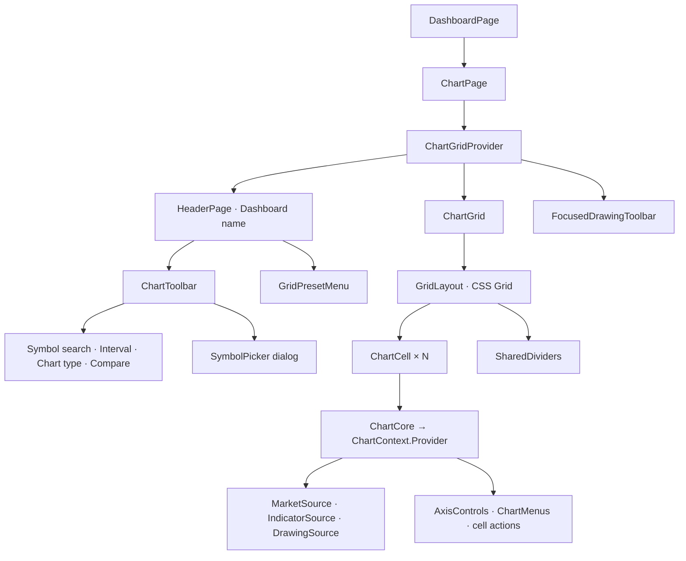
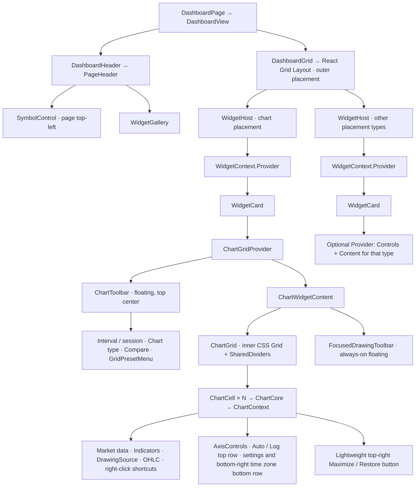

# Dashboard and Widget Architecture

Status: as of 2026-09-19, Dashboard placements, the Chart widget, and the Workspace file widget are implemented. This document records the implementation boundaries and verification scope.
Metabase serves only as a reference for responsibility boundaries; controls, typography, theme, and interaction styling follow the [app design guidelines](../../app/DESIGN.md).

## 1. Data model: separate user data from frontend presentation

A Resource is the domain description of user data. Dashboard, Chart, and Drawing are all Resources;
Dashboard is not outside Resources, and Resource does not specifically mean some kind of "content" placed into a Dashboard.
A Widget is a frontend unit of presentation and interaction; how a widget presents data and how user data is modeled are two separate questions.

```text
User data / backend                           Frontend
Dashboard Resource { widgets[] } -- Query --> Dashboard view
                                                  |
                                         registry(kind) -> WidgetHost
                                                           | Card + Provider
Chart / Drawing Resources -------- Query -----------------> | widget components
Workspace files on disk ---------- backend API + Query ---> |
World observations --------------- Feed / useBars --------> |
```

`DashboardPage` renders widgets from Dashboard placements; the page owns the header, and ChartGrid is the first widget type.
The old `ChartPage` and `?chart=` selection logic have been removed. The existing
`dashboard_widget` table, Resource revision, Query, Feed, and chart runtime all remain in use.

| Existing Resource | User data it describes                        | Unit of change     |
| ----------------- | --------------------------------------------- | ------------------ |
| Dashboard         | Name, favorite, widget placement and layout   | Dashboard revision |
| Chart             | Inputs, interval, internal cells/preset/links | Chart revision     |
| Drawing           | Drawing geometry, style, visibility           | Drawing revision   |

`WidgetPlacement` is one data item in the Dashboard Resource's `widgets[]`:
`{id, kind, resourceId?, layout: {x,y,w,h}}`. It records one placement; it is not a running component,
and it has no Resource envelope of its own. Each placement has one `wdg_` ID and shares the Dashboard's revision.

The frontend `WidgetDefinition` statically declares the type, controls, components, and size constraints; the Host mounts that definition by placement ID.
A widget can read several Resources and can also read workspace data through the backend; the two need not map one to one.
We add no Widget Resource, generic Card Resource, second chart configuration, or arbitrary `settings: JSON`.
`kind` stays a non-empty string, and existing unknown kinds show an unsupported card; adding a new frontend presentation does not require changing a backend enum.

The existing `resourceId` is a reference field on the placement, not a unified data interface for all widgets.
The Chart adapter queries its own placement in the Dashboard where it is used, validates it, and obtains the required `chartId`; the generic Host does not interpret this field, nor does it treat a missing value as an unbound widget.
Workspace files use the disk as the source of truth and are read through the backend API; there are no separate Resource records for files and does not store file contents in the placement or ViewState.
The Workspace adapter is not bound to a single directory; it mounts the complete `WorkspaceView` shared with the files page directly. For the file API, see [Workspace architecture](workspace.md).

### What data changes mean

- New Dashboard/Command+D calls `resources.macro.createDashboardWithChart()`, which atomically creates a Dashboard, a default Binance `BTCUSDT` daily Chart, and a placement, then navigates to it on success. Creation does not read Feed. Picking an item in the Widgets dropdown adds it immediately: Chart reuses the same default BTC daily configuration, and Workspace shows all registered directories. Alerts are not a widget; the sidebar and Feed host them.
- Changing a widget's position or size, or removing a placement, modifies the Dashboard Resource's `widgets` data.
- Changing the interval in a Chart widget modifies the Chart Resource; this is a different operation from changing the Dashboard layout.
- Today, `Remove from dashboard` removes only the placement and keeps the linked Chart; the button does not mean deleting the Chart.
  Duplicating a widget is not implemented, and there is no generic operation to put a Resource back.
- The existing `Chart.dashboardId` ownership FK, the Chart/Drawing cascade on Dashboard deletion, and the fact that placement references carry no FK to their target all stay unchanged.
  Storage relationships do not replace UI command semantics; the existing remove entry point only submits a Dashboard mutation.
- Moving a Chart and existing references keep their current contracts; drawings are still decided by the Chart's actual owner.

Metabase's [separation of Card and DashCard](https://github.com/metabase/metabase/blob/v0.63.15.3/frontend/src/metabase-types/api/dashboard.ts)
is only a reference for the boundary "placement data and displayed data are described separately"; we do not equate its Card with our Resource, nor adopt its query model or settings-merging system.

### State ownership

| State                                             | Owner / write path                                                                                |
| ------------------------------------------------- | ------------------------------------------------------------------------------------------------- |
| Outer position, size, membership                  | Dashboard Resource; React Query reads and mutations, refreshed by SSE invalidation                |
| Chart symbol, interval, internal preset, drawings | Their own Resources; controls call Query where they are used, and the Host does not copy entities |
| Workspace file contents                           | Disk is the source of truth; the backend reads it, and React Query caches bounded read results    |
| Market data and subscriptions                     | Existing Feed/`useBars`; not turned into Query or a Host data store                               |
| Viewport, axis style, internal track ratios       | placement-scoped Zustand persist; the widget owns schema/defaults                                 |
| Hover, menus, focus                               | CSS/local React state; not persisted                                                              |
| Temporary layout during drag/resize               | RGL internal interaction state; not written to the Query cache or a second Zustand Dashboard      |

### How placements are saved: measure first, then decide whether an optimistic cache is needed

By default, there is a single backend write path:

```text
pointermove -> RGL local geometry (no request)
drag/resize stop -> dashboard.patch(expectedRevision, widgets with final layout)
                -> DB commit -> resource.changed -> Query invalidation/refetch
                -> authoritative Dashboard -> RGL layout prop
```

Submit the complete layout once, only in `onDragStop/onResizeStop`, because collisions can move other widgets.
Do not save unconditionally in `onLayoutChange`; it also fires on first mount, window resize, and syncing backend state.
No optimistic writes through `onMutate/setQueryData`, no optimistic mutation queue, and no mirrored Dashboard store.
RGL's temporary view can persist until the save completes; it does not change the data other Query consumers see, and drag frames never wait on the network.

The request uses the Dashboard revision from when the gesture started; the next outer layout gesture is paused until Query confirms that revision.
Only this request's final layout and revision are kept for retry. On conflict, show an error and re-read; never swap in the new revision to force an overwrite.
A failed save keeps the gesture result clearly marked "unsaved" and offers retry and discard; an unsaved state is never disguised as success.

Checked against [RGL 2.2.4](https://github.com/react-grid-layout/react-grid-layout/blob/v2.2.4/src/react/components/GridLayout.tsx#L435-L472):
it compares old and new external layout values, so when the parent passes back the same old value it keeps the internal gesture result. A temporary React 18 mount/mouse event check also confirmed that drag and resize do not snap back on release.
But after a failure, a refetch that returns the same value cannot reset it, and the main component has no public reset method. An explicit click on "Discard changes" re-reads and remounts the RGL boundary;
this recovery remounts the child charts. If a Workspace has an unsaved draft, discarding must be confirmed first, and cancelling keeps the editor. Normal drag/save must not remount via a revision key. We accept the cost of this rare operation for now rather than rewriting the layout engine for it.

Measurements of the shipped write path on 2026-09-16 (macOS arm64, Node 24.8.0): a separate backend process, a temporary-file SQLite, real
AppTransport HTTP/SSE, unmodified Resource invalidation, and mounted QueryObservers for the Dashboard detail and the sidebar list.
Each group used 10 warm-up runs and 50 samples, with no optimistic writes and without writing mutation return values directly into the cache.

| placements | patch returns p50 / p95 | Query receives new revision p50 / p95 |
| ---------- | ----------------------- | ------------------------------------- |
| 1          | 1.38 / 1.66 ms          | 2.47 / 2.84 ms                        |
| 16         | 2.20 / 2.60 ms          | 4.21 / 4.94 ms                        |
| 64         | 5.45 / 12.61 ms         | 9.30 / 19.87 ms                       |

In the 16-placement control group, adding 50ms / 150ms of delay before each request gave a Query p95 of 124.75ms / 321.00ms.
These requests carried all four real geometry fields, repeatedly changed rectangle positions, and went through final geometry validation and persistence; there were no optimistic writes.
**The measured range is backend to Query; it excludes paint time and many Charts running at once.** Regression tests with real RGL mouse events cover a single submit on release,
keeping layout and components while waiting for Query, delayed confirmation, retry, and discard; an isolated Electron window verified live market data, creation, position editing, and the split of controls.
Frame rate with many Charts still needs dedicated measurement. If a bottleneck appears later, first separate layout/paint from request time; if it really is waiting for the refetch,
first consider updating Query from the committed mutation response, which also needs no optimistic rollback path.

## 2. Interface: separate static definitions from runtime context

### Component tree: before and after migration

The diagrams below omit layout `div`s, loading/error branches, and global Providers. `QueryClientProvider` and `FeedProvider`
stay at the application level and are not rebuilt with widgets. The current `/app` index is `FullPageAgent`; Dashboards are entered through
`/app/dashboards/:dashboardId`, and there is no separate Chart route.

**Before migration: a Dashboard rendered only one ChartPage and did not mount widgets by placement.**



The old `features/chart/components/page.tsx` has been removed; the current composition lives in
[`DashboardPage`](../../app/src/app/dashboard/dashboard-page.tsx) and
[`DashboardView`](../../app/src/features/dashboard/components/dashboard-view.tsx), and the chart implementation lives in
[`toolbar.tsx`](../../app/src/features/chart/components/toolbar.tsx),
[`grid.tsx`](../../app/src/features/chart/components/grid.tsx), and
[`cell.tsx`](../../app/src/features/chart/components/cell.tsx).

**Current implementation: the Dashboard owns the whole page, and ChartGrid is one widget type within it.** The diagram omits ErrorBoundary and pure layout containers.
Arrows show React component containment; the symbol entry point belongs directly to the page header.



The symbol entry point **lives only in the page's top-left corner**; it is not placed in each widget and does not disappear on hover.
The drawing toolbar stays in the chart area, always visible and floating, and does not show/hide with the hover of the top Controls.
Auto/Log and vertical axis settings stay on each vertical axis and act on the corresponding pane/axis; they use V1's compact square buttons,
with Auto/Log in a separate row above settings, shown on vertical axis hover/focus. The display time zone opens from the bottom-right clock button, in the bottom row.
The remaining Chart controls, such as session type, go into the widget's floating top Controls, including `GridPresetMenu`, which changes the arrangement of internal cells.
The outer React Grid Layout moves the whole widget, and the inner ChartGrid arranges that Chart's cells; the two are never mixed.

Confirming a symbol replacement modifies the backend Chart Resource; there is no separate frontend "currently viewed symbol" that overrides the saved configuration.
`SymbolControl` receives the target `chartId/cellId` and reads and mutates through React Query itself:

```text
SymbolPicker selection -> Chart mutation -> backend commit
                      -> resource invalidation/refetch -> Chart consumers -> renderer
```

The header and charts share the target identity, and Query provides the Resource data. The symbol entry point does not read mounted handles/preferences
and does not depend on the renderer being ready; it does not use a portal, DOM slot, or widget runtime Context to connect to the header.
It keeps the existing backend write and invalidation path, and for now adds no optimistic cache or second write path that modifies the renderer directly.

Following the default behavior stated at implementation time, the page symbol entry point modifies the focused cell of the currently selected Chart widget and keeps that Chart's existing symbol linking rules.
The Dashboard uses `ChartSelectionContext` to provide the current chart ID and the cell ID each chart remembers; it updates when a chart or its controls are clicked/focused, and hover does not switch the target.
The header and Grid read this single piece of frontend selection state, derive the first visible target on first display, and neither store a separate entity nor save focus to the backend.
When the search dialog opens it captures the full `{chartId, cellId}`, and submit uses the captured chartId; later focus changes do not change the target of this operation.
If the target is deleted, the placement is rebound, or the Dashboard switches, the dialog closes; it does not fall back to another Chart or the first cell.
Query and save errors are shown by the header symbol component; the header dialog does not need to keep the widget toolbar expanded.

`ChartGridProvider` sits inside `WidgetCard` and wraps both Controls and Content so they share runtime/preferences handles
and interactions such as maximize; the selection state they need is read from the single owner above. No separate `ChartWidgetProvider` with its own state is added.
The Chart adapter only resolves the placement's chart ID and then composes the existing Provider.
Widget Controls sit outside `ChartCore` and obtain target handles through `ChartGridProvider.mounted`; they cannot read a single cell's `ChartContext` directly.

### Widget interface

Below is a shorthand of the current interface; the placement wire type derives from the Resource contract.

```ts
type WidgetDefinition = {
  kind: string;
  title: string;
  Icon: React.ComponentType<{ className?: string }>;
  defaultSize: { w: number; h: number };
  minSize: { w: number; h: number };
  Content: React.ComponentType;
  Controls?: React.ComponentType;
  Provider?: React.ComponentType<React.PropsWithChildren>;
};

type WidgetContextValue = {
  placementId: string;
  dashboardId: string;
  transport: AppTransport;
  holdControls: () => () => void;
  placeBeside: (definition: WidgetDefinition, resourceId?: string) => string;
};
```

`WidgetContext` is just a React Context, and the above is its value type. `WidgetHost` is an ordinary component that renders one placement, composed as `Context → WidgetCard → Provider(Controls, Content)`.
The placement shell is kept; when kind changes, the Host remounts the inner subtree. The Chart adapter remounts its own Provider when chartId changes, closing internal menus and releasing the runtime.
The header symbol dialog owns its own captured target and close logic and does not rely on a widget Provider remount for cleanup.
Other widgets manage their lifecycle by their own data identity; the Workspace widget is bound by registered directory ID, and layout changes keep its Tabs and drafts.
Each Host's ErrorBoundary sits outside the Provider and covers the provider, controls, and content; the fallback uses a generic card that does not depend on that Provider.
`Provider` is an optional widget-specific React provider; Chart uses it to compose the existing `ChartGridProvider` so the toolbar and content share
interactions and mounted handles. The Provider sits inside the Card and wraps both; it cannot be placed only inside Content.

`Controls` is simply a React component that can compose the interval menu, chart type, and split selector; the symbol search entry point stays in the page's top-left corner.
They query the state they need themselves; there is no actions JSON DSL, generic settings form engine, or family of CRUD hooks.
Metabase's [visualization definition](https://github.com/metabase/metabase/blob/v0.63.15.3/frontend/src/metabase/visualizations/types/visualization.ts#L623-L676)
serves as a reference, but its shared action bar is not fully declared by the visualization; here we add an explicit Controls slot.

`holdControls()` only manages card UI: it takes a lease when a menu/dialog opens and releases it idempotently on close or unmount.
Multiple nested portals do not hide the toolbar early for each other; there is no global popover scan or business event bus.
The Context only provides identity, the existing transport, the card lease, and the single Host layout capability `placeBeside`; it does not create another resource/dataset/agent client, and consumers still use the libraries' hooks directly.
`placeBeside` returns a placement ID synchronously: if the Dashboard (or the save still being saved or refreshed) already has a placement with the same kind and `resourceId`, it returns that ID directly without saving (widgets that need no Resource, such as the single Workspace, match by kind only); otherwise it starts one save at the current revision with the same DashboardView mutation, docks the new placement to the right of the caller, and returns the new ID immediately. A failed save uses the existing Retry/Discard; Retry replays the same ID and never retries automatically against a new revision; it throws if another change is still unsaved.
The app overrides `WorkspaceFileNavigation` in the Chart widget's Provider: both Open code in the Indicator legend and the code entry in the Indicator picker obtain the Dashboard's single Workspace placement (which shows all registered directories) through `placeBeside(workspaceWidget)`, and before the save completes they write the file into the per-placement request table in `lib/workspace/workspace.ts` (the latest request wins for a given placement). Once mounted, the Workspace widget opens the file, scrolls it into view, and clears the request, so a repeated request re-activates the Tab while a remount does not reopen it. Other places still navigate to the full-page Workspace.
QueryClient, AppTransport, and FeedProvider keep an application-connection-level lifecycle.

Main owners: `app/widgets/` composes the cross-feature widget catalog and gallery; within it, `widget-registry.ts` is the only place that imports each feature's widget definition. The Dashboard route/header uses this catalog, while placement writes stay owned by the Dashboard. `features/dashboard/components/widget-host.tsx`
handles composition; `lib/widget/widget.tsx` holds the contract and Context, `hooks/use-widget.ts` reads the Context, and `features/dashboard/components/widget-card.tsx`
holds the generic shell. The Chart adapter lives in `features/chart/components/widget.tsx`; features do not import each other.

Dashboard page composition is concentrated in `app/dashboard/`: `workspace.tsx` connects the Header and Grid
and owns shared selection, save state, and recovery; `dashboard-header.tsx` composes page actions; `dashboard-grid.tsx` handles outer geometry and gestures.
`widget-gallery.tsx` renders a DropdownMenu from the same widget catalog. Picking an item adds it immediately; DashboardView captures the current layout/revision and owns the mutation, pending, and recovery state in one place. The first widget fills the viewport; the second splits the width evenly with the first, and both rectangles are submitted in the same save; from the third on, widgets are appended at the bottom at their default size without changing the existing layout.
Chart's `widget.tsx` only defines the Provider, Controls, and Content for an existing placement and contains no creation entry point.

ChartGrid and WorkspaceView each own their content. The Workspace widget shows all registered directories and needs no placement reference; DashboardView adds it using the same placement mutation, pending, and recovery state; it does not copy the editor implementation or create a second file store. The shared exit guard reads each Workspace's live Tab flags; when a Host is removed, only the corresponding placement is checked.

## 3. Card design: app visual style, controls per widget

- The Dashboard header keeps symbol search and Widgets in the page's top-left corner and does not repeat the Dashboard name already shown in the sidebar; the page title is for screen readers only. Chart's drawing toolbar keeps its always-on floating form; vertical axis Auto/Log and settings sit in two rows, top and bottom, and the time zone entry stays in the bottom row at the bottom-right. **Placement is computed from the widget card alone**: the border and content fill the RGL rectangle, cards in the first row start directly below the header, and no space is reserved for hover controls. The remaining business controls, such as session type, are absolutely positioned on the card's top edge, horizontally centered, and shifted up by half their own height so that half is inside and half is outside; their height, visibility, and wrapping never change the card or canvas geometry. The Dashboard workspace (including the header) scrolls as one, and the grid does not separately clip controls beyond its top edge. No separate hide control is added for now.
- Widget controls and outer drag/resize work during normal browsing, with no Arrange mode; narrow screens still show a single column. The X button removes the placement directly and keeps the linked Chart. The top Controls appear on hover, keyboard focus, or while their own popover is open; a mouse click on the canvas does not pin them permanently. Touch screens show the top Controls directly. The drawing toolbar is always visible and does not use these show/hide rules.
- Focus-based show/hide uses visible-focus descendants (such as `:has(:focus-visible)`), not a blanket `focus-within` that would treat mouse focus on a canvas with `tabIndex` as keyboard interaction. The drag handle supports arrow keys to move and Shift + arrow keys to resize, with layout calculation still left to the library; there is no longer a position/size dialog.
- Controls, Content, and Provider stay mounted. Hiding is handled through styles and focus reachability; a single mouseleave must never unmount a menu, renderer, or Feed.
- The shell uses the app's shared surface, border, radius, shadow, Button, DropdownMenu, Tooltip, and icon rules.
  Metabase's compact grouping, drag isolation, and popover persistence rules serve as interaction references; we do not copy its components or bring in Mantine as a second design system.
- Widget controls are centered with the card width as their maximum, wrap naturally on narrow cards, and reuse existing menus instead of building a separate overflow menu system. The page symbol entry point hides the full company name when narrow.
- Only the content area clips; toolbars and portals are not clipped by the canvas overflow. Failure, loading, unbound, deleted target, and unknown type all have in-card states, and a single widget failure never blanks the whole Dashboard.

The outer layer uses React Grid Layout; the inner layer keeps using the existing ChartGrid CSS Grid, and panes are still managed by chart core.
The new integration uses the [RGL 2.x API](https://github.com/react-grid-layout/react-grid-layout#whats-new-in-v2);
the currently verified `2.2.4` supports React 18. Pin the version that passed acceptance, and do not copy Metabase's 1.x wrapper.
Use the library's width observer, collision, and layout algorithms. Dragging starts only from the dedicated grip; canvas pan/zoom, internal dividers, inputs, and menus do not trigger outer dragging.

The canonical layout has 12 columns; the desktop viewport is fixed at 24 rows, row height is computed from the height of the container below the Header, and the gap is 8px.
New arrangements are computed by `prepareWidgetLayout` in `features/dashboard/utils/layout.ts`: the first widget on an empty Dashboard fills 12×24; adding a second gives each of the two widgets 6×24 side by side; from the third on, widgets are appended downward at their default size and the existing layout is unchanged. Ordinary widgets and Chart creation share this rule and submit all geometry changes in the same save.
`placeBeside` uses `placeWidgetBeside` in the same file. It never appends below: the new widget always goes to the right of anchor A, computed on the layout as the Grid shows it (after vertical compaction).
The rows A occupies are called the band; columns where no other widget intersects the band are free columns; A's columns together with the adjacent free columns on both sides form the interval `[L, R)` of width `S`. The new widget's minimum size is M. Take the first rule that holds, in order of increasing disruption:

1. Start from A's full height, then shorten the band row by row from the top (at least `M.h` rows, with the bottom edge still at A's bottom edge), and take the first band where the free columns to the right of A are ≥ `M.w` wide: the new widget fills those columns, its top edge lands on the bottom of the widget above it, and no widget moves;
2. The total width of free columns in the interval `S - A.w ≥ M.w`: A keeps its width and moves left to `L`, and the new widget takes the remaining columns;
3. `S ≥ A.minW + M.w`: A moves to `L` and splits these `S` columns with the new widget; the new widget's width is `clamp(floor(S/2), M.w, S - A.minW)`, and A keeps the larger half;
4. Otherwise, a pair block of total width `T = max(A.w, A.minW + M.w)` starting at `min(A.x, 12 - T)` pushes the widgets it covers downward, then rules 2–3 run again on the pushed layout; the columns freed by pushed widgets go to the pair, leaving no empty columns.

An A shorter than `M.h` cannot use rule 1; if the free columns to its right are wide enough, A stays in place and both grow downward together.
Rows: the pair is pinned as one block of height `max(A.h, M.h)` at A's rows (rule 1 pins only A), RGL vertical compaction moves the covered widgets down (under the first three rules this happens only when A is shorter than `M.h`), and then the pin is released and the layout is compacted the way the Grid does it; finally each half rises to the bottom of the widget above its own columns, and both halves share the block's bottom edge. So the first three rules move no widget other than A; the saved layout is exactly the layout the Grid shows after compaction, and the two always sit side by side without overlap and without changing other widgets' IDs or order.
Container resize only changes pixel sizes; it does not save placements or remount widgets; Chart and Workspace resize with their own containers.
RGL maxRows limits the current gesture, and keyboard editing uses the same row limit; when an old layout or collision pushing exceeds the budget, page scrolling is kept rather than clipping content.
Narrow screens show a single column in array order; the first version does not save a breakpoint layout dictionary. Layout engine types do not enter the Resource schema.

## 4. Persistence changes and migration

`server/resources/dashboard/schema.ts` adds only four layout columns, which the API combines into `layout`:

```text
BEFORE: dashboard_widget          AFTER: dashboard_widget
+----------------------------+    +-------------------------------+
| id TEXT PK NOT NULL        |    | identity/reference/order: same|
| dashboard_id TEXT NOT NULL |    | + x INTEGER NOT NULL          |
| position INTEGER NOT NULL  | -> | + y INTEGER NOT NULL          |
| kind TEXT NOT NULL         |    | + w INTEGER NOT NULL          |
| resource_id TEXT NULL      |    | + h INTEGER NOT NULL          |
+----------------------------+    +-------------------------------+
 FK dashboard_id -> dashboard.id ON DELETE CASCADE, ON UPDATE NO ACTION
 UNIQUE(dashboard_id, position); existing checks retained
 Added columns: no defaults; x >= 0, y >= 0, w >= 1, h >= 1, x + w <= 12
```

The four columns require SQLite `typeof(...) = 'integer'`; these conditions become DB checks, and the Effect schema also uses Int and range validation.
The Dashboard entity adds non-overlapping rectangle and unique placement ID constraints; overlap across rows is validated by `withInvariants`, with no new SQL trigger.
No index, separate revision, or layout JSON column is added; other table structures stay unchanged. `position` keeps the array/keyboard reading order and cannot be inferred from 2D coordinates.

Add one forward migration that rebuilds and backfills the table inside the runner's transaction:

1. Keep the ID, kind, resourceId, and order of existing placements. Each Dashboard is sorted by `(position,id)` and stacked vertically as `x=0,w=12,h=16,y=16*n`; old unknown kinds are kept too.
2. Iterate all Charts sorted by `(created_at,id)` and append a chart placement to each one's owning Dashboard.
   If a placement for the same Dashboard and Chart already exists, do not add another. New placements get a `wdg_` ID; the second widget splits the width with the first, and from the third on they keep stacking from the bottom of the existing layout.
3. Chart/Drawing IDs, child records, revisions, and timestamps are unchanged; each Dashboard affected by the backfill gets its revision bumped once and its update time refreshed.
   Empty Dashboards stay empty. A failed migration rolls back entirely; startup/page mount does no backfilling.

Generate and check `schema.json`, `schema.gen.ts`, and `migration.gen.ts`. The new wire fields have no runtime fallback for historical data.

## 6. Verification

- [x] Temporary SQLite: fresh creation/upgrade of old data, rectangle bounds and overlap validation, ID preservation; a failure in any step of creating Chart + placement rolls back.
- [x] Real RGL mouse events: only the handle starts outer dragging, and release submits all affected rectangles once; the request uses the revision from gesture start, and saving neither changes the Query cache nor remounts widgets.
- [x] Dashboard interaction regressions: delayed Query confirmation, retry at the original revision, re-read after discard, unknown kind, menu lease, no save when the window narrows, bounds and collisions for keyboard handle operations, X removing the placement directly.
- [x] Chart regressions: header search has no renderer dependency and captures its target; an invalidated target closes the dialog; a failed background refresh keeps mounted charts; repeated references do not create a second runtime; each vertical axis has independent settings.
- [x] Browser/isolated Electron window: multiple widgets with live market data, creating a Chart, saving position/size, axis Log, the session menu, the always-on floating drawing toolbar, dark and light themes, and the 320px single-column layout.
- [x] `just check` passes on Node 24; the backend-to-Query geometry save benchmark covers 1/16/64 placements and 0/50/150ms per-request delay; see the data above.
- [ ] Paint frame rate with many Charts running at once and the release-to-stable-frame p95 have not been measured specifically; the current benchmark makes no performance promise for that scope.
- [x] The Workspace file widget reuses the files page directly, with disk storage and the unified read/write API.
