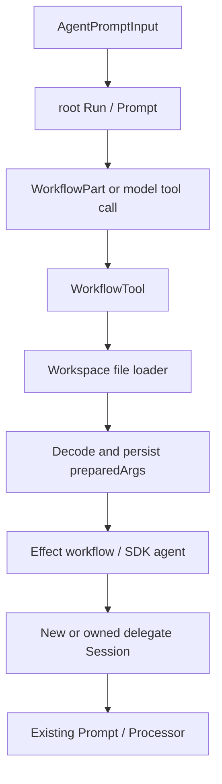

# Workflow

OpenChart workflows are trusted Effect programs stored as `.workflow.ts` files. The authoring API, runtime,
host integration, and shipped templates live in `server/agent/workflow`.
The tool adapter lives with other tools in `server/agent/tool/tools/workflow.ts`.
OpenChart imports no V1 implementation.

An authored workspace file imports only `@openchart/workflow`, which
supplies Effect, Schema, `defineWorkflow`, `agent`, `parallel`, `phase`, `textPrompt`, and prompt/result
types. The program owns its argument schema and control flow; its workspace and
file path own identity. Shipped templates also import `@openchart/workflow`; ESLint
prohibits other imports, dynamic loading, and ambient I/O globals for those programs. The
workspace loader rejects imports outside the SDK and dynamic imports. It executes
trusted code in the backend process, not a security sandbox; ambient globals are
not isolated.

`authoring/index.ts` is the sole public authoring API. Each primitive has its own
file (`define-workflow.ts`, `agent.ts`, `parallel.ts`, `text-prompt.ts`); shared helpers live in
`authoring/shared/` and stay outside the public API. The file loader binds
the authoring import above to this index; ESLint rejects imports of individual
primitives or shared helpers from workflow programs. `runtime.ts` owns invocation
execution. `workflow.ts` is the sole service entrypoint, exported
as `@openchart/server/agent/workflow`. Its `Workflow.Service` supplies parent prompt,
settings, and child-agent execution. The existing
`WorkflowPart` in `server/agent/contracts` remains the shared invocation contract.
Executable programs and Effect services stay server-owned.



`Prompt.execute(run)` remains Runner's claimed-run adapter.
`executeInvocation({rootRunID, sessionID, input})` runs both root and child
prompts. The workflow host captures services for the SDK callback at that
invocation boundary; it starts no extra runtime or detached fiber. All workflow
and child execution stays Effect-native. The existing model SDK boundary remains
the only Effect-to-Promise adapter on this path.

`agent(input)` creates a fresh persisted child Session with an explicit prompt
and profile. `agent(input, {sessionId})` continues a child created by the same
invocation's host, appending a new prompt to its existing transcript. An unknown,
parent, or another host's Session ID fails with `Workflow.SessionNotOwned`.
The host's child map owns admission and per-Session Effect semaphores; SQLite
remains the transcript source of truth. A permit covers execution, cleanup, and
reading the answer, so concurrent calls to one Session cannot interleave turns
or return another turn's answer. Waiting calls remain interruptible.
Before execution, the workflow registers the child in its calling ToolPart's
`childSessionIds`. Processor appends and deduplicates these direct relationships;
repeated turns share one link. The collection survives completion or cancellation.
On success, `WorkflowTool` also includes `childSessionIds` beside the author's
unchanged `result` in its model-facing JSON. The existing registration callback
collects this per-invocation, deduplicated index, including children whose failures
the program handled. Authors need not return `AgentResult` or track references.
The root can call `read_transcript({session_id, cursor: null})` for details when
an answer needs clarification; full child transcripts are not eagerly copied.
Workflow UI continues using spans for individual calls, including single-child
workflows; child links do not create native subagent cards.
Children share the root Run and cancellation. They do not copy parent history
or enqueue another Run. Results contain `{sessionId, output}` for that turn.
Different agents receive earlier answers only when the authored program includes
them in a prompt. Continuation is scoped to the current host, not durable resume
across root Runs or process restarts.

### Structured agent output

`agent(input, {schema})` returns `AgentResult<typeof schema.Type>`; without a
schema, `output` is a string. The schema describes service-free JSON input and
output, using the same Effect `Schema` export as workflow arguments. Effect's
Standard JSON Schema adapter projects the encoded input shape and retains
referenced definitions. Transformations run when authoring decodes the answer;
for example, `Schema.FiniteFromString` requests a string and returns a number.
Constraints that JSON Schema cannot express remain enforced by local decoding;
provider-specific schema restrictions still apply.

```ts
const Review = Schema.Struct({
  passed: Schema.Boolean,
  missingEvidence: Schema.Array(Schema.String),
});
const verify = Effect.gen(function* () {
  const review = yield* agent(
    textPrompt(
      "Check the supporting evidence",
      parentPrompt.model,
      parentPrompt.agent,
    ),
    { schema: Review, label: "review" },
  );
  return review.output;
});
```

Authoring projects the schema to JSON Schema and supplies it through the existing
host and `Prompt.executeInvocation` boundary. The constraint belongs to this call,
including its model steps; subsequent calls, title generation, compaction, and
nested agents do not inherit it. LLM forwards it through AI SDK to the native
provider and records it in the Assistant request snapshot. The committed text
remains the transcript source; authoring decodes it once into the typed result,
rejecting invalid JSON, schema mismatches, and excess properties.

`InvalidOutput` is exported by the authoring API and carries `sessionId` and the
validation message. Workflow authoring does not retry invalid output. A workflow
may handle it with `Effect.catchIf(Schema.is(InvalidOutput), ...)` and continue
that child with corrective input, including a different output schema. Omitting
the schema on a continuation requests ordinary text again. `InvalidOutputSchema`
reports JSON Schema projection failures before model I/O. Native provider failures
retain the existing `ChildFailed` path.

`parallel()` accepts lazy Effects, uses bounded concurrency, preserves result
order, and returns success/error outcomes per item. Expected child failures retain
session identity in their error. Defects and interruption propagate. The runtime
also enforces the child limit when a program uses Effect concurrency directly.
Cancellation waits for active child cleanup and never starts queued children.
Prompt supplies `{concurrency: 5}` as a separate settings argument to
`makeWorkflowHost`. Each `run()` creates its own semaphore and locally provides
the same `Workflow.Service` with a bounded child callback. Concurrent workflows
sharing a host retain independent limits. Authored programs keep the top-level
`agent()` and `parallel()` verbs without concurrency options; their ordinary
`InvocationContext` argument contains only `parentPrompt`.

## Default workflow files

At startup, `defaults.ts` installs missing `templates/*.workflow.ts` into the
user's default Workspace at `workflows/*.workflow.ts`, beside `indicators/`.
These are ordinary editable files. Existing bytes always win, including on
restart; missing defaults are restored at the next startup. Installation reads
the template directory, with no executable catalog or versioned workflow IDs.
Desktop packages the original TypeScript templates as text assets.

`default:workflows/best-of-n.workflow.ts` explicitly loads a file from the default
Workspace. `workspace:relative/path.workflow.ts` loads from the prompt's selected
Workspace, using default when no Workspace was selected. Both use the same fresh
file loader. Source selection does not alter the parent prompt or the Workspace
inherited by child agents. Missing files fail without another-source fallback.

The predefined slash commands keep their names and argument syntax, independently
declare their argument schemas, and emit `default:workflows/*.workflow.ts`
references. Commands never import workflow definitions or their schemas; each
file validates its own arguments at execution.

## Workspace authoring

Create `workflows/research.workflow.ts` in a registered workspace:

```ts
import { defineWorkflow, Schema, agent, textPrompt } from "@openchart/workflow";

export default defineWorkflow({
  description: "Research a question using a fresh agent",
  args: Schema.Struct({ question: Schema.String }),
  run: ({ question }, { parentPrompt }) =>
    agent(textPrompt(question, parentPrompt.model, parentPrompt.agent)),
});
```

The same authoring import exports `CODEX`, `CLAUDE_CODE`,
and `TIER1` through `TIER5`. Pass `{providerID: CODEX, modelID: TIER4}` to
request a tier, or reuse `parentPrompt.model` as above. Each child invocation
resolves its requested tier once, with downward fallback within that provider;
explicit native model IDs remain valid. User intent retains the requested model
reference, while Assistant execution metadata records the resolved native ID.
See [model references](models.md#model-references-and-shared-constants).

Select the file with `@` in the Composer. The file directive retains its path;
a provider with native file tools reads the definition and supplies arguments to
the existing `workflow` tool:

```json
{
  "workflow": "workspace:workflows/research.workflow.ts",
  "args": { "question": "Explain NVIDIA's latest earnings" }
}
```

There is one tool and no dynamic tool registration. The definition has no ID;
its relative path identifies it. The loader uses the current prompt's workspace,
checks registration and filesystem boundaries through `Workspaces`, and reads
source once per call. The loader type-checks that snapshot with strict TypeScript
settings and the bundled SDK declarations, then emits CommonJS from the same
compiler program before evaluating any source. Diagnostics retain the file, line,
column and TypeScript error code and become ordinary `Workflow.LoadFailed` tool
failures; no child agent starts. The only
module import binds to the backend's exact authoring API instance. Evaluation
checks the default definition export before entering the existing runtime. It
does not create a second Effect runtime or retain a module cache. A save affects
the next invocation. Prepared/terminal ToolPart metadata retains `workspaceId`,
`path`, the SHA-256 of executed source, and decoded `preparedArgs`. Permission
checking precedes source evaluation. Existing child Session, tracing and
cancellation semantics apply unchanged. The workflow argument schema still validates
tool input at execution. Workspace tsconfig files and installed packages never
configure the compiler or supply SDK types; checking and emission write no files
into the workspace. Type checking does not guarantee model output or I/O success.

The workspace needs only the authored `.workflow.ts` file. Acquiring the workspace
and loading a workflow never create dependencies, symlinks, configuration, emitted
JavaScript, or metadata in that directory. Existing project files and packages are
left untouched; the loader does not consult them to resolve the authoring API.
User-authored code and agent file operations still retain their normal capabilities.

The authoring API is bundled into the backend; TypeScript is an app runtime
dependency. `just desktop`, `desktop-build`, and `desktop-package` use the same
runtime assembly without a separate authoring package or installation step.
External editors may report that `@openchart/workflow` cannot be resolved; automatic
VS Code/tsc setup is outside this version's scope. The in-app Monaco editor supplies
the same public entrypoint's declarations to its built-in TypeScript worker for
diagnostics, completion and hover. Workflow's `generate-workflow-types.ts` generates
the declarations with `rollup-plugin-dts`, including Effect/Schema and their type
dependencies, while preserving module boundaries. Desktop ships them beside the
backend; Vitest setup and the source-run Agent demo prepare the same artifact.
The editor's Vite plugin consumes that generator as declaration text; no server
implementation runs in the renderer and no support files are written into the workspace.

`just workflow-test` covers standalone files, unchanged workspace contents,
read-only workspaces, source edits, validation/errors, path boundaries, and real
Session execution. The relocated packaged Desktop smoke selects a workspace
workflow through `@`, receives a model-issued tool call, and executes its child
agent with a controlled native Codex CLI fixture. It verifies that the workspace
still contains only the authored file after execution.

For an opt-in real-model check, set `OPENCHART_WORKFLOW_RUNTIME_DIR` to an existing
app-managed `model-providers` directory, then run
`just test-core server/agent/workflow/structured-output.live.test.ts` from the repository root.
It uses tier 1 for each native provider, isolated temporary workspaces and SQLite,
and verifies transformed structured outputs, a loop, and plain-text continuation. Default checks skip
these paid model calls.

## Phases

`phase(name, effect)` names an execution scope and returns the Effect's result.
It accepts any Effect, including sequential `Effect.gen`, `parallel`, nested
phases and concurrent phases. It starts only when executed and uses a distinct
`Workflow.phase` span for each call, even when names repeat. Effect parentage
assigns descendants to their scope without a mutable current-phase variable.

```ts
const report = Effect.gen(function* () {
  const research = yield* phase("Research", parallel(researchTasks));
  return yield* phase(
    "Review and summarize",
    Effect.gen(function* () {
      const review = yield* agent(reviewPrompt(research));
      return yield* agent(summaryPrompt(review));
    }),
  );
});
```

Start and terminal snapshots use the existing awaited trace publication. Failure
and cancellation propagate after cleanup; handled failures in `parallel` can
coexist with a completed phase. Phases neither change execution order nor add
persistence, child Sessions or a second lifecycle.

The waterfall renders collapsible phases on the same workflow-wide time axis.
Within each phase, calls group by Session; continuations across phases therefore
have separate rows linking to the same Session. Nested phases retain their scope.
Headers show status, elapsed time and observed agent-call counts, including failed
and cancelled calls. Counts describe calls already observed, not a promised total
or percentage. Clean completed phases fold automatically unless toggled by the
user; running, failed and cancelled work stays expanded by default. Phases appear
when execution reaches them, without declaring future stages.

Shipped workflows name their research and review stages. Debate groups both sequential
speakers in one phase per round, followed by synthesis. Conditional follow-up
phases appear only when requested; the workflows retain their prompts, outputs,
model selection, call order and failure policy.

## Tracing

`agent()`, `parallel()` and `phase()` automatically open Effect spans in the authoring API. Workflow
authors add no instrumentation. `run()` installs the official
`@effect/opentelemetry` bridge with an invocation-local SDK provider, collecting
spans in the `Workflow.` namespace. Effect propagates the parallel
span as the children's parent; each group lasts until all its items settle.
Expected item failures remain outcomes, so the group can complete successfully
while a child span fails. The host reports the selected
child Session ID before execution. Every call has a fresh span ID, including
continuations: the Session ID is a grouping attribute, never the span identity.
`agent(input, {label})` can name the step;
otherwise its label comes from the first prompt line, falling back to the agent
name. The span also carries the agent profile and requested model.

The official OpenTelemetry JSON serializer produces OTLP-shaped snapshots in
`ToolPart.state.metadata.trace`. The SDK processor collects spans at `onStart`
and retains the same objects through completion. Publication uses awaited
`ctx.metadata` progress when an agent binds its Session ID, when a parallel group
starts, and after each span closes, including failure/interruption. Snapshots
retain stable span IDs in start order, so live steps update in place.
A semaphore serializes snapshot creation and persistence across parallel agents.
Finalization completes before Processor closes tool progress; no background writer,
separate event log, collector, or exporter is required. Live snapshots use the SDK's
zero end timestamp for unfinished spans as an internal UI convention; they are
not standard OTLP export payloads. Completed snapshots are standard OTLP.
Cancellation adds the `openchart.cancelled` span attribute because OTel
status alone does not distinguish interruption from successful completion.

The existing `openchart.tool` Activity carries metadata in `content.details`.
Its snapshot/delta projection and the community reducer need no tracing-specific
protocol changes. Cold bootstrap reads the same persisted metadata. The frontend
adapter decodes the OTLP fields it consumes and derives relative timing, depth,
and status for the TraceWaterfall. A local clock grows
running bars without backend heartbeat writes. Spans sharing
`openchart.session.id` within one phase occupy one row, with separate bars
retaining their timing and status; unbound spans occupy individual rows. Row
durations sum the spans' active time. Each Session-linked bar opens the
existing host-owned AgentPanel. Future authoring verbs can emit additional spans
through the same transport; workflow structure is not encoded as a new DAG model.

Workflow references accept only `workspace:` or `default:` followed by a valid
relative `.workflow.ts` path. Catalog IDs such as `best-of-n@1` are rejected.
WorkflowPart and ToolPart retain intent, progress, results, and failure.

A deterministic WorkflowPart runs before ordinary model inference and automatic
compaction. Prompt selects executable Parts only after the latest Assistant with
`finish` or `time.completed`. The same interval applies to workflow, subtask,
and explicit compaction Parts; action owners need no consumption marker. Completing the
ordinary Assistant advances that interval, including on failure or cancellation.
Only one executable Part may be pending; selection rejects multiple pending
Parts before execution so completing an Assistant cannot silently skip work.
Subtask execution remains unmigrated. Explicit compaction reuses its input marker
and ends after sealing the summary; automatic compaction appends its own marker
and resumes through a synthetic continuation. Failed summaries from either mode
retain an empty Assistant lifecycle boundary; incomplete content never enters
model replay, and later prompts never replay completed explicit intents.
Automatic compaction still uses the context-capacity trigger; its persisted
markers record attempts rather than requesting another explicit action.
The removed workflow metadata marker requires no data conversion: existing
metadata remains valid, and selection reads only existing Assistant lifecycle
fields. No reader transforms historical rows.
Both deterministic and model-selected calls use `prompt/step.ts` for Assistant
creation, tool binding, and `processor.process()`. An accepted deterministic call
supplies a local stream through the existing `LLM.Service` boundary; it emits the
known call, invokes Processor's wrapped callback, and emits its result and finish.
It makes no model request. Processor has one stream consumer and no separate
deterministic executor. The local override applies only to that step; child
prompts retain the real LLM service captured by their host. Processor waits for
the running ToolPart commit before
entering callbacks, so immediate argument-snapshot/progress writes cannot be lost.
Terminal metadata merges preserve those execution facts. Workflow completion
allows the root to answer sibling instructions and finish naturally.

`workflows/best-of-n.workflow.ts` accepts `{n, question}`, with a positive integer `n`. It launches n independent researchers in parallel,
then one summarizer with their explicit outcomes. The integration test uses the
real application runtime, Run admission/claim/terminal writes, SQLite Sessions,
Prompt, Processor, and model SDK bridge with controlled model streams. It proves
both entrypoints, concurrency and synthesis ordering, child transcript isolation,
exact admission replay, failure isolation, and cancellation cleanup. A live
research demonstration additionally needs research tools or a capable provider;
the controlled test proves orchestration rather than research quality.

The `/best-of-n` command uses the template `$1 $2`: `$1` is n and
`$2` captures the remaining question. Its builder validates its independently declared
argument schema and emits a WorkflowPart; it never executes the program.

`workflows/multi-turn-debate.workflow.ts` accepts `{round, topic}`, a positive integer round count
and any debate topic. Two agents argue the affirmative and negative positions,
alternating for the requested number of rounds. Both debaters and the summarizer
use `parentPrompt.model` unchanged. Each debater
keeps its own Session and receives the opponent's latest public statement; the
final round requests closing statements. A fresh Session
then receives all public statements in order and summarizes both sides as a
neutral analyst. The result contains the topic, all `{round, affirmative, negative}`
entries, and `summary`; each answer retains its Session ID. This produces three
child Sessions, `2 * round + 1` agent spans and `round + 1` phase spans. Normal permissions apply to child tools. A failed
turn stops the workflow; cancellation joins active cleanup.

`/multi-turn-debate <round> <topic>` uses `$1 $2` to build this WorkflowPart.
The command declares its own arguments; the file independently validates execution input.

`workflows/thesis-killer.workflow.ts` accepts `{thesis}`. A structured decomposition produces one to
five critical assumptions; the schema rejects empty or oversized lists before
fan-out. Each assumption gets an independent structured challenge with evidence
for and against it, a failure mechanism, observable signals, an invalidation
condition, and evidence gaps. A fresh reviewer assesses whether the conditions
would actually change the thesis and returns a structured verdict. Results retain
the decomposition, labeled challenge outcomes, and summary with Session IDs.

`workflows/hypothesis-race.workflow.ts` accepts `{question}`. A structured decomposition produces one
to five explanations with distinguishing predictions. Independent investigations
collect evidence for and against each explanation. A structured reviewer compares
all outcomes and returns a summary plus a nullable follow-up question. Null ends
the race immediately; otherwise one fresh investigator researches that question
and the reviewer continues its own Session to produce the final structured summary.
There is at most one follow-up. Results retain the decomposition, labeled research
outcomes, nullable follow-up, and final summary with Session IDs.

Both reuse the parent model/profile, the existing concurrency bound, and normal
child permissions. Parallel investigation failures remain explicit outcomes for
the reviewer; missing evidence does not prove that a thesis survived or an
explanation was rejected. Decomposition, review, and follow-up failures stop the
workflow. All stages use schema-constrained outputs with no implicit repair.
`/thesis-killer <thesis>` and `/hypothesis-race <question>` compile their respective
WorkflowParts without executing them.

`workflows/find-laggers.workflow.ts` accepts `{request}` describing a stock move or event, with optional
market and horizon. `/find-laggers` preserves that nonblank request verbatim.
One invocation captures an Effect-clock cutoff and passes it to every child.
A structured catalyst check gates discovery; an unresolved, untimed or unsourced
premise stops without candidate research. Discovery is bounded to three pathways,
with prompts limiting transmission to two links and one market. Code deduplicates
exchange/symbol pairs, retains their pathways and researches at most eight listings.

Business-exposure and price-evidence checks run independently under the existing
host concurrency limit. Child agents own source research and market-tool I/O.
Price output records the provider, listing symbol/currency/MIC, window endpoints
and series settings; child tool calls retain the full source-native listing.
Code computes pre-event and event returns, and benchmark differences
only for matching timestamps, resolution, session and adjustment. Invalid windows
and unavailable prices never count as a muted response. Freshness, identity,
source accuracy and economic materiality still require the agents' evidence;
schema validation alone cannot establish those facts.

A fresh reviewer receives every check outcome, including failures. Its generated
schema requires exactly one assessment per candidate ID. It may request one
follow-up investigation, then continue its own Session for the final assessment;
follow-up failures remain explicit. Findings include decisions, counterarguments,
recognition catalysts and invalidation conditions. Code prevents retain/watch
decisions without sourced material exposure and usable candidate/market prices;
missing checks remain unresolved, and sourced non-beneficiaries or immaterial
exposures are rejected even if the reviewer selects them. Follow-up research is
skipped when no candidate meets the initial evidence requirements.
Zero qualifying candidates is valid. The workflow uses the parent model unchanged
and adds no scheduler, persistent scanner or new runtime services.

The generic control-flow semantics follow V1. This slice does not port profile
lifecycle plugins, semantic watchlist configuration/bindings/results, TaskTool,
scheduled dispatch, or startup repair. No mid-program replay or durable DAG engine
is introduced. Those consumers can build on this execution boundary independently.
