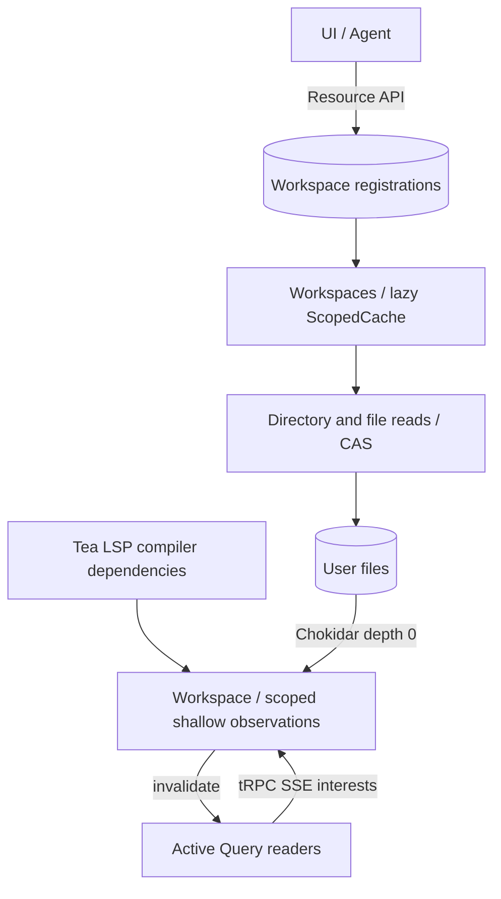

# Workspace: user artifacts in a local directory

## 1. Conclusions and source of truth

A Workspace is a local directory registered with OpenChart. The registration record and the file contents each have their own owner:

| Data                                                   | Source of truth                        | Owner                         |
| ------------------------------------------------------ | -------------------------------------- | ----------------------------- |
| Which workspaces are registered, and the root of each  | SQLite under the OpenChart home        | `server/resources/workspace/` |
| Content, path, and existence of text, images, and PDFs | File system                            | User directory                |
| Directory queries, availability, watcher               | Disk queries and on-demand observation | `server/workspace/`           |
| Which workspace is shown, unsaved editor buffers       | Frontend view/local state              | App                           |



- **Registrations go through Resource.** SQLite is the only persistent source of the registry. No roots list is kept in `settings.json`.
- **The root is a fixed physical location.** It cannot change after registration. There is no operation to move a whole workspace, and a Resource patch cannot point it at another directory.
- **The directory owns the files.** No marker or hidden metadata directory is added. Users can work on the files directly with VS Code, git, Finder, and Agent file tools.
- **A reference is `{workspaceId, path}`.** The ID identifies the registration, and the root locates the directory on disk. path is the relative path inside the workspace. Renaming a file does not rewrite references. Consumers show old references as missing.
- **CAS protects file operations that go through the backend.** The UI uses the Workspace file API. External tools, such as the Agent's native file tools, do not take part in this lock. The watcher observes their changes, and races with external writes are accepted.

SQLite, settings.json, and credential.key all belong to the OpenChart home, and never go into the user's workspace directories.

## 2. Concepts and reused implementation

| Term               | Definition                                                                                    | Owner                                       |
| ------------------ | --------------------------------------------------------------------------------------------- | ------------------------------------------- |
| Home               | The profile directory of one backend. Also holds workspaces created without a given root      | `home` option of `runtime.ts`               |
| Workspace Resource | `{id, root}` plus the existing Resource envelope                                              | `server/resources/workspace/`               |
| Workspaces         | Observes registrations, and gets and releases runtime instances by ID                         | `server/workspace/workspace.ts`             |
| Workspace instance | On-demand queries, observation, and file operations under a fixed `{workspaceId, root}`       | `server/workspace/instance.ts`              |
| Entry              | `{path, hash}`. File contents are not cached                                                  | Workspace instance                          |
| Artifact           | `.tea` / `.workflow.ts` / `.md` / `.markdown` text, plus PDF, PNG, JPEG, GIF, WebP, AVIF, SVG | `RelPath` in `server/workspace/contract.ts` |

Reuses the current Effect `4.0.0-rc.112` and existing OpenChart mechanisms:

| Capability                                                                     | Implementation                                                                               |
| ------------------------------------------------------------------------------ | -------------------------------------------------------------------------------------------- |
| Registration CRUD, revision, transactions, change events, Agent Resource tools | Existing Resource framework                                                                  |
| File I/O, canonical paths, artifact matching                                   | `FileSystem` + `NodeFileSystem.layer`. Hidden directories are excluded when enumerating      |
| Directory watching                                                             | Chokidar: `ignored`, `followSymlinks: false`, `ready`, handling of editor atomic-save events |
| Acquiring and releasing watchers, background tasks                             | `Effect.acquireRelease`, `Scope`, `Effect.forkScoped`                                        |
| Merging watch callbacks and scan signals                                       | `Stream.callback`, `bufferSize: 1`, `strategy: "sliding"`                                    |
| Instance reuse, and release on removal                                         | `ScopedCache`, `capacity: Infinity`, no expiry policy                                        |
| Current index and subscriptions                                                | `RcMap` shares directory observations. `SubscriptionRef` holds only a change counter         |
| Serializing file operations, retrying failures                                 | `Semaphore`, `Schedule`                                                                      |
| SHA-256, and the `lstat` needed to reject symlinks                             | Node standard library, with I/O wired in through `Effect.tryPromise`                         |

The server formally declares the `@effect/platform-node` and Chokidar dependencies it uses, and does not rely on indirect installs through desktop or the toolchain. The current Effect `stat` follows symlinks, so it cannot replace `lstat`. No generic Watcher or FileSystem abstraction is added.

Workspace does not compile Tea, and does not manage running indicators, alerts, or strategies. `app/agent/full-page-agent.tsx` and `app/dashboard/dashboard-page.tsx` own App page composition. Workspace here means only the registered file directory.

Getting and reading a Workspace never installs dependencies, creates symlinks, or writes `package.json`, `tsconfig.json`, or other helper files. A Workflow needs only the user-authored `.workflow.ts`. The loader binds its `@openchart/workflow` import to the App's built-in API. The Workflow owner handles loading and running; see [workflow](workflow.md#workspace-authoring).

## 3. Home and directories

`makeRuntime({home, databasePath?})`. Profile paths are derived from home:

```text
<home>/openchart.sqlite3
<home>/settings.json
<home>/credential.key
<home>/.cache/models/
<home>/workspaces/default/
<home>/workspaces/<slug>/
```

- The desktop release uses `~/.openchart`. `just desktop` uses `platform/desktop/.artifacts/dev-profile/home` in the current checkout, and Electron userData lives in its parent directory `dev-profile`, so different worktrees do not share the database and browser storage. Smoke tests and `demo/agent/server.ts` use a temporary home.
- Desktop `init` uses home instead of databasePath. Electron userData still owns browser storage and the Clerk session. main still decrypts credential.key with safeStorage and hands the bytes to the backend.
- `databasePath: ':memory:'` stays only as a test override. Tests still provide a temporary home. `OPENCHART__SQLITE__PATH` is removed.
- The `resources.workspace.createLocal` transition prepares the `<home>/workspaces/<slug>/` directory in resolve, and reuses register in apply to register its canonical root. Creating a directory on disk does not register it by itself.
- At registration, the root must be an existing directory. If an ordinary registered directory later disappears or is moved away by an external tool, inside or outside home, the registration stays and reports missing. The backend does not fail to start, and does not search for a new location or recreate an empty directory. Automatic recreation of default is the explicit exception below.

**default is also a real Resource row.** Before accepting requests, startup idempotently ensures that `<home>/workspaces/default/` and its registration exist. The first time, it gets an ordinary WorkspaceId, and the row is reused afterwards. default keeps the rule that it cannot be removed, and its root is fixed. No separate default flag is stored; the fixed root identifies it. `resources.workspace.getDefault` returns only this record's ID, so the frontend does not rely on the first row of a paginated list.

Before the app is ready, the Indicators owner makes default's `indicators/builtin/` match the
built-in scripts shipped with the app: missing ones are added, and ones with different content (an old version, or edits made outside the app) are rewritten to the shipped text.
The Workspace file API forbids writing or deleting the built-in originals, renaming files onto those original paths, or moving them out.
The `readOnly` flag in read results drives the editor's read-only mode. Copies and other Workspaces are not restricted. Built-in files deleted outside the app are restored on the next startup.
No install record or second copy of the scripts is kept.

Likewise, the Workflow owner installs missing preset programs into default's `workflows/*.workflow.ts` at startup,
next to `indicators/`. These are ordinary editable files, and existing content is never overwritten.
See [workflow files](workflow.md#default-workflow-files).

## 4. Registry: Workspace Resource

`server/resources/workspace/schema.ts` owns the `workspace` table. The entity is derived from it, and the catalog registers the Resource. The only domain field is root. ID, revision, and timestamps reuse the Resource envelope.

```text
BEFORE                         AFTER
workspace: absent              workspace
                               +--------------------------------------------+
                               | id          TEXT PK NOT NULL               |
                               | revision    INTEGER NOT NULL DEFAULT 1     |
                               | created_at  INTEGER NOT NULL DEFAULT nowMs |
                               | updated_at  INTEGER NOT NULL DEFAULT nowMs |
                               | root        TEXT NOT NULL UNIQUE           |
                               +--------------------------------------------+
```

Reuses `resourceEnvelopeColumns/Checks`: revision >= 1, non-negative timestamps, and nowMs produced by SQLite. Adds `length(root) > 0`. root stores a canonical absolute path, with no extra FK. Absolute path, directory type, and ancestor overlap are domain checks, and cannot rely on UNIQUE alone.

- The Workspace Resource is marked `readOnly`. The UI and the Agent query registrations through the get/list of `resources.workspace`. `resource.ts` only composes definitions. `transitions/` owns register, forget, createLocal, and getDefault, which are exposed automatically as `resources.workspace.register/forget/createLocal/getDefault`. ensureDefault is an internal transition called only at startup. The Agent gets no registration write entry point. File operations keep the `workspace.*` namespace, and there is no second registry.
- root is a required input of register, and cannot change afterwards. The public API has no create/patch/delete, and the Store still rejects root changes in internal save. Framework-generated intrinsic operations keep their ordinary implementation, and do not carry directory preparation or default record protection.
- For users, removing a registration means forget: it deletes only the Resource row and never deletes the directory. If an external tool moves the directory elsewhere, the old record stays missing. To use the new location, register it separately. This produces a new WorkspaceId, and old references are not migrated automatically.
- Registration requires canonicalization, and rejects the same directory, case/symlink aliases, and ancestor/descendant overlap. Checks use path components, not string prefixes.
- Registration and forget run through explicit business transitions. Agent `resource_mutate` respects readOnly and cannot bypass them. External file system preparation follows the transition's resolve/apply boundary. The overlap check and the registration write happen in the same SQLite transaction, so two concurrent registers cannot each pass the check. `server/resources/workspace/transitions/ensure-default.ts` and `create-local.ts` own preparing the default and anonymous directories, and reuse register. The startup layer runs ensureDefault through Transactor.run.
- Filesystem and SQLite have no cross-store transaction. If registration fails after the directory is prepared, the directory is not deleted automatically. If the watcher fails to start after a successful registration, that is runtime unavailability, and the registration is not rolled back or hidden.

`Workspaces` keeps no second persisted registry. It reads Resource `get` on demand and caches instances. After it observes `resource.changed {resource: "workspace"}`, it uses `listAll` to release instances whose registration was removed, and does not proactively open other registrations. It sets up observation before reading the initial list, and realigns after observation is interrupted.

Instances are cached by WorkspaceId and capture the fixed root at creation. An instance is created only on first use. New registrations are neither scanned nor watched. Removing a record invalidates and releases its instance. Use the `ScopedCache` entry scope instead of hand-writing another dispose/ref-count scheme.

Resource changes and instance alignment need serialized coordination. A new file operation confirms that the registration still exists, instead of relying only on whether the removal event has arrived. A removed ID must not create a new instance. Registration queries still treat the database as the source of truth, and React Query expresses pending while a query runs.

## 5. Files, index, and lifecycle

The core contract follows. Boundary schemas are defined once, and types are derived from them:

```ts
type ArtifactRef = { workspaceId: WorkspaceId; path: RelPath };
type Entry = { path: RelPath; hash: Hash };
type Snapshot =
  | {
      status: "ready";
      entries: { path: RelPath }[];
      directories: RelativePath[];
    }
  | { status: "missing" }
  | { status: "unavailable"; reason: string };
```

`RelPath` uses posix separators, and must be a non-empty relative file path with no `..`, backslashes, hidden path segments, or non-artifact extensions. The schema checks the input shape. Every file access also checks the real path at the Workspace file system boundary, and rejects any symlink path segment and any out-of-bounds access. The file index includes only regular files. Directory paths go separately in `directories`, including empty directories. These constraints are re-checked after a registered directory is restored or replaced.

### 5.1 On-demand reads

- `listDirectory(path)` enumerates only the direct children of that directory; `""` means root. File entries have only `{path}`. Directories include empty ones. It reads no file bodies and computes no hashes.
- `listTree` is a bounded recursive metadata query. It returns a flat list of file and directory paths, including unexpanded directories. Consumers that need a global list or file name search filter on the frontend. It sets up no watching, and keeps no persistent or background index.
- `read(path)` always reads disk, computes SHA-256 over the same bytes, and returns `{entry, mediaType, base64, readOnly}`. Only body reads and CAS need the hash. mtime/size never replaces the hash.
- `write` accepts only `.tea` / `.workflow.ts` / `.md` / `.markdown` text. Markdown extensions are case-insensitive. Media keeps a 32 MiB limit.
- A missing directory returns missing. Enumeration or permission errors return unavailable. One unreadable file does not block the directory from showing, and does not make saving other files fail.

### 5.2 Observation and recovery

`server/workspace/directory-observation.ts` wraps Chokidar, Effect Scope, and `RcMap`.
Consumers declare the files or directories they need. Workspace groups files under their parent directory, and each directory shares one `depth: 0`
observation, without recursively watching subdirectories. It closes after the last consumer releases it. A 250 ms RcMap idle period absorbs
subscription recomposition, without keeping the whole tree. Hidden paths and symlinks are still excluded, with no special case for node_modules.

Events only invalidate queries. They do not drive full scans or incremental indexing. The subscription's initial notification and the Chokidar ready
notification make consumers re-read, which covers the gap between the first read and the watcher being set up. Every five seconds, each active directory
checks dev/ino. A replaced or lost directory, or a watcher error, first closes the old watcher, then retries every five seconds.
Only default can be recreated. Unobserved directories need no recovery task. The next query reads the current disk directly.

Server consumers can hand the current file set to `observeWorkspaceFiles`. It derives the needed directories,
merges duplicate sets and event bursts, and releases old observations through an Effect Stream switching Scope. It does not require
Tea or other consumers to implement watchers, ref counting, retries, or registration matching.
It and tRPC both pass `WorkspaceInterest[]` to `Workspaces.watch`, so the rules for batch acquisition, merging notifications, and
skipping removed workspaces exist only once. One workspace ending does not end the observation of other workspaces.

### 5.3 File operations and commit points

The built-in indicator paths of the default Workspace are read-only. Ordinary `write`, `remove`, and `rename` reject these paths.
The internal `installBuiltin` writes only built-in original paths: if the content already equals the given text, it does not write; otherwise it writes that text. It exposes no RPC and no input parameter that bypasses read-only.

`read`, `mkdir`, `write`, `remove`, `rename`, and instance shutdown admission use the same semaphore. Directory enumeration runs independently and does not hold the save lock. Waiting for a permit is interruptible. Once a file mutation enters its commit phase, it completes the necessary operations and publishes the result before it responds to cancellation or release. Whole-directory scans are never put inside the uninterruptible file commit phase.

| Operation                     | Preconditions                                                                                    | Commit point and result                                                                                                       |
| ----------------------------- | ------------------------------------------------------------------------------------------------ | ----------------------------------------------------------------------------------------------------------------------------- |
| `mkdir(path)`                 | Path passes validation and goes through no symlink. An existing path must be a directory         | Creates the directory and missing parents. An existing directory succeeds. Creates no Resource registration                   |
| `write(path, text, expected)` | Re-reads disk inside the lock and compares the hash. expected null means the file must not exist | After a `wx` temp file in the same directory is fully written and renamed into place, returns the Entry for the written bytes |
| `remove(path, expected)`      | Compares the hash if the file exists. Succeeds directly if it is already gone                    | Returns success once unlink succeeds or the file is confirmed gone                                                            |
| `rename(from, to, expected)`  | from matches the hash, and to does not exist. Both pass path checks                              | After rename succeeds, returns the new path and the source content hash                                                       |

write/rename create parent directories as needed, and clean up their own temp files on failure. rename fails directly on EXDEV, without falling back to copy and delete. The same root does not guarantee the same volume.

CAS and the target-does-not-exist check only cover operations coordinated by this backend. External tools may change files between the check and rename/unlink. This is handled by the race rule in §1.

**After the disk commit, only a query invalidation notification is published.** The commit path scans no other files. Query failures are independent of the success result of a committed mutation.

### 5.4 Shutdown and conflicts

- forget or runtime shutdown first closes the instance's operation admission. Mutations already in their commit phase complete, then observation and background tasks are released. Queued and later `listTree/listDirectory/read/mkdir/write/remove/rename` return WorkspaceClosed.
- Old `watch` subscriptions end explicitly. Closing the Scope alone does not invalidate every object already handed out. The instance owner must enforce the closed state and stream termination. A new `Workspaces.open(id)` returns WorkspaceUnknown for a deleted registration.
- `EntryStale` has only one conflict shape: `{workspaceId, path, current: Entry | null}`. null means the file does not exist. When create hits an existing name, or the rename target exists, current points to the target. It contains no file body.
- The shared policy in `server/lib/errors` maps EntryStale to CONFLICT, with explicit structured details for the tRPC error projection. The frontend can read again to get the latest content for a diff, and retry with the new hash. It must not receive only a generic error or have to parse an error string.

## 6. Transport, frontend, and Agent

Registrations reuse the get/list of `resources.workspace` and the existing Resource Query/invalidation. The Resource router generates `resources.workspace.register({root})`, `resources.workspace.forget({id})`, and `resources.workspace.createLocal()` automatically from business transitions. readOnly only hides the intrinsic create/patch/delete. createLocal prepares an anonymous directory under home, then reuses register to finish registration. ensureDefault stays an internal startup entry point, and there is no second registry. `resources.workspace.getDefault()` is derived from a `kind: "query"` declaration. It only reads the default registration ID inside a transaction, and creates no directory or registration. Its Query key belongs to `resources.workspace` and follows Resource invalidation. The file service provides:

| Procedure                                              | Returns                                                                              |
| ------------------------------------------------------ | ------------------------------------------------------------------------------------ |
| `workspace.listTree({workspaceId})`                    | Snapshot with status. ready includes `entries: {path}[]` and `directories: string[]` |
| `workspace.listDirectory({workspaceId, path})`         | Direct children of one directory, same shape as listTree                             |
| `workspace.watch({interests})`                         | tRPC SSE. Notifies when active data changes                                          |
| `workspace.mkdir({workspaceId, path})`                 | Success. Creates a directory in the workspace, and any missing parents               |
| `workspace.read({workspaceId, path})`                  | `{entry, mediaType, base64, readOnly}`                                               |
| `workspace.write({workspaceId, path, text, expected})` | Committed Entry                                                                      |
| `workspace.remove({workspaceId, path, expected})`      | Success                                                                              |
| `workspace.rename({workspaceId, from, to, expected})`  | Committed Entry                                                                      |

The frontend `lib/workspace/workspace.ts` is the Workspace API shared by features. It owns registrations, the default Workspace, directory queries, reads and writes, and cache invalidation. `app/connection` mounts the shared SSE subscription. The app passes a transport to `AgentView`, and the Agent feature renders the fixed Workspace picker and file candidates directly from shared queries. `AgentViewContext` shares the transport and the current workspaceId with the normal and edit composers. `useAgent` takes only the workspaceId needed for submission, and does not expose Workspace queries.

The App reads with React Query and writes with mutations, with no optimistic overwrites. The file query prefix is `[["workspace"]]`. The index key adds workspaceId, and the content key also adds path. `lib/workspace/workspace-observation.ts` derives file/directory interests automatically from active Queries (a Tea program read observes its entry file and all imports, based on its result), and merges them into one
`workspace.watch` tRPC SSE connection. The Query itself owns the consumer count. Components just use ordinary queries.
RxJS merges synchronous Query events, dedupes the interest set, and switches subscriptions. Notifications only invalidate the matching active Queries.
Late notifications after an old subscription exits are dropped, with no separate connection generation or manual lifecycle state.
A collapsed directory unmounts its child queries through Collapsible, and closing a file unmounts its content query. Cached or disabled queries hold no observation.
Reopening reads disk automatically, and the initial notification after a reconnect covers changes made while disconnected. Workspace does not use Hose.
The existing app event connection still handles:

- `workspace.changed {}` invalidates the file query prefix, which covers committed file operations.
- `resource.changed {resource: "workspace"}` invalidates both registration and file queries, which covers additions and removals. SSE ready/reconnect re-reads both kinds of query.
- Both mutation success and failure cancel/refetch the matching queries. A failed save and a later failed refetch are shown separately.

The Workspace file page lives at `/app/workspaces`. The top level shows all registered workspaces. Each root collapses independently, and hovering shows the full path. The registration list and the direct children of expanded directories use the shared Query, and no current workspace selection is kept. A Sidebar-11 file tree and a single-group Dockview Tab layout form the file view. A Tab's identity and read/write target are decided by `{workspaceId, path}`, so files with the same name in different workspaces can be open at once. Code uses Monaco, Markdown uses Milkdown Crepe by default, images use img, and PDF uses EmbedPDF. All files use the same read Query: text is decoded strictly as UTF-8 on the frontend, and images/PDF use Blob URLs that get cleaned up. Crepe, the Monaco worker, and PDFium WASM are bundled with the app and loaded on demand.

Markdown Edit / Source share one file draft, and Source uses Monaco. Crepe initialization and disk sync produce no edits. Editing transactions update the draft synchronously, and undoing all edits restores the original text. Visual editing normalizes Markdown formatting. Frontmatter, or content that cannot survive parsing, automatically goes to Source, so HTML and similar content is not lost. Uploaded images are embedded as data URLs, and temporary Blob addresses are never saved. Crepe keeps its official components and styles, with colors and fonts mapped to App tokens.

Create workspace at the top of the file tree calls the single-directory system picker that Desktop must provide. main allows only `openDirectory`. Cancel registers nothing. After a selection, it registers through `resources.workspace.register({root})`. Once the list is invalidated, the new root appears automatically, without navigating or rebuilding open Tabs. Failures use the existing notification toast.

The file tree context menu reuses the shared Context Menu component, and Create file / Create folder share one path input dialog. A directory item creates inside that directory, a file item creates in its parent directory, and a workspace root node creates in its own root. The new file button belongs to each workspace row, and does not use a global current workspace. File items also have Delete file, which reads the file's readOnly and hash on confirm, and reuses the file service's read-only protection and CAS delete. Non-default workspace root nodes offer Forget workspace, which removes only the registration and keeps the files on disk. The frontend identifies default by the ID that getDefault returns, and the backend still owns the protection. Delete and forget both confirm first. On success they close only the matching Tabs in the current view. On failure the dialog and drafts stay. After an operation, the existing mutation Query invalidation and SSE refresh apply, and no temporary file tree is kept.

Dockview owns Tab dragging, closing, and selection. Cmd/Ctrl+B toggles only the file tree that has focus. A narrow container collapses it into an opaque overlay, based on the container's own width. To the right of the Tab bar are, in order, the current file's actions, the file tree toggle, and the Copilot toggle. When app navigation is collapsed, its entry point moves into the main view.

File actions follow the current Tab, and read dirty/saving from the Dockview params without keeping state of their own. They are hidden when there is no Tab or the Tab is a library Tab. The buttons are 32px (`size-8`), the same as the file tree toggle:

- **Save**: Appears only when there are unsaved changes, and is disabled while saving. An editor Tab registers its save in a view-local registry keyed by panel id, and unregisters on unmount. The button and Cmd/Ctrl+S call the same CAS save.
- **Copy path**: Copies the relative path inside the workspace.
- **Duplicate**: Text files only. `duplicateWorkspaceFile` in `lib/workspace` reads the current content from disk, picks a free `<name>-copy[-N]<extension>` next to the original (the name check is case-insensitive, because the default macOS disk is case-insensitive), writes it create-only, then opens the copy. Read-only built-in files show Duplicate to edit. The chart's Indicator picker reuses the same function.
- **App-provided actions**: `.tea` files also render the `WorkspaceFileActions` context from `lib/workspace`, with `{workspaceId, path}` and `prepare()` as parameters. `prepare()` first saves when the current Tab has a draft, and rejects if the save fails. Workspace does not know which actions the app provides (for example, adding to a chart).
- **Add to chart**: Provided by `app/widgets` only on Dashboards that contain a chart. The full Workspace page does not have it. The target is the same as the Dashboard header: the focused cell (otherwise the first visible cell) of the active chart (otherwise the first chart widget). It calls `prepare()` first, then follows the same add flow as the Indicator picker: compile from the content re-read after saving (`useTeaDefinition`), the required-parameters dialog, and `resources.macro.addIndicator`. If the chart already has an Indicator whose source is this file, the button becomes Reload on chart. After saving, it calls `resources.indicator.reload` on those Indicators and reports whether they were reloaded or unchanged. After adding, the button stays disabled until that chart's Indicator list has refreshed, so a second click only reloads and never adds a second copy.

Each Tab has a 24px read-only path breadcrumb row at the top (the Breadcrumb UI component): the workspace root directory name, followed by each path level. Library Tabs show Tea library and the file name. Symbol hierarchy is not shown yet.

The Dashboard Widgets dropdown adds a `kind: "workspace"` placement directly, with no directory reference needed. The widget adapter mounts the full `WorkspaceView`, which shows all registered directories. It adds no separate file tree, Tab, or content state. Removing the placement does not delete directories or registrations.

An editor buffer is local state of its Tab, and records the hash at the start of editing. Background refetches do not overwrite unsaved content. Cmd/Ctrl+S saves through the existing CAS, and a dot on the Tab marks changes. Closing a Tab, switching pages, and closing the window protect unsaved content. Pages and widgets share one route/window exit check through `UnsavedChangesProvider` in the app shell. Each instance registers a callback that reads the Dockview dirty/saving flags, and cleans it up on unmount. Removing a widget checks only that placement's drafts. A grid reset after a failed layout save checks the drafts of every affected placement. The Query is still the only cache of disk read results. root is fixed, so no directory binding revision is added.
When there is a draft and the disk hash that was read differs from the draft's starting hash, the file editor shows the shared `StatusBanner`, with no separate conflict state.
On a known conflict, Save focuses the banner's actions and refuses to continue. Unknown conflicts still go through the existing CAS and refresh after a failure.
Discard edits and reload clears the draft and re-reads disk. Merge with AI hands the original text, the draft, and the latest disk text to
the app-provided `WorkspaceFileMerge`, which merges them in a separate Copilot Session through the existing `submitPrompt`, using the `tier1` of the current default
provider. The submitted draft is cleared only after the backend accepts the prompt. On a submit failure, or for new edits made during submission, it stays.
After the Agent writes the file back, the existing watcher refreshes it. No new backend endpoint is added.

WorkspaceContents declares `{view: "workspace", file}` with assistant-ui's `useAssistantContext`,
where file contains only the current Tab's `{workspaceId, path}`, and is null when no file is open. Page unmount unregisters it automatically.
Copilot captures a snapshot at send time and saves it through the existing synthetic TextPart, and does not read unsaved
The Agent uses two kinds of entry points, by data owner:

- **Registrations**: Query the Workspace and its fixed root through `resource_read`. `resource_mutate` rejects writes, and there is no Agent tool for registration or forget.
- **File contents**: Get the root from the Workspace Resource, then work on disk directly with the provider's native file tools or shell. No separate Workspace file tool is added. These operations follow their existing permissions and count as external writes: the watcher handles refresh, and they do not get the CAS guarantee of the Workspace API. Models without native file abilities cannot edit files through Agent tools.

Server-internal consumers use `Workspaces.open(workspaceId)`, without going through tRPC. Creating a directory does not register it automatically. Removing a registration does not delete the directory.

Prompt picks `workspaceId` at the start of an invocation. When it is omitted, Prompt gets the default ID through `getDefault()`, then reads the registered canonical root through the Workspace Resource `get(id)`. Workflow subtasks keep the existing rule: an explicit choice wins, otherwise inherit the parent input. If the registration does not exist, it fails with no fallback. Prompt does not open a Workspace file instance or re-check the disk. Actual use of the directory is left to the provider. root is passed as `cwd` to the main response, the title, and compaction, and is written into the Assistant's `path`. The persisted User and Run keep the original workspace choice, including an omitted one.

`LLM.StreamInput.cwd` enters the binding through `ProviderRequestContext`: Claude overrides the cwd of this Query, and Codex overrides the cwd of this thread/turn. The shared provider process and the host `process.cwd()` stay independent, and the registry is not rebuilt per workspace. The native resume cache includes cwd in config matching, so sessions are not reused across directories. The directory itself does not change the provider's existing permission policy.

In the chat Composer, `@` reads the current Workspace's file names through the `listTree` Query only when search is activated, and filters them on the frontend. The assistant-ui async completion adapter owns debounce and stale-result protection, and concurrent requests share the same read. Search covers unexpanded directories, and re-triggering reads the latest disk state, without holding a whole-tree watch. The trigger picker searches only relative paths. On selection, it saves a `:file[label]{name=absolute path}` directive in the TextPart (the formatter escapes separators in file names), without reading or uploading file contents. The official Lexical input shows the directive as an inline pill, and DirectiveText in messages parses it with the same formatter. Refresh and re-editing both restore from the persisted text, with no extra editor state. The native Agent reads the file itself from the path in the marker. The frontend restores the selection from the latest User's `workspaceId`, and a new Session uses default. The same selection is used for file candidates and prompt submission. Editing a message uses the same picker, and existing absolute path references are not affected by switching workspaces.

Local file links in Assistant Markdown all reuse the DirectiveText file chip, which shows the file name, and the full path on hover. Relative paths resolve against the message's persisted `path.cwd`. Only on click does it look up the original Workspace's registration and file index. A matching file opens in the existing file page through the app's shared navigation. Other local paths open in the system default app through Desktop `openPath`. If the lookup fails or the index is not ready yet, it does not fall back to opening with the system, and open failures use the shared error toast. Relative paths without a cwd, invalid paths, and remote file URLs show as plain text. Switching the Composer Workspace does not change links in old messages, and web links keep their existing behavior.

## 7. Replacing the Tea Script Resource, and migration

A forward migration has removed the draft and published version tables of the original OpenChart `tea-script` Resource, along with its directory, catalog registration, and promote. The old migration `20260906005122_tea-script.ts` stays unchanged.

```text
BEFORE                                      AFTER
tea_script                                  DROPPED
  envelope: id/revision/created_at/updated_at
  name TEXT NOT NULL
  draft_source TEXT NOT NULL
  current_version_id TEXT NULL
tea_script_version                          DROPPED
  script_id TEXT NOT NULL
  version_id TEXT NOT NULL
  source TEXT NOT NULL
  created_at INTEGER NOT NULL
  PK(script_id, version_id)
```

Append the OpenChart forward migration `20260917014159_workspace`, ordered after `20260916223704_agent-run-stop` on main. It creates the §4 workspace table, and removes the two Tea tables correctly according to the existing foreign key relations. Migrations or checksums already merged into main are not edited. This keeps the original draft's scope of not preserving the old Tea Resource: old draft/version rows are not converted into `.tea` files automatically, which is an explicit data removal. Workspace registration starts from an empty table, and the home-aware startup flow creates default.

When merging main, this PR's not-yet-merged Workspace migration is renumbered from `20260916134751_workspace` to the end position above. Development databases that ran the old branch migration are not converted automatically. The old files remain, and `just desktop` uses a worktree-isolated Home. Main databases upgrade under the existing strict ledger prefix rule.

Migration tests keep covering the forward upgrade with the old tables present, the new table constraints, and fresh schema parity. Only the outdated Tea CRUD/promotion behavior tests are deleted, with no loss of migration coverage. Generic test fixtures that used teaScriptResource are replaced with a suitable Resource. Tests of custom transition exposure use an in-test Resource to keep coverage.

Consumers reference `{workspaceId, path}`, and show missing when the workspace or file has been removed. Which source a running indicator/alert/strategy uses, whether it follows saves, and how it keeps an execution source snapshot belong to each execution owner. Workspace does not bring back a second persistent source of editable source code because of this.

## 10. Verification

Verify the implementation with temporary directories, a temporary SQLite database, and controllable Effect scopes:

- The public Resource API keeps get/list and the auto-generated register/forget/createLocal. The intrinsic create/patch/delete and the internal ensureDefault are not exposed, and Agent writes are rejected. root is required at register, and internal changes to a registered root are rejected too. Concurrent duplicate/overlapping registrations are rejected. default is created only once, keeps the same ID, and cannot be removed.
- Registration rejects ancestor overlap. The Workspace file API rejects symlinks, out-of-bounds paths, and hidden paths. An unreadable hidden directory does not block scanning valid artifacts.
- External changes refresh active queries. Changes in unexpanded subdirectories trigger no scan. read always returns the body and hash of the same disk bytes.
- Text/images/PDF return the correct MIME and raw bytes through the same read, which rejects symlinks, hidden paths, and out-of-bounds access. The text write endpoint rejects images/PDF, and the original file stays unchanged.
- A stale write/create/rename returns a structured conflict. remove of an already deleted file succeeds. rename covers the failure paths for an existing target, a stale source hash, and EXDEV.
- File commits scan no other files. An unreadable file does not block other saves, and enumeration failures and file commits are reported separately.
- Deleting the root, restoring an empty directory, and quickly replacing the root all recover. State changes are published between missing and ready-empty. Verify retries with controlled time, without requiring the operation to finish within exactly five seconds.
- After an external tool moves an ordinary workspace directory away, the old registration keeps its original root and shows missing, without recreating an empty directory. Registering the new path gets a new ID, and old references stay missing.
- forget closes operation admission. Writes already in their commit phase complete before release. Queued operations and old handles fail, and old subscriptions end.
- SSE reconnects, registration changes, and file changes invalidate Queries correctly. Conflicts or invalidation notifications do not overwrite unsaved editor buffers.
- Verify fresh/upgrade/schema/checksum according to the OpenChart migration rules. Run `just check` after the implementation is complete.

Verification notes: directory integration tests explicitly enable the Chokidar polling backend, to avoid differences in native events across test environments. Production uses the default native backend. On 2026-09-16, in the real Electron dev app, we verified that external changes update the index, that writes with an old hash are rejected, and that the external content is kept.
